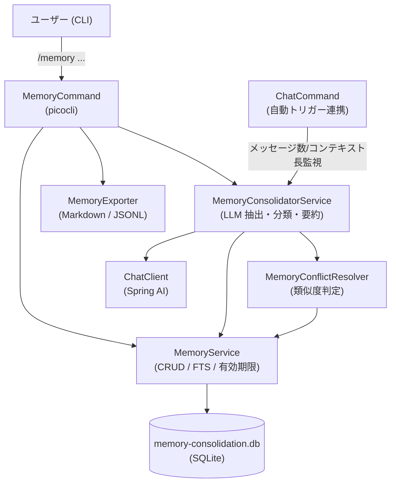
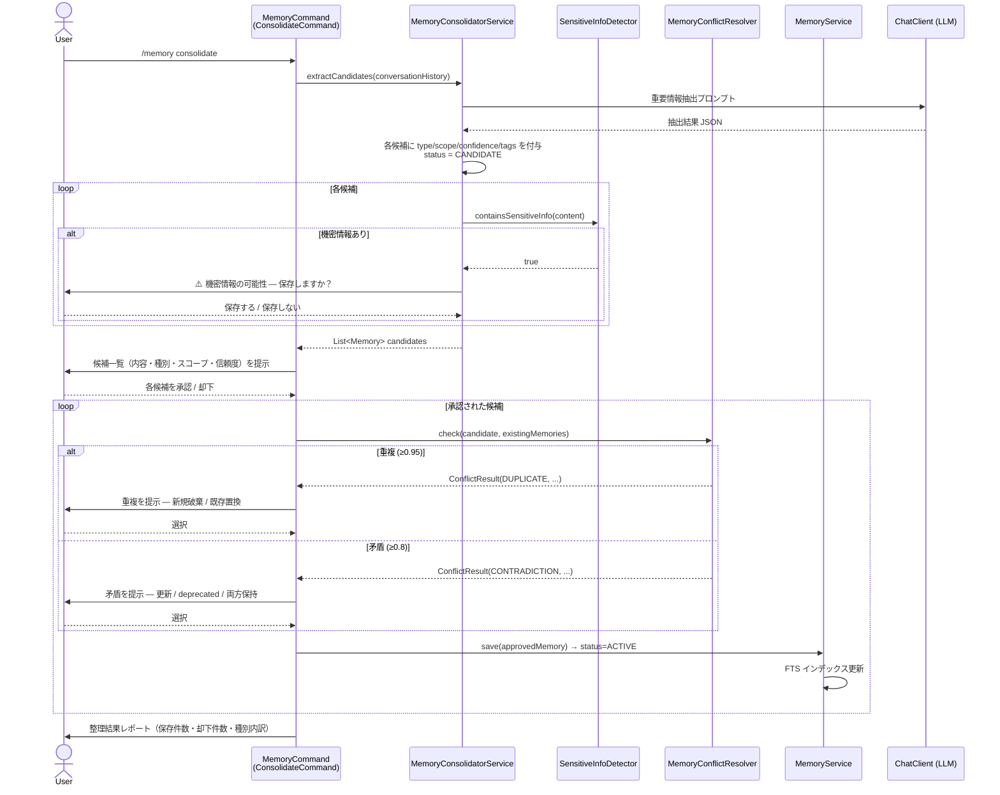

# Design Document: AI 睡眠（記憶整理）

## Overview

本機能は rei AI エージェントに長期記憶能力を付与する。会話履歴・決定事項・タスク・ユーザー設定・プロジェクト文脈を LLM で抽出・分類し、専用 SQLite データベース（`.rei/memory-consolidation.db`）に永続化する。モデル重みの更新は行わず、外部記憶として管理する。

主要な操作は `/memory` コマンド群（consolidate / list / search / forget / export / summarize）で提供し、自動トリガーによる整理提案も `ChatCommand` との連携で実現する。

## Architecture

### コンポーネント図



### パッケージ依存関係

```
dev.mikoto2000.rei.memory
  ├── command/         ← MemoryCommand (picocli)
  ├── configuration/   ← MemoryDataSourceConfiguration, MemoryProperties
  ├── model/           ← Memory record, MemoryType, MemoryScope, MemoryStatus
  ├── service/         ← MemoryService, MemoryConsolidatorService,
  │                       MemoryConflictResolver, MemoryExporter
  └── util/            ← SensitiveInfoDetector
```

## Components and Interfaces

### MemoryCommand

```java
@Component
@Command(
    name = "memory",
    description = "記憶を操作します",
    subcommands = {
        MemoryCommand.ConsolidateCommand.class,
        MemoryCommand.ListCommand.class,
        MemoryCommand.SearchCommand.class,
        MemoryCommand.ForgetCommand.class,
        MemoryCommand.ExportCommand.class,
        MemoryCommand.SummarizeCommand.class
    })
public class MemoryCommand { /* 空のコンテナ */ }
```

各サブコマンドは `@Component` + `static inner class` パターンに従う。

| サブコマンド | クラス名 | 主な依存 |
|---|---|---|
| `consolidate` | `ConsolidateCommand` | `MemoryConsolidatorService` |
| `list` | `ListCommand` | `MemoryService` |
| `search <query>` | `SearchCommand` | `MemoryService` |
| `forget <id>` | `ForgetCommand` | `MemoryService` |
| `export` | `ExportCommand` | `MemoryExporter` |
| `summarize` | `SummarizeCommand` | `MemoryConsolidatorService` |

### MemoryService

```java
@Service
public class MemoryService {
    public MemoryService(@Qualifier("memoryConsolidationDataSource") DataSource ds) { ... }

    // CRUD
    public Memory save(Memory memory);
    public Optional<Memory> findById(long id);
    public List<Memory> listActive();
    public void updateStatus(long id, MemoryStatus status);
    public void saveRelation(long fromId, long toId, String relationType);

    // FTS 検索
    public List<Memory> search(String query, int limit);

    // 有効期限チェック（取得時に期限切れを deprecated へ）
    public List<Memory> listActiveWithExpiryCheck();

    // タグ・ソース
    public void saveTags(long memoryId, List<String> tags);
    public List<String> findTags(long memoryId);
    public void saveSource(long memoryId, String conversationId, String messageRef);

    // 要約
    public void saveSummary(long memoryId, String summaryText);
}
```

### MemoryConsolidatorService

```java
@Service
public class MemoryConsolidatorService {
    public MemoryConsolidatorService(ChatClient chatClient, MemoryService memoryService,
                                     MemoryConflictResolver conflictResolver,
                                     MemoryProperties properties) { ... }

    // 会話履歴から保存候補を生成（LLM 呼び出し）
    public List<Memory> extractCandidates(List<Message> conversationHistory);

    // 会話全体を要約（LLM 呼び出し、2000 文字以内）
    public String summarize(List<Message> conversationHistory);

    // 自動トリガー判定
    public boolean shouldSuggestConsolidation(int messageCount, int contextLength, int contextLimit);
}
```

### MemoryConflictResolver

```java
@Service
public class MemoryConflictResolver {
    public MemoryConflictResolver(MemoryService memoryService) { ... }

    // 類似度スコアに基づく判定
    public ConflictResult check(Memory candidate, List<Memory> existingMemories);

    // 類似度計算（Jaccard / TF-IDF ベース、外部ベクトルストア不使用）
    public double computeSimilarity(String text1, String text2);
}

public record ConflictResult(
    ConflictType type,       // NONE / DUPLICATE / CONTRADICTION
    Memory conflicting,      // 競合する既存記憶（NONE の場合 null）
    double similarityScore
) {}
```

### MemoryExporter

```java
@Service
public class MemoryExporter {
    public MemoryExporter(MemoryService memoryService) { ... }

    // Markdown + JSONL エクスポート
    public ExportResult export(Path exportDir);
}

public record ExportResult(Path latestMd, Path datedMd, Path datedJsonl, int count) {}
```

### SensitiveInfoDetector

```java
public final class SensitiveInfoDetector {
    public static boolean containsSensitiveInfo(String text);
    public static List<String> detectPatterns(String text); // 検出されたパターン名リスト
}
```

## Data Models

### エンティティ・Enum

```java
// dev.mikoto2000.rei.memory.model

public record Memory(
    Long id,
    String content,
    MemoryType type,
    MemoryScope scope,
    MemoryStatus status,
    double confidence,       // 0.0〜1.0
    String expiresAt,        // ISO-8601 文字列、null = 無期限
    String createdAt,        // ISO-8601 文字列
    String updatedAt         // ISO-8601 文字列
) {}

public enum MemoryType {
    USER_PREFERENCE, PROJECT_CONTEXT, DECISION, TASK,
    KNOWLEDGE, EPISODE_SUMMARY, TEMPORARY_CONTEXT
}

public enum MemoryScope {
    SESSION, SHORT_TERM, PROJECT, LONG_TERM, PERMANENT
}

public enum MemoryStatus {
    CANDIDATE, ACTIVE, DEPRECATED, ARCHIVED, DELETED
}
```

### データベース設計（DDL）

```sql
-- memories: 記憶本体
CREATE TABLE IF NOT EXISTS memories (
    id          INTEGER PRIMARY KEY AUTOINCREMENT,
    content     TEXT    NOT NULL,
    type        TEXT    NOT NULL,   -- MemoryType の name()
    scope       TEXT    NOT NULL,   -- MemoryScope の name()
    status      TEXT    NOT NULL DEFAULT 'CANDIDATE',
    confidence  REAL    NOT NULL DEFAULT 1.0,
    expires_at  TEXT,               -- ISO-8601、NULL = 無期限
    created_at  TEXT    NOT NULL,
    updated_at  TEXT    NOT NULL
);

-- memory_tags: タグ（多対多）
CREATE TABLE IF NOT EXISTS memory_tags (
    id          INTEGER PRIMARY KEY AUTOINCREMENT,
    memory_id   INTEGER NOT NULL REFERENCES memories(id),
    tag         TEXT    NOT NULL
);
CREATE INDEX IF NOT EXISTS idx_memory_tags_memory_id ON memory_tags(memory_id);

-- memory_sources: 根拠となる会話参照
CREATE TABLE IF NOT EXISTS memory_sources (
    id              INTEGER PRIMARY KEY AUTOINCREMENT,
    memory_id       INTEGER NOT NULL REFERENCES memories(id),
    conversation_id TEXT,
    message_ref     TEXT
);
CREATE INDEX IF NOT EXISTS idx_memory_sources_memory_id ON memory_sources(memory_id);

-- memory_relations: 記憶間の関係（updates / contradicts）
CREATE TABLE IF NOT EXISTS memory_relations (
    id              INTEGER PRIMARY KEY AUTOINCREMENT,
    from_memory_id  INTEGER NOT NULL REFERENCES memories(id),
    to_memory_id    INTEGER NOT NULL REFERENCES memories(id),
    relation_type   TEXT    NOT NULL,  -- 'updates' | 'contradicts'
    created_at      TEXT    NOT NULL
);

-- memory_summaries: 会話要約
CREATE TABLE IF NOT EXISTS memory_summaries (
    id          INTEGER PRIMARY KEY AUTOINCREMENT,
    memory_id   INTEGER NOT NULL REFERENCES memories(id),
    summary     TEXT    NOT NULL,
    created_at  TEXT    NOT NULL
);

-- memory_fts: FTS5 全文検索仮想テーブル
CREATE VIRTUAL TABLE IF NOT EXISTS memory_fts
    USING fts5(content, memory_id UNINDEXED);
```

### MemoryDataSourceConfiguration

```java
@Configuration
public class MemoryDataSourceConfiguration {

    @Bean
    @Qualifier("memoryConsolidationDataSource")
    public DataSource memoryConsolidationDataSource() throws Exception {
        Path dbPath = ReiPaths.memoryConsolidationDbPath();
        ReiPaths.ensureParentDirectoryExists(dbPath);
        SQLiteDataSource ds = new SQLiteDataSource();
        ds.setUrl("jdbc:sqlite:" + dbPath.toString());
        return ds;
    }
}
```

`ReiPaths` に以下を追加する：

```java
public static Path memoryConsolidationDbPath() {
    return workDirectory().resolve(".rei").resolve("memory-consolidation.db");
}

public static Path memoryConsolidationDbPath(Path workDirectory) {
    return workDirectory.resolve(".rei").resolve("memory-consolidation.db");
}
```

### MemoryProperties

```java
@ConfigurationProperties(prefix = "rei.memory")
public record MemoryProperties(
    boolean enabled,
    int autoTriggerMessageThreshold,   // デフォルト: 20
    int autoTriggerContextPercent,     // デフォルト: 80
    int searchMaxResults,              // デフォルト: 10
    int searchMaxInjected,             // デフォルト: 3
    int summarizeMaxLength,            // デフォルト: 2000
    int conflictTimeoutSeconds,        // デフォルト: 60
    ExpiryDefaults expiry
) {
    public record ExpiryDefaults(
        int shortTermDays,   // デフォルト: 30
        int longTermDays     // デフォルト: 365
    ) {}
}
```

## Sequence Diagrams

### `/memory consolidate` 主要フロー



## Configuration Properties

`application.yaml` への追加項目：

```yaml
rei:
  memory:
    enabled: ${REI_MEMORY_ENABLED:true}
    auto-trigger-message-threshold: ${REI_MEMORY_AUTO_TRIGGER_MSG_THRESHOLD:20}
    auto-trigger-context-percent: ${REI_MEMORY_AUTO_TRIGGER_CTX_PERCENT:80}
    search-max-results: ${REI_MEMORY_SEARCH_MAX_RESULTS:10}
    search-max-injected: ${REI_MEMORY_SEARCH_MAX_INJECTED:3}
    summarize-max-length: ${REI_MEMORY_SUMMARIZE_MAX_LENGTH:2000}
    conflict-timeout-seconds: ${REI_MEMORY_CONFLICT_TIMEOUT_SECONDS:60}
    expiry:
      short-term-days: ${REI_MEMORY_EXPIRY_SHORT_TERM_DAYS:30}
      long-term-days: ${REI_MEMORY_EXPIRY_LONG_TERM_DAYS:365}
```

## Auto-Trigger Design

`ChatCommand` との連携は以下の方針で実装する：

1. `ChatCommand` は `MemoryConsolidatorService` を任意依存（`@Autowired(required=false)` または `Optional<MemoryConsolidatorService>`）として受け取る。`rei.memory.enabled=false` の場合は Bean が生成されないため、既存の動作に影響しない。

2. `ChatCommand.run()` の応答受信完了後（`latch.await` 後）に以下を呼び出す：

```java
if (memoryConsolidatorService != null) {
    int msgCount = chatMemory.getMessages(conversationId).size();
    if (memoryConsolidatorService.shouldSuggestConsolidation(msgCount, 0, 0)) {
        IO.println("[memory] 記憶整理を実行することをお勧めします。/memory consolidate を実行してください。");
    }
}
```

3. コンテキスト長の監視は Spring AI の `ChatMemory` から取得したメッセージ数で代替する（トークン数の直接取得は Spring AI 2.0.0-M3 では非公開 API のため）。

4. タスク完了・重要決定の検出は LLM 応答テキストのキーワードマッチング（「完了しました」「決定しました」等）で簡易実装する。

## Sensitive Information Detection

`SensitiveInfoDetector` が使用する正規表現パターン一覧：

| パターン名 | 正規表現 | 説明 |
|---|---|---|
| `EMAIL` | `[a-zA-Z0-9._%+\-]+@[a-zA-Z0-9.\-]+\.[a-zA-Z]{2,}` | メールアドレス |
| `PHONE_JP` | `(0\d{1,4}[-\s]?\d{1,4}[-\s]?\d{4}\|\\+81[-\s]?\d{1,4}[-\s]?\d{1,4}[-\s]?\d{4})` | 日本の電話番号 |
| `PHONE_INTL` | `\+?[1-9]\d{1,14}` | 国際電話番号（E.164） |
| `SECRET_KEY` | `(?i)(password\|secret\|token\|api_key\|apikey\|api-key\|access_key\|private_key)\s*[=:]\s*\S+` | パスワード系キーと値のペア |
| `PEM` | `-----BEGIN [A-Z ]+-----` | PEM 形式の証明書・鍵 |

検出ロジック：

```java
public static boolean containsSensitiveInfo(String text) {
    return PATTERNS.values().stream()
        .anyMatch(pattern -> pattern.matcher(text).find());
}

public static List<String> detectPatterns(String text) {
    return PATTERNS.entrySet().stream()
        .filter(e -> e.getValue().matcher(text).find())
        .map(Map.Entry::getKey)
        .toList();
}
```

## Correctness Properties

*A property is a characteristic or behavior that should hold true across all valid executions of a system — essentially, a formal statement about what the system should do. Properties serve as the bridge between human-readable specifications and machine-verifiable correctness guarantees.*

### Property 1: 保存候補の不変条件

*For any* 会話履歴から生成された保存候補リストの各要素について、ステータスが `CANDIDATE`、信頼度が 0.0〜1.0 の範囲内、記憶種別が `MemoryType` の有効値、スコープが `MemoryScope` の有効値であること。

**Validates: Requirements 1.2, 1.3**

### Property 2: 承認記憶の保存ラウンドトリップ

*For any* 承認された記憶候補について、`MemoryService.save()` を呼び出した後に `findById()` で取得したとき、content・type・scope・confidence・tags・sources の全フィールドが元の値と一致し、ステータスが `ACTIVE` であること。

**Validates: Requirements 1.5, 2.3, 2.4, 2.5**

### Property 3: 却下記憶の非保存

*For any* 却下された記憶候補について、却下処理後に `MemoryService.findById()` で取得したとき、レコードが存在しないこと。

**Validates: Requirements 1.6, 9.5**

### Property 4: 整理結果レポートの件数一致

*For any* 承認セットと却下セットの組み合わせについて、整理結果レポートに含まれる保存件数・却下件数の合計が元の候補件数と一致すること。

**Validates: Requirements 1.7**

### Property 5: FTS 検索の一貫性

*For any* content を持つ記憶を保存した後、その content に含まれる単語でFTS 検索を実行したとき、その記憶が検索結果に含まれること。

**Validates: Requirements 2.6, 4.1**

### Property 6: 一覧取得の順序とフィルタリング

*For any* `ACTIVE` / `DELETED` / `DEPRECATED` が混在する記憶セットについて、`listActive()` の結果が `ACTIVE` ステータスの記憶のみを含み、`created_at` の降順で並んでいること。

**Validates: Requirements 3.1**

### Property 7: コンテンツプレビューの長さ制約

*For any* 長さの content 文字列について、プレビュー生成関数の結果が 100 文字以内であること。元の content が 100 文字以内の場合はそのまま返し、超える場合は末尾に「…」を付与すること。

**Validates: Requirements 3.2**

### Property 8: 検索結果の件数上限とフィルタリング

*For any* 検索クエリと記憶セット（10 件超の `ACTIVE` 記憶を含む）について、`search()` の結果が最大 10 件であり、すべて `ACTIVE` ステータスであること。

**Validates: Requirements 4.1, 4.2**

### Property 9: プロンプト注入の件数上限

*For any* 選択された記憶リスト（3 件超）について、プロンプトへ注入される記憶が最大 3 件であること。

**Validates: Requirements 4.4**

### Property 10: 論理削除の不変条件

*For any* `ACTIVE` ステータスの記憶について、`forget()` を呼び出した後にステータスが `DELETED` になり、物理レコードがデータベースに残存すること。また、`listActive()` および `search()` の結果に含まれないこと。

**Validates: Requirements 5.1**

### Property 11: 類似度スコアに基づく矛盾・重複判定

*For any* 類似度スコア値について、スコア ≥ 0.95 のとき `DUPLICATE`、0.8 ≤ スコア < 0.95 のとき `CONTRADICTION`、スコア < 0.8 のとき `NONE` と判定されること。

**Validates: Requirements 6.1**

### Property 12: deprecated 更新の不変条件

*For any* `ACTIVE` ステータスの記憶について、`updateStatus(id, DEPRECATED)` を呼び出した後にステータスが `DEPRECATED` になり、物理レコードがデータベースに残存すること。

**Validates: Requirements 6.4**

### Property 13: 自動トリガー判定の閾値

*For any* メッセージ数と設定閾値の組み合わせについて、メッセージ数が閾値を超えるとき `shouldSuggestConsolidation()` が `true` を返し、閾値以下のとき `false` を返すこと。コンテキスト長が上限の 80% を超えるときも同様に `true` を返すこと。

**Validates: Requirements 7.1, 7.2**

### Property 14: 自動トリガー時の非保存

*For any* 自動トリガー発動後、ユーザーが明示的に承認操作を行わない限り、`MemoryService.save()` が呼び出されないこと（DB への保存が行われないこと）。

**Validates: Requirements 7.5**

### Property 15: エクスポート出力の完全性と正確性

*For any* `ACTIVE` 記憶セットについて、エクスポート後に生成された `latest.md` および日付付き `.md` ファイルが全 `ACTIVE` 記憶の content を含み、`.jsonl` ファイルが各行が有効な JSON オブジェクトである有効な JSON Lines 形式であり、報告された出力件数が実際の `ACTIVE` 記憶数と一致すること。

**Validates: Requirements 8.1, 8.2, 8.3, 8.4**

### Property 16: 要約の長さ制約

*For any* 会話履歴について、`summarize()` が生成する要約テキストが 2000 文字以内であること。

**Validates: Requirements 9.1**

### Property 17: 機密情報検出と保護

*For any* メールアドレス・電話番号・パスワード系キーと値のペア・PEM 文字列のいずれかを含む content について、`SensitiveInfoDetector.containsSensitiveInfo()` が `true` を返すこと。また、機密情報を含む候補に警告ラベルが付与され、ユーザーが保存を拒否したとき DB に保存されないこと。

**Validates: Requirements 10.1, 10.2, 10.4**

### Property 18: スコープ別デフォルト有効期限の設定

*For any* スコープで記憶を保存したとき、`expires_at` フィールドがスコープのデフォルト有効期限と一致すること（`SHORT_TERM`: 保存日 +30 日、`LONG_TERM`: 保存日 +365 日、`PERMANENT`: null）。ユーザーが有効期限を明示指定した場合はその値が設定されること。

**Validates: Requirements 11.1, 11.3**

### Property 19: 有効期限切れ記憶の自動 deprecated 化

*For any* `expires_at` が現在日時より過去の `ACTIVE` 記憶を含む DB から `listActiveWithExpiryCheck()` を呼び出したとき、期限切れ記憶のステータスが `DEPRECATED` に更新され、結果リストに含まれないこと。

**Validates: Requirements 11.2**

## Error Handling

| エラー状況 | 対応方針 |
|---|---|
| 会話履歴が空（consolidate / summarize） | 処理を中断し、ユーザーにメッセージを返す |
| LLM 呼び出し失敗 | `ChatClient` の例外をキャッチし、ユーザーにエラーメッセージを提示。保存は行わない |
| DB 書き込み失敗 | トランザクションをロールバックし、ステータスを `CANDIDATE` のまま保持。エラー内容をユーザーに提示 |
| 指定 ID が存在しない（forget） | 「指定された ID の記憶が見つかりません」を返す |
| すでに `DELETED` の記憶を forget | 「すでに削除済みです」を返す |
| 検索クエリが空/空白 | 「検索クエリを入力してください」を返し、検索を実行しない |
| 検索クエリが 200 文字超 | 「検索クエリは 200 文字以内で入力してください」を返す |
| エクスポート先への書き込み失敗 | ファイルパスと失敗理由をユーザーに提示し、処理を中断 |
| 矛盾・重複解消の 60 秒タイムアウト | 保存を中断し、「タイムアウトにより保存をキャンセルしました」を返す |
| 過去日時を有効期限として指定 | 「有効期限には現在日時より未来の日時を指定してください」を返す |

すべての DB 操作は `try-catch (SQLException e)` でラップし、`IllegalStateException` に変換してコマンド層でユーザー向けメッセージに変換する。

## Testing Strategy

### 方針

本機能は純粋なビジネスロジック（記憶の保存・検索・有効期限管理・機密情報検出・類似度判定）を多く含むため、プロパティベーステスト（PBT）が有効に機能する。

PBT ライブラリとして **[jqwik](https://jqwik.net/)** を使用する（JUnit 5 と統合可能、Java エコシステムで最も成熟した PBT ライブラリ）。

各プロパティテストは最低 **100 回**のイテレーションを実行する（jqwik のデフォルト: 1000 回）。

### ユニットテスト（例ベース）

- `SensitiveInfoDetector`: 各パターンの具体的な検出例・非検出例
- `MemoryCommand` の各サブコマンド: 正常系・異常系の具体的なシナリオ
- `MemoryConflictResolver.computeSimilarity()`: 既知のテキストペアに対するスコア検証
- エラーハンドリング: 空履歴・存在しない ID・無効クエリ等のエッジケース

### プロパティベーステスト（PBT）

各テストには以下のタグ形式でコメントを付与する：
`// Feature: ai-memory-consolidation, Property N: <property_text>`

| テスト対象 | 対応プロパティ | 生成する入力 |
|---|---|---|
| `MemoryConsolidatorService.extractCandidates()` | Property 1 | ランダムな会話メッセージリスト（モック LLM） |
| `MemoryService.save()` + `findById()` | Property 2 | ランダムな Memory オブジェクト（全フィールド） |
| 却下処理 | Property 3 | ランダムな候補リスト |
| 整理結果レポート | Property 4 | ランダムな承認/却下セット |
| FTS 検索 | Property 5 | ランダムな content 文字列 |
| `listActive()` | Property 6 | ランダムなステータス混在の記憶セット |
| プレビュー生成 | Property 7 | ランダムな長さの文字列（0〜500 文字） |
| `search()` | Property 8 | ランダムなクエリと記憶セット |
| プロンプト注入 | Property 9 | ランダムな件数の記憶リスト（0〜20 件） |
| `forget()` | Property 10 | ランダムな active 記憶 |
| `ConflictResult` 判定 | Property 11 | ランダムな類似度スコア（0.0〜1.0） |
| `updateStatus(DEPRECATED)` | Property 12 | ランダムな active 記憶 |
| `shouldSuggestConsolidation()` | Property 13 | ランダムなメッセージ数・閾値・コンテキスト長 |
| 自動トリガー非保存 | Property 14 | ランダムなトリガー条件 |
| エクスポート出力 | Property 15 | ランダムな active 記憶セット |
| `summarize()` | Property 16 | ランダムな会話履歴（モック LLM） |
| `SensitiveInfoDetector` | Property 17 | ランダムな機密情報パターンを含む文字列 |
| デフォルト有効期限 | Property 18 | ランダムな MemoryScope 値 |
| 有効期限切れ deprecated 化 | Property 19 | ランダムな expires_at（過去/未来混在） |

### インテグレーションテスト

- `MemoryDataSourceConfiguration`: DB ファイルが指定パスに作成されること（スモークテスト）
- `MemoryService.initializeSchema()`: 全 6 テーブルが存在すること（スモークテスト）
- エクスポートファイルの実際の書き込み確認（一時ディレクトリ使用）
