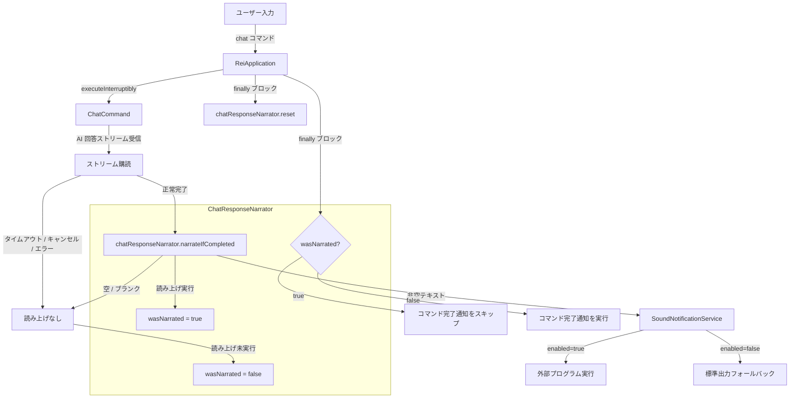
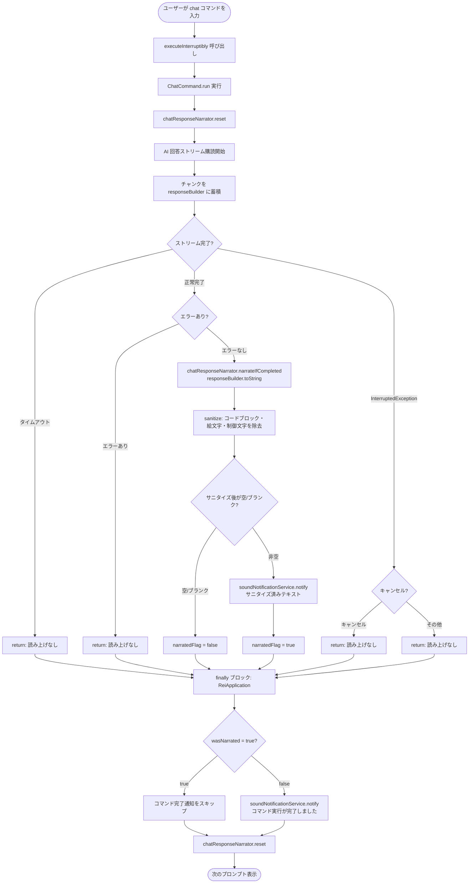

# 設計書: ChatCommand 回答音声読み上げ機能

## 概要

本機能は、AI エージェント「rei」の `ChatCommand` が AI から受け取った回答テキストを `SoundNotificationService` で音声読み上げする機能を追加する。

音声読み上げが実行された場合は、`ReiApplication.executeInterruptibly()` の `finally` ブロックで行われるコマンド完了音声通知（「コマンド実行が完了しました」）を抑制する。これにより、ユーザーは AI の回答を音声で受け取りつつ、重複した音声通知を避けられる。

### 設計方針

- **新規サービス `ChatResponseNarrator` を導入**: `CommandCancellationService` と同様のパターンで、`dev.mikoto2000.rei.sound` パッケージに Spring Bean として作成する
- **読み上げスキップフラグの共有**: `ChatCommand` と `ReiApplication` の間でフラグを共有するために `ChatResponseNarrator` シングルトン Bean を使用する
- **有効/無効判定の委譲**: `ChatResponseNarrator` は `enabled` チェックを行わず、`SoundNotificationService.notify()` に委譲する
- **正常完了時のみ読み上げ**: タイムアウト・キャンセル・エラー時は `narrateIfCompleted()` を呼び出さない
- **テキストサニタイズ**: `notify()` 呼び出し前に絵文字・制御文字・非表示文字を除去し、外部 TTS プログラムの誤動作を防ぐ

---

## アーキテクチャ



---

## コンポーネントとインターフェース

### ChatResponseNarrator（新規作成）

`dev.mikoto2000.rei.sound` パッケージに新規作成する Spring Component。`CommandCancellationService` と同様のパターンで、`ChatCommand` と `ReiApplication` の間でフラグを共有するシングルトン Bean。

#### クラス定義

```java
package dev.mikoto2000.rei.sound;

import java.util.concurrent.atomic.AtomicBoolean;

import org.springframework.stereotype.Component;

import lombok.RequiredArgsConstructor;

@Component
@RequiredArgsConstructor
public class ChatResponseNarrator {

    private final SoundNotificationService soundNotificationService;

    private final AtomicBoolean narratedFlag = new AtomicBoolean(false);

    /**
     * 読み上げスキップフラグをリセットする。
     * ChatCommand の実行開始時に呼び出す。
     */
    public void reset() {
        narratedFlag.set(false);
    }

    /**
     * 回答テキストが非空の場合に音声読み上げを実行し、読み上げスキップフラグを設定する。
     * 読み上げ前に絵文字・制御文字・非表示文字を除去するサニタイズを行う。
     *
     * @param responseText AI 回答テキスト全文
     */
    public void narrateIfCompleted(String responseText) {
        if (responseText == null || responseText.isBlank()) {
            narratedFlag.set(false);
            return;
        }
        String sanitized = sanitize(responseText);
        if (sanitized.isBlank()) {
            narratedFlag.set(false);
            return;
        }
        soundNotificationService.notify(sanitized);
        narratedFlag.set(true);
    }

    /**
     * 音声読み上げに不適切な文字・ブロック・Markdown 記法を除去する。
     *
     * <p>除去・変換の内容:
     * <ul>
     *   <li>Markdown コードブロック（```...```）をブロックごと除去</li>
     *   <li>表（| を含む行）は保持</li>
     *   <li>水平線（--- または *** のみの行）を行ごと除去</li>
     *   <li>見出し（# 〜 ######）の記号を除去してテキストを残す</li>
     *   <li>引用（> ）の記号を除去してテキストを残す</li>
     *   <li>箇条書き（* item）の * を - に置換して残す（- item はそのまま）</li>
     *   <li>太字・斜体（**text**、*text*、__text__、_text_）の記号を除去してテキストを残す</li>
     *   <li>インラインコード（`code`）のバッククォートを除去してテキストを残す</li>
     *   <li>リンク（[text](url)）を text のみに変換</li>
     *   <li>絵文字・記号文字（Unicode So カテゴリ）を除去</li>
     *   <li>サロゲートペア文字（Cs カテゴリ）を除去</li>
     *   <li>未割当文字（Cn カテゴリ）を除去</li>
     *   <li>制御文字（タブ・改行・復帰以外）を除去</li>
     * </ul>
     *
     * @param text 入力テキスト
     * @return サニタイズ済みテキスト
     */
    static String sanitize(String text) {
        return text
            // コードブロック（```...```）をブロックごと除去
            .replaceAll("```[\\s\\S]*?```", "")
            // 表（| を含む行）は保持（削除しない）
            // 水平線（--- または *** のみの行）を行ごと除去
            .replaceAll("(?m)^[ \\t]*(-{3,}|\\*{3,})[ \\t]*$", "")
            // 見出し（# 〜 ######）の記号を除去してテキストを残す
            .replaceAll("(?m)^#{1,6}\\s+", "")
            // 引用（> ）の記号を除去してテキストを残す
            .replaceAll("(?m)^>+\\s?", "")
            // 箇条書き（* item）の * を - に置換（行頭のスペース + * + スペース）
            .replaceAll("(?m)^([ \\t]*)\\*\\s", "$1- ")
            // 太字（**text** または __text__）の記号を除去してテキストを残す
            .replaceAll("\\*\\*(.+?)\\*\\*", "$1")
            .replaceAll("__(.+?)__", "$1")
            // 斜体（*text* または _text_）の記号を除去してテキストを残す
            .replaceAll("\\*(.+?)\\*", "$1")
            .replaceAll("_(.+?)_", "$1")
            // インラインコード（`code`）のバッククォートを除去してテキストを残す
            .replaceAll("`(.+?)`", "$1")
            // リンク（[text](url)）を text のみに変換
            .replaceAll("\\[(.+?)\\]\\(.*?\\)", "$1")
            // 絵文字・記号・サロゲート・未割当文字を除去
            .replaceAll("[\\p{So}\\p{Cs}\\p{Cn}]", "")
            // 制御文字を除去（タブ \t、改行 \n、復帰 \r は残す）
            .replaceAll("[\\x00-\\x08\\x0B\\x0C\\x0E-\\x1F\\x7F]", "");
    }

    /**
     * 読み上げスキップフラグを返す。
     *
     * @return 音声読み上げが実行された場合 true
     */
    public boolean wasNarrated() {
        return narratedFlag.get();
    }
}
```

#### メソッド一覧

| メソッド | 引数 | 戻り値 | 説明 |
|---|---|---|---|
| `reset()` | なし | `void` | 読み上げスキップフラグを `false` にリセットする。`ChatCommand` 実行開始時に呼び出す |
| `narrateIfCompleted(String responseText)` | `responseText`: AI 回答テキスト全文 | `void` | テキストをサニタイズした上で、非空の場合に `SoundNotificationService.notify()` を呼び出し、フラグを `true` に設定する。空/ブランク（サニタイズ後も含む）の場合はフラグを `false` に設定する |
| `sanitize(String text)` | `text`: 入力テキスト | `String` | Markdown 記法（コードブロック・見出し・太字・斜体・リンク・引用・水平線）・絵文字・制御文字を除去し、箇条書き `*` を `-` に変換したテキストを返す（表は保持、`static`） |
| `wasNarrated()` | なし | `boolean` | 読み上げスキップフラグを返す |

---

### ChatCommand への変更

`ChatResponseNarrator` を注入し、実行開始時に `reset()` を呼び出し、正常完了時に `narrateIfCompleted()` を呼び出す。

#### 変更内容

```java
// 追加するフィールド
private final ChatResponseNarrator chatResponseNarrator;

@Override
public void run() {
    cancellationService.begin(Thread.currentThread());
    chatResponseNarrator.reset();  // 追加: 実行開始時にフラグをリセット

    ChatClientRequestSpec requestSpec = chatClient
        .prompt(new Prompt(String.join(" ", prompts),
            OpenAiChatOptions.builder()
                .model(currentModelHolder.get())
                .build()));

    IO.println("=== answer ===");
    CountDownLatch latch = new CountDownLatch(1);
    AtomicReference<Throwable> errorRef = new AtomicReference<>();
    StringBuilder responseBuilder = new StringBuilder();  // 追加: 回答テキスト蓄積用

    Disposable disposable = requestSpec.stream()
        .content()
        .subscribe(
            chunk -> {
                System.out.print(chunk);
                responseBuilder.append(chunk);  // 追加: チャンクを蓄積
            },
            error -> {
                errorRef.set(error);
                latch.countDown();
            },
            latch::countDown);
    cancellationService.register(disposable);

    try {
        boolean completed = latch.await(streamTimeoutMillis(), TimeUnit.MILLISECONDS);
        if (!completed) {
            disposable.dispose();
            log.warn("Chat response timed out after {} ms", streamTimeoutMillis());
            System.out.println();
            IO.println("[error] 回答の取得がタイムアウトしました");
            return;  // 読み上げなし（chatResponseNarrator.narrateIfCompleted は呼ばない）
        }
        System.out.println();
        Throwable error = errorRef.get();
        if (error != null) {
            log.warn("Chat response failed", error);
            IO.println("[error] " + buildUserFacingMessage(error));
            return;  // 追加: エラー時は読み上げなし
        }
        // 正常完了時のみ読み上げを実行
        chatResponseNarrator.narrateIfCompleted(responseBuilder.toString());  // 追加
    } catch (InterruptedException e) {
        if (cancellationService.consumeCancellationRequested()) {
            System.out.println();
            IO.println("[cancelled]");
            return;  // キャンセル時は読み上げなし
        }
        Thread.currentThread().interrupt();
        log.warn("Chat response wait interrupted", e);
        IO.println("[error] 回答待機が中断されました");
    } finally {
        cancellationService.clear();
    }
}
```

**変更点の説明:**
- `ChatResponseNarrator chatResponseNarrator` フィールドを追加（`@RequiredArgsConstructor` で自動注入）
- `run()` 冒頭で `chatResponseNarrator.reset()` を呼び出し、前回の状態をリセット
- `StringBuilder responseBuilder` でストリームのチャンクを蓄積
- 正常完了かつエラーなしの場合のみ `chatResponseNarrator.narrateIfCompleted(responseBuilder.toString())` を呼び出す
- タイムアウト・エラー・キャンセル時は `narrateIfCompleted()` を呼び出さない（フラグは `false` のまま）

---

### ReiApplication への変更

`ChatResponseNarrator` を注入し、`executeInterruptibly()` の `finally` ブロックで読み上げスキップフラグを確認してコマンド完了通知を制御する。

#### フィールド追加

```java
// 既存フィールド（変更なし）
private final RootCommand rootCommand;
private final CommandLine.IFactory factory;
private final ModelHolderService currentModelHolder;
private final EscCancellationMonitor escCancellationMonitor;
private final CommandCancellationService commandCancellationService;
private final AsyncVectorDocumentService asyncVectorDocumentService;
private final SoundNotificationService soundNotificationService;

// 追加するフィールド
private final ChatResponseNarrator chatResponseNarrator;  // 追加
```

#### executeInterruptibly() の変更

```java
// 変更前
protected void executeInterruptibly(CommandLine cmd, Terminal terminal,
    ExecutorService commandExecutor, String... args) throws IOException {
  Attributes originalAttributes = terminal.enterRawMode();
  try {
    var future = commandExecutor.submit(() -> cmd.execute(args));
    escCancellationMonitor.await(future,
        timeoutMillis -> terminal.reader().read(timeoutMillis),
        commandCancellationService::cancel);
  } finally {
    terminal.setAttributes(originalAttributes);
    soundNotificationService.notify(COMMAND_COMPLETION_MESSAGE);
  }
}

// 変更後
protected void executeInterruptibly(CommandLine cmd, Terminal terminal,
    ExecutorService commandExecutor, String... args) throws IOException {
  Attributes originalAttributes = terminal.enterRawMode();
  try {
    var future = commandExecutor.submit(() -> cmd.execute(args));
    escCancellationMonitor.await(future,
        timeoutMillis -> terminal.reader().read(timeoutMillis),
        commandCancellationService::cancel);
  } finally {
    terminal.setAttributes(originalAttributes);
    if (!chatResponseNarrator.wasNarrated()) {  // 追加: 読み上げ済みの場合はスキップ
      soundNotificationService.notify(COMMAND_COMPLETION_MESSAGE);
    }
    chatResponseNarrator.reset();  // 追加: 次回実行のためにリセット
  }
}
```

**変更点の説明:**
- `ChatResponseNarrator chatResponseNarrator` フィールドを追加
- `finally` ブロックで `chatResponseNarrator.wasNarrated()` を確認し、`true` の場合はコマンド完了通知をスキップ
- `finally` ブロックの末尾で `chatResponseNarrator.reset()` を呼び出し、次回実行のためにフラグをリセット
- `ChatCommand` 以外のコマンドでは `narrateIfCompleted()` が呼ばれないため、`wasNarrated()` は常に `false` → コマンド完了通知は従来どおり実行される

---

## データモデル

本機能は新規の永続化データを持たない。既存の `SoundNotificationProperties` の設定値をそのまま利用する。

### ChatResponseNarrator の状態

| フィールド | 型 | 初期値 | 説明 |
|---|---|---|---|
| `narratedFlag` | `AtomicBoolean` | `false` | 音声読み上げが実行されたかどうかのフラグ |

### 利用する既存設定プロパティ

| プロパティキー | 型 | デフォルト値 | 説明 |
|---|---|---|---|
| `rei.sound-notification.enabled` | `boolean` | `false` | 音声通知の有効/無効（`SoundNotificationService` が参照） |
| `rei.sound-notification.command` | `List<String>` | `[]` | 実行するコマンドと引数のリスト（`SoundNotificationService` が参照） |

---

## 処理フロー



---

## 正確性プロパティ

*プロパティとは、システムのすべての有効な実行において成立すべき特性または振る舞いのことです。プロパティは人間が読める仕様と機械で検証可能な正確性保証の橋渡しをします。*

### プロパティ 1: 非空テキストで narrateIfCompleted を呼ぶと読み上げが実行されフラグが true になる

*任意の* 非空・非ブランクの文字列 `responseText` に対して、`narrateIfCompleted(responseText)` を呼び出したとき、`SoundNotificationService.notify()` がサニタイズ済みテキストで呼び出され、かつ `wasNarrated()` が `true` を返す。

**Validates: 要件 1.1, 4.1, 5.1**

### プロパティ 2: ブランクテキストで narrateIfCompleted を呼ぶと読み上げが実行されずフラグが false になる

*任意の* 空文字列またはブランク文字列（空白文字のみで構成される文字列）に対して、`narrateIfCompleted(responseText)` を呼び出したとき、`SoundNotificationService.notify()` が呼び出されず、かつ `wasNarrated()` が `false` を返す。

**Validates: 要件 1.2, 4.2**

### プロパティ 3: 連続実行でリセットが正しく機能する

*任意の* 実行シーケンス（読み上げあり・なしの組み合わせ）に対して、各実行の開始時に `reset()` を呼び出すことで、前回の `wasNarrated()` の状態が次回の実行に影響しない。すなわち、`reset()` を呼び出した直後は常に `wasNarrated()` が `false` を返す。

**Validates: 要件 4.3, 4.4**

### プロパティ 4: サニタイズで Markdown 記法・絵文字・制御文字が除去される

*任意の* テキストに対して、`sanitize()` を呼び出したとき、結果に Markdown コードブロック・見出し記号・太字/斜体記号・インラインコードのバッククォート・リンクの URL・引用記号・水平線・絵文字（Unicode So カテゴリ）・サロゲートペア（Cs カテゴリ）・未割当文字（Cn カテゴリ）・制御文字（タブ・改行・復帰を除く）が含まれない。タブ・改行・復帰、表行、箇条書き `-`、および箇条書き `*` を `-` に変換したものは保持される。

**Validates: 要件 5.2〜5.17**

---

## エラーハンドリング

### ChatCommand 側の方針

`narrateIfCompleted()` は `SoundNotificationService.notify()` を呼び出すが、`SoundNotificationService.notify()` は内部で例外を捕捉して標準出力にフォールバックするため、読み上げの失敗が `ChatCommand.run()` に伝播しない。

| 状況 | 対応 |
|---|---|
| AI 回答テキストが空/ブランク | `narrateIfCompleted()` が読み上げをスキップし、フラグを `false` に設定 |
| サニタイズ後にテキストが空/ブランクになった | `narrateIfCompleted()` が読み上げをスキップし、フラグを `false` に設定 |
| タイムアウト | `narrateIfCompleted()` を呼び出さない。フラグは `false` のまま |
| キャンセル | `narrateIfCompleted()` を呼び出さない。フラグは `false` のまま |
| エラー | `narrateIfCompleted()` を呼び出さない。フラグは `false` のまま |
| `enabled=false` | `SoundNotificationService` が標準出力フォールバック（既存動作）。フラグは `true` に設定される（読み上げ試行済みとして扱う） |
| 外部プログラム実行失敗 | `SoundNotificationService` が標準出力フォールバック（既存動作） |
| 外部プログラムタイムアウト | `SoundNotificationService` がプロセス強制終了 + 標準出力フォールバック（既存動作） |

### ReiApplication 側の方針

`finally` ブロックで `chatResponseNarrator.wasNarrated()` を確認する。`SoundNotificationService.notify()` は例外をスローしない設計のため、通知の失敗はコマンド実行の結果に影響しない。

---

## テスト戦略

### デュアルテストアプローチ

- **単体テスト（例ベース）**: 特定のシナリオ・エッジケース・エラー条件を検証
- **プロパティベーステスト（PBT）**: 普遍的なプロパティを多様な入力で検証

### 単体テスト（例ベース）

#### ChatResponseNarratorTest

| テストケース | 検証内容 | 対応要件 |
|---|---|---|
| 非空テキストで notify が呼ばれる | `narrateIfCompleted("hello")` → `verify(soundNotificationService).notify("hello")` | 1.1 |
| 空文字列で notify が呼ばれない | `narrateIfCompleted("")` → `verifyNoInteractions(soundNotificationService)` | 1.2 |
| ブランク文字列で notify が呼ばれない | `narrateIfCompleted("   ")` → `verifyNoInteractions(soundNotificationService)` | 1.2 |
| タイムアウト時は narrateIfCompleted が呼ばれない | `wasNarrated()` が `false` を返す | 1.3 |
| エラー時は narrateIfCompleted が呼ばれない | `wasNarrated()` が `false` を返す | 1.4 |
| reset 後は wasNarrated が false | `narrateIfCompleted("text")` → `reset()` → `wasNarrated() == false` | 4.3 |

#### ReiApplicationTest（既存テストへの追加）

| テストケース | 検証内容 | 対応要件 |
|---|---|---|
| 読み上げ済みの場合はコマンド完了通知をスキップ | `wasNarrated() == true` → `verify(soundNotificationService, never()).notify(COMMAND_COMPLETION_MESSAGE)` | 2.1 |
| 読み上げ未実行の場合はコマンド完了通知を実行 | `wasNarrated() == false` → `verify(soundNotificationService).notify(COMMAND_COMPLETION_MESSAGE)` | 2.2 |
| ChatCommand 以外のコマンドではコマンド完了通知を実行 | `wasNarrated() == false` → `verify(soundNotificationService).notify(COMMAND_COMPLETION_MESSAGE)` | 2.3 |

### プロパティベーステスト（PBT）

jqwik を使用してプロパティベーステストを実装する。

#### ChatResponseNarratorPropertyTest

| テスト | 対応プロパティ | タグ |
|---|---|---|
| 任意の非空テキストで notify が呼ばれ wasNarrated が true になる | プロパティ 1 | `Feature: chat-response-narration, Property 1: 非空テキストで narrateIfCompleted を呼ぶと読み上げが実行されフラグが true になる` |
| 任意のブランクテキストで notify が呼ばれず wasNarrated が false になる | プロパティ 2 | `Feature: chat-response-narration, Property 2: ブランクテキストで narrateIfCompleted を呼ぶと読み上げが実行されずフラグが false になる` |
| 任意の実行シーケンスで reset 後は wasNarrated が false になる | プロパティ 3 | `Feature: chat-response-narration, Property 3: 連続実行でリセットが正しく機能する` |

**テスト実装上の注意:**
- `SoundNotificationService` は `@Mock` でモック化し、`verify()` で呼び出しを検証する
- プロパティ 1 のジェネレータ: `@ForAll @NotBlank String responseText`（jqwik の `@NotBlank` または `Arbitraries.strings().ofMinLength(1).filter(s -> !s.isBlank())`）
- プロパティ 2 のジェネレータ: 空文字列 + ランダムな空白文字列（`Arbitraries.strings().withCharRange(' ', ' ').ofMinLength(0)`）
- プロパティ 3 のジェネレータ: ランダムな `List<Optional<String>>` で読み上げあり・なしのシーケンスを表現
- 各プロパティテストは最低 100 回実行する（jqwik のデフォルト設定）
