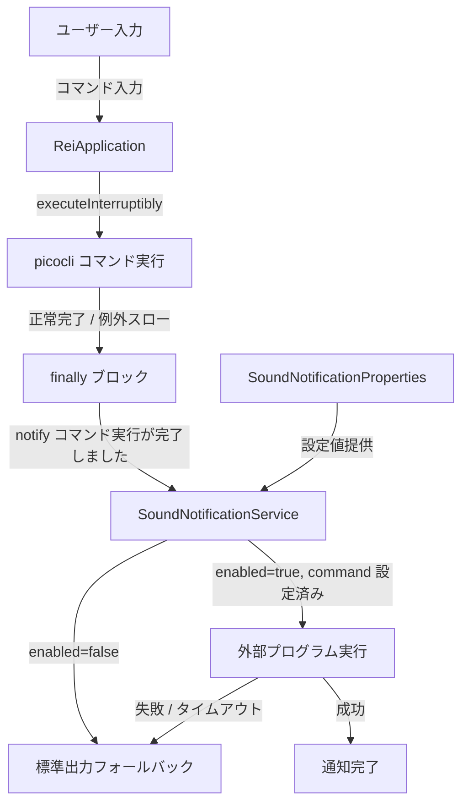
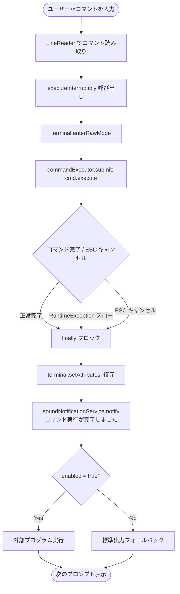

# 設計書: コマンド完了音声通知機能

## 概要

本機能は、AI エージェント「rei」の CLI コマンドが完了した際に「コマンド実行が完了しました」と音声通知する機能を追加する。

既存の `SoundNotificationService` を活用し、`ReiApplication.executeInterruptibly()` メソッドの `finally` ブロックで `soundNotificationService.notify("コマンド実行が完了しました")` を呼び出すことで、すべての picocli コマンドの完了を横断的に検知して音声通知を行う。

### 設計方針

- **最小限の変更**: `ReiApplication` に `SoundNotificationService` を直接注入し、`executeInterruptibly()` の `finally` ブロックに 1 行追加するだけで実現する
- **新規クラス不要**: `CommandCompletionNotifier` という独立したクラスは作成しない。`ReiApplication` への最小限の変更のみ
- **既存フォールバック機構の活用**: `SoundNotificationService` の `enabled=false` 時のフォールバック動作をそのまま利用する。`ReiApplication` は `enabled` の値を意識しない
- **正常・例外どちらでも通知**: `finally` ブロックで呼び出すため、正常完了・`RuntimeException` スローどちらの場合も通知される

---

## アーキテクチャ



---

## コンポーネントとインターフェース

### ReiApplication への変更

`ReiApplication` に `SoundNotificationService` フィールドを追加し、`executeInterruptibly()` の `finally` ブロックで通知を呼び出す。

#### フィールド追加

```java
// 既存フィールド（変更なし）
private final RootCommand rootCommand;
private final CommandLine.IFactory factory;
private final ModelHolderService currentModelHolder;
private final EscCancellationMonitor escCancellationMonitor;
private final CommandCancellationService commandCancellationService;
private final AsyncVectorDocumentService asyncVectorDocumentService;

// 追加するフィールド
private final SoundNotificationService soundNotificationService;  // 追加
```

`@RequiredArgsConstructor` により、Spring が自動的に `SoundNotificationService` を注入する。

#### executeInterruptibly() の変更

```java
// 変更前
private void executeInterruptibly(CommandLine cmd, Terminal terminal,
    ExecutorService commandExecutor, String... args) throws IOException {
  Attributes originalAttributes = terminal.enterRawMode();
  try {
    var future = commandExecutor.submit(() -> cmd.execute(args));
    escCancellationMonitor.await(future,
        timeoutMillis -> terminal.reader().read(timeoutMillis),
        commandCancellationService::cancel);
  } finally {
    terminal.setAttributes(originalAttributes);
  }
}

// 変更後
private void executeInterruptibly(CommandLine cmd, Terminal terminal,
    ExecutorService commandExecutor, String... args) throws IOException {
  Attributes originalAttributes = terminal.enterRawMode();
  try {
    var future = commandExecutor.submit(() -> cmd.execute(args));
    escCancellationMonitor.await(future,
        timeoutMillis -> terminal.reader().read(timeoutMillis),
        commandCancellationService::cancel);
  } finally {
    terminal.setAttributes(originalAttributes);
    soundNotificationService.notify("コマンド実行が完了しました");  // 追加
  }
}
```

**変更点の説明:**
- `finally` ブロックに `soundNotificationService.notify("コマンド実行が完了しました")` を 1 行追加するだけ
- `terminal.setAttributes(originalAttributes)` の後に配置することで、ターミナル状態の復元を優先する
- `SoundNotificationService.notify()` は内部で例外を捕捉するため、通知の失敗が `executeInterruptibly()` の呼び出し元に伝播しない

---

## データモデル

本機能は新規の永続化データを持たない。既存の `SoundNotificationProperties` の設定値をそのまま利用する。

### 利用する既存設定プロパティ

| プロパティキー | 型 | デフォルト値 | 説明 |
|---|---|---|---|
| `rei.sound-notification.enabled` | `boolean` | `false` | 音声通知の有効/無効 |
| `rei.sound-notification.command` | `List<String>` | `[]` | 実行するコマンドと引数のリスト |

### 通知メッセージ

| 定数 | 値 |
|---|---|
| コマンド完了通知メッセージ | `"コマンド実行が完了しました"` |

---

## 処理フロー



---

## 正確性プロパティ

*プロパティとは、システムのすべての有効な実行において成立すべき特性または振る舞いのことです。プロパティは人間が読める仕様と機械で検証可能な正確性保証の橋渡しをします。*

### プロパティ 1: コマンド実行結果によらず固定メッセージで通知される

*任意の* コマンド引数と実行結果（正常完了・RuntimeException スロー）に対して、`executeInterruptibly()` が完了したとき、`SoundNotificationService.notify()` が常に「コマンド実行が完了しました」というメッセージで呼び出される。

**Validates: 要件 1.1, 1.2, 3.1, 3.2**

---

## エラーハンドリング

### ReiApplication 側の方針

`executeInterruptibly()` の `finally` ブロックで `soundNotificationService.notify()` を呼び出す。`SoundNotificationService.notify()` は内部で例外を捕捉して標準出力にフォールバックするため、通知の失敗が `executeInterruptibly()` の呼び出し元に伝播しない。

| 状況 | 対応 |
|---|---|
| `enabled=false` | `SoundNotificationService` が標準出力フォールバック（既存動作） |
| `command` が空リスト | `SoundNotificationService` が標準出力フォールバック（既存動作） |
| 外部プログラム実行失敗 | `SoundNotificationService` が標準出力フォールバック（既存動作） |
| 外部プログラムタイムアウト | `SoundNotificationService` がプロセス強制終了 + 標準出力フォールバック（既存動作） |

### 通知失敗時の影響範囲

`SoundNotificationService.notify()` は例外をスローしない設計のため、通知の失敗はコマンド実行の結果に影響しない。ユーザーは通知が失敗しても通常通り次のコマンドを入力できる。

---

## テスト戦略

### 単体テスト（例ベース）

`ReiApplicationTest` として実装する。`SoundNotificationService` を Mockito でモック化し、`executeInterruptibly()` の呼び出し後に `verify()` で通知が行われたことを確認する。

- 正常完了時に `notify("コマンド実行が完了しました")` が呼ばれること
- `RuntimeException` スロー時にも `notify("コマンド実行が完了しました")` が呼ばれること
- 複数の異なるコマンド（`chat`、`briefing today` など）でそれぞれ通知が呼ばれること（要件 1.3 の横断的通知の確認）

### プロパティベーステスト（PBT）

jqwik を使用してプロパティベーステストを実装する。

`ReiApplicationPropertyTest` として実装する。

| テスト | 対応プロパティ | タグ |
|---|---|---|
| 任意のコマンド引数（正常完了・例外スロー）で固定メッセージの通知が呼ばれる | プロパティ 1 | `Feature: command-completion-sound-notification, Property 1: コマンド実行結果によらず固定メッセージで通知される` |

**テスト実装上の注意:**
- `SoundNotificationService` は `@Mock` でモック化し、`verify(soundNotificationService).notify("コマンド実行が完了しました")` で検証する
- `CommandLine` の実行はスタブ化し、正常完了（`0` を返す）と例外スロー（`RuntimeException` をスロー）の両パターンを生成する
- `Terminal` は `TerminalBuilder.builder().dumb(true).build()` で生成するか、モック化する
- 各プロパティテストは最低 100 回実行する（jqwik のデフォルト設定）

---

## 追補設計 (2026-05-08): model / models の通知スキップ

### 設計方針
- `ReiApplication.executeInterruptibly(..., String... args)` の `finally` で通知する直前に、コマンド名ベースのスキップ判定を追加する。
- 既存の `chatResponseNarrator.wasNarrated()` 判定はそのまま維持し、条件を合成する。

### 仕様詳細
- 追加メソッド: `shouldSkipCompletionNotification(String... args)`
- 判定条件:
1. `args` が空または先頭が `null` の場合は `false`
2. 先頭引数が `"model"` または `"models"` の場合は `true`
3. それ以外は `false`

- 通知実行条件（更新後）:
- `!chatResponseNarrator.wasNarrated() && !shouldSkipCompletionNotification(args)`

### テスト方針
- `ReiApplicationCommandNotificationTest` に以下を追加:
1. `model` 実行時は `notify(COMMAND_COMPLETION_MESSAGE)` が呼ばれない
2. `models` 実行時は `notify(COMMAND_COMPLETION_MESSAGE)` が呼ばれない
3. 既存ケース（通常コマンド時の通知、narrated時のスキップ）は回帰しない
