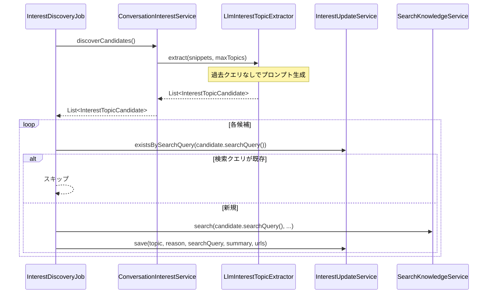
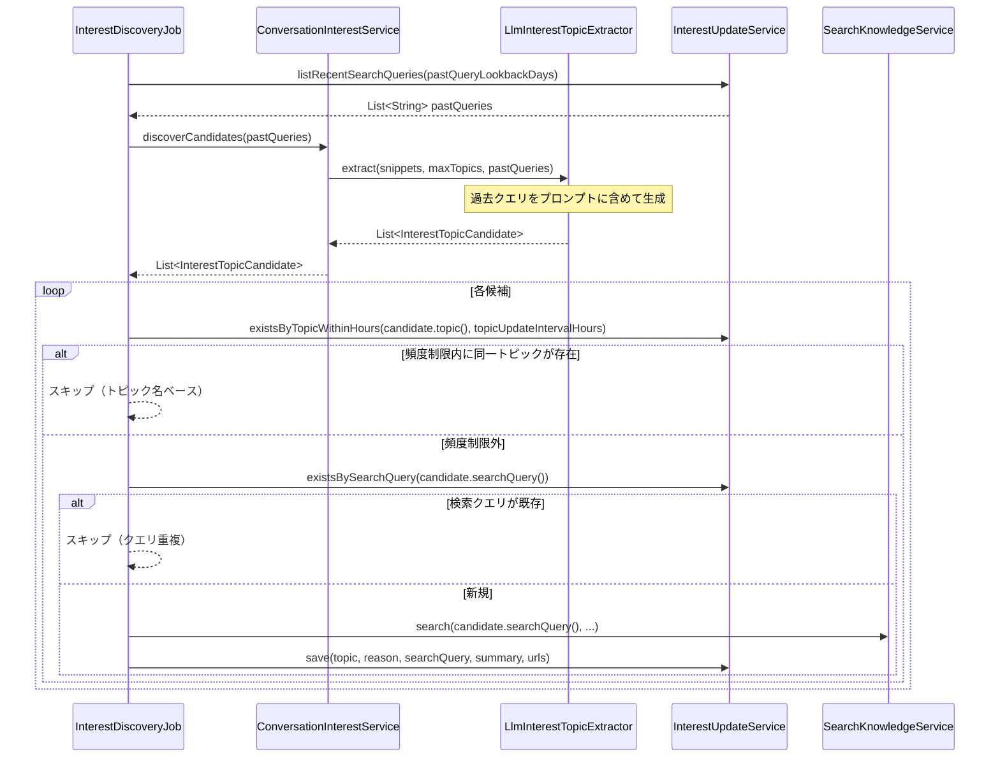

# 設計書: Interest Discovery（興味関心発見）機能

## 概要

本設計書は、要件 2「興味関心トピックの Web 検索と更新」および要件 2-A「過去クエリを考慮した検索クエリ生成」（D案）の実装設計を記述する。

### D案の概要

D案は以下の 2 つの改善を組み合わせたものである。

- **A案（過去クエリコンテキスト）**: トピック候補の検索クエリ生成時に、過去 N 日間の検索クエリ一覧を LLM に渡し、重複しない新しい角度のクエリを生成させる
- **C案（トピック更新頻度制限）**: 同一トピック名の更新情報が `rei.interest.topic-update-interval-hours` 時間以内に存在する場合はスキップする

### 変更の目的

現在の実装では以下の問題がある。

1. `InterestDiscoveryJob` が `existsBySearchQuery(searchQuery)` で完全一致チェックのみ行うため、同一トピックでも検索クエリが少し変わると重複して実行される
2. `LlmInterestTopicExtractor.buildPrompt()` が過去クエリを考慮しないため、毎回同じ角度のクエリが生成されやすい
3. `InterestProperties` に頻度制限や過去クエリ参照期間のプロパティが存在しない

---

## アーキテクチャ

### 変更対象コンポーネント

```
rei.interest パッケージ
├── InterestProperties          ← topicUpdateIntervalHours, pastQueryLookbackDays を追加
├── InterestUpdateService       ← existsByTopicWithinHours(), listRecentSearchQueries() を追加
├── InterestTopicExtractor      ← extract() シグネチャに pastQueries を追加
├── LlmInterestTopicExtractor   ← buildPrompt() に過去クエリセクションを追加
├── ConversationInterestService ← discoverCandidates() に pastQueries を渡す
└── InterestDiscoveryJob        ← スキップ判定変更、過去クエリ取得を追加
```

### 変更前後のシーケンス図

#### 変更前: InterestDiscoveryJob の処理フロー



#### 変更後: InterestDiscoveryJob の処理フロー（D案）



---

## コンポーネントとインターフェース

### InterestProperties の変更

**追加プロパティ:**

```java
// rei.interest.topic-update-interval-hours
// 同一トピック名の更新を再実行するまでの最小間隔（時間）
// デフォルト: 24
private int topicUpdateIntervalHours = 24;

// rei.interest.past-query-lookback-days
// 過去クエリコンテキストとして LLM に渡す検索クエリの参照期間（日数）
// デフォルト: 7
private int pastQueryLookbackDays = 7;
```

**設定例（application.yml）:**

```yaml
rei:
  interest:
    enabled: true
    topic-update-interval-hours: 24   # 同一トピックの再検索間隔（時間）
    past-query-lookback-days: 7       # 過去クエリ参照期間（日数）
```

---

### InterestUpdateService の変更

**追加メソッド:**

```java
/**
 * 指定トピック名の更新情報が指定時間以内に存在するかを確認する。
 * 同一トピックへの過剰な検索を防ぐ頻度制限チェックに使用する。
 *
 * @param topic 確認するトピック名
 * @param hours 確認する時間範囲（現在時刻から遡る時間数）
 * @return 指定時間以内に同一トピックの更新情報が存在する場合 true
 */
public boolean existsByTopicWithinHours(String topic, int hours);

/**
 * 指定日数以内に保存された検索クエリをすべて返す。
 * LLM への過去クエリコンテキストとして使用する。
 *
 * @param days 参照する日数（現在時刻から遡る日数）
 * @return 指定日数以内の検索クエリ一覧（重複なし）
 */
public List<String> listRecentSearchQueries(int days);
```

**実装詳細:**

`existsByTopicWithinHours` は `interest_updates` テーブルの `topic` カラムと `created_at` カラムを使用する。

```sql
SELECT COUNT(*) FROM interest_updates
WHERE topic = ? AND created_at >= ?
```

`listRecentSearchQueries` は `interest_updates` テーブルから指定日数以内の `search_query` を取得する。

```sql
SELECT DISTINCT search_query FROM interest_updates
WHERE created_at >= ?
ORDER BY created_at DESC
```

---

### InterestTopicExtractor インターフェースの変更

**変更前:**

```java
public interface InterestTopicExtractor {
  List<InterestTopicCandidate> extract(List<ConversationSnippet> snippets, int maxTopics);
}
```

**変更後:**

```java
public interface InterestTopicExtractor {
  List<InterestTopicCandidate> extract(List<ConversationSnippet> snippets, int maxTopics);

  /**
   * 過去クエリコンテキストを考慮してトピック候補を抽出する。
   *
   * @param snippets   会話スニペット一覧
   * @param maxTopics  最大トピック数
   * @param pastQueries 過去 N 日間に使用した検索クエリ一覧（重複回避に使用）
   * @return 抽出されたトピック候補一覧
   */
  default List<InterestTopicCandidate> extract(
      List<ConversationSnippet> snippets,
      int maxTopics,
      List<String> pastQueries) {
    return extract(snippets, maxTopics);
  }
}
```

後方互換性のため、`pastQueries` なしの既存シグネチャはデフォルトメソッドとして残す。

---

### LlmInterestTopicExtractor の変更

**変更後のシグネチャ:**

```java
@Override
public List<InterestTopicCandidate> extract(
    List<ConversationSnippet> snippets,
    int maxTopics,
    List<String> pastQueries);
```

**buildPrompt() の変更:**

過去クエリが存在する場合、プロンプトに以下のセクションを追加する。

```
過去に使用した検索クエリ（これらと重複・類似しない新しい角度のクエリを生成すること）:
- [過去クエリ 1]
- [過去クエリ 2]
...
```

**変更後のプロンプト構造:**

```java
private String buildPrompt(List<ConversationSnippet> snippets, int maxTopics, List<String> pastQueries) {
    String conversation = /* 既存の会話フォーマット */;

    String pastQueriesSection = pastQueries.isEmpty()
        ? ""
        : """

          過去に使用した検索クエリ（これらと重複・類似しない新しい角度のクエリを生成すること）:
          %s
          """.formatted(pastQueries.stream()
              .map(q -> "- " + q)
              .collect(Collectors.joining("\n")));

    return """
        あなたはユーザーの過去会話から、今後 Web 検索して知らせる価値のある話題だけを抽出します。

        制約:
        - 出力は JSON 配列のみ
        - 最大 %d 件
        - 一時的な雑談、単発の依頼、あいさつは除外
        - private な内容や固有の個人情報は一般化
        - 各要素は topic, reason, searchQuery, score を持つ
        - score は 0.0 から 1.0
        - 該当がなければ [] を返す
        %s
        会話:
        %s
        """.formatted(maxTopics, pastQueriesSection, conversation);
}
```

---

### ConversationInterestService の変更

**変更後のシグネチャ:**

```java
/**
 * 過去クエリコンテキストを考慮してトピック候補を発見する。
 *
 * @param pastQueries 過去 N 日間に使用した検索クエリ一覧
 * @return スコアフィルタ・件数制限済みのトピック候補一覧
 */
public List<InterestTopicCandidate> discoverCandidates(List<String> pastQueries);
```

既存の `discoverCandidates()` は後方互換性のため `discoverCandidates(List.of())` に委譲するデフォルト実装として残す。

---

### InterestDiscoveryJob の変更

**変更点:**

1. `discover()` メソッドの先頭で `listRecentSearchQueries(pastQueryLookbackDays)` を呼び出す
2. `discoverCandidates()` を `discoverCandidates(pastQueries)` に変更
3. スキップ判定を `existsBySearchQuery` から `existsByTopicWithinHours` に変更（トピック名ベースの頻度制限）
4. 頻度制限を通過した場合のみ `existsBySearchQuery` で検索クエリの重複チェックを行う

**変更後の `discover()` メソッドの主要部分:**

```java
private List<InterestUpdate> discover(boolean force, Consumer<String> progressListener) {
    if (!force && !properties.isEnabled()) {
        return List.of();
    }

    // 過去クエリを取得して LLM コンテキストに渡す（A案）
    List<String> pastQueries = interestUpdateService.listRecentSearchQueries(
        properties.getPastQueryLookbackDays());

    List<InterestTopicCandidate> candidates = conversationInterestService.discoverCandidates(pastQueries);

    for (InterestTopicCandidate candidate : candidates) {
        // C案: トピック名ベースの頻度制限チェック
        if (interestUpdateService.existsByTopicWithinHours(
                candidate.topic(), properties.getTopicUpdateIntervalHours())) {
            progressListener.accept("頻度制限内のためスキップ: " + candidate.topic());
            continue;
        }
        // 既存: 検索クエリの重複チェック
        if (interestUpdateService.existsBySearchQuery(candidate.searchQuery())) {
            progressListener.accept("既存クエリのためスキップ: " + candidate.topic());
            continue;
        }
        // Web 検索と保存（既存ロジック）
        // ...
    }
}
```

---

## データモデル

### interest_updates テーブル（変更なし）

既存のスキーマをそのまま使用する。新しいメソッド（`existsByTopicWithinHours`、`listRecentSearchQueries`）は既存の `topic` カラムと `created_at` カラムを活用する。

```sql
CREATE TABLE IF NOT EXISTS interest_updates (
  id INTEGER PRIMARY KEY AUTOINCREMENT,
  topic TEXT NOT NULL,
  reason TEXT NOT NULL,
  search_query TEXT NOT NULL UNIQUE,
  summary TEXT NOT NULL,
  source_urls TEXT NOT NULL,
  created_at TEXT NOT NULL
)
```

### InterestProperties の新フィールド

| プロパティキー | フィールド名 | 型 | デフォルト値 | 説明 |
|---|---|---|---|---|
| `rei.interest.topic-update-interval-hours` | `topicUpdateIntervalHours` | `int` | `24` | 同一トピック名の再検索最小間隔（時間） |
| `rei.interest.past-query-lookback-days` | `pastQueryLookbackDays` | `int` | `7` | 過去クエリ参照期間（日数） |

---

## 正確性プロパティ

*プロパティとは、システムのすべての有効な実行において成立すべき特性または振る舞いのことである。プロパティは人間が読める仕様と機械検証可能な正確性保証の橋渡しをする。*

### Property 1: 過去クエリがプロンプトに含まれる

*任意の* 過去クエリリストに対して、`buildPrompt()` が生成するプロンプト文字列はそのリスト内のすべてのクエリを含む。

**Validates: Requirements 2-A.1**

---

### Property 2: 過去クエリ一覧は指定日数以内のものだけを返す

*任意の* 日数 N と、N 日以内および N 日超の作成日時を持つ検索クエリレコードの混在データに対して、`listRecentSearchQueries(N)` は N 日以内のクエリのみを返す。

**Validates: Requirements 2-A.3**

---

### Property 3: 頻度制限内のトピックはスキップされる

*任意の* トピック名と頻度制限時間に対して、`existsByTopicWithinHours(topic, hours)` が `true` を返す場合、`InterestDiscoveryJob` はそのトピックの Web 検索を実行しない。

**Validates: Requirements 2.2**

---

### Property 4: 既存検索クエリはスキップされる

*任意の* 検索クエリに対して、`existsBySearchQuery(searchQuery)` が `true` を返す場合、`InterestDiscoveryJob` はその検索クエリで Web 検索を実行しない。

**Validates: Requirements 2-A.4**

---

### Property 5: 保存データの完全性

*任意の* `InterestTopicCandidate` と Web 検索結果に対して、`InterestUpdateService.save()` に渡される `topic`・`reason`・`searchQuery` は候補オブジェクトの対応フィールドと一致する。

**Validates: Requirements 2.3**

---

## エラーハンドリング

### 既存の方針（変更なし）

`InterestDiscoveryJob.discover()` は各候補の処理を `try-catch` で囲み、1 件の失敗がジョブ全体を止めないようにしている。この方針は変更しない。

### 新規追加メソッドのエラーハンドリング

| メソッド | エラー条件 | 対応 |
|---|---|---|
| `existsByTopicWithinHours()` | DB アクセス失敗 | `DataAccessException` をそのままスロー（呼び出し元の `try-catch` で捕捉） |
| `listRecentSearchQueries()` | DB アクセス失敗 | `DataAccessException` をそのままスロー（ジョブ全体が停止するが、過去クエリなしで続行するよりも安全） |
| `buildPrompt()` with pastQueries | `pastQueries` が `null` | `NullPointerException` を防ぐため、呼び出し元で `List.of()` を渡す規約とする |

### `listRecentSearchQueries()` の失敗時の考慮

過去クエリ取得に失敗した場合、空リストにフォールバックして処理を継続するか、例外をスローするかは実装時に判断する。安全側に倒すなら空リストフォールバックが望ましい。

---

## テスト戦略

### ユニットテスト

以下の具体的なシナリオをユニットテストでカバーする。

- `InterestProperties` のデフォルト値が正しいこと（`topicUpdateIntervalHours=24`、`pastQueryLookbackDays=7`）
- `enabled=false` の場合に `InterestDiscoveryJob.run()` が何も実行しないこと
- `pastQueries` が空の場合、プロンプトに過去クエリセクションが含まれないこと
- `pastQueries` が存在する場合、プロンプトに重複回避の指示文が含まれること

### プロパティベーステスト

プロパティベーステストには [jqwik](https://jqwik.net/) を使用する。各プロパティテストは最低 100 回のイテレーションで実行する。

各テストには以下の形式でタグを付与する:
**Feature: interest-discovery, Property {番号}: {プロパティ内容}**

#### Property 1 のテスト実装方針

```
// Feature: interest-discovery, Property 1: 過去クエリがプロンプトに含まれる
@Property
void pastQueriesAreIncludedInPrompt(@ForAll List<@AlphaChars String> pastQueries) {
    // LlmInterestTopicExtractor の buildPrompt() を呼び出し
    // 各クエリが結果文字列に含まれることを検証
}
```

#### Property 2 のテスト実装方針

```
// Feature: interest-discovery, Property 2: 過去クエリ一覧は指定日数以内のものだけを返す
@Property
void listRecentSearchQueriesReturnsOnlyWithinDays(@ForAll @IntRange(min=1, max=30) int days) {
    // days 日以内と days 日超のレコードを混在させて保存
    // listRecentSearchQueries(days) が days 日以内のものだけを返すことを検証
}
```

#### Property 3 のテスト実装方針

```
// Feature: interest-discovery, Property 3: 頻度制限内のトピックはスキップされる
@Property
void topicWithinIntervalIsSkipped(@ForAll String topic, @ForAll @IntRange(min=1, max=168) int hours) {
    // existsByTopicWithinHours が true を返すモックを設定
    // searchKnowledgeService.search が呼ばれないことを検証
}
```

#### Property 4 のテスト実装方針

```
// Feature: interest-discovery, Property 4: 既存検索クエリはスキップされる
@Property
void existingSearchQueryIsSkipped(@ForAll @AlphaChars String searchQuery) {
    // existsBySearchQuery が true を返すモックを設定
    // searchKnowledgeService.search が呼ばれないことを検証
}
```

#### Property 5 のテスト実装方針

```
// Feature: interest-discovery, Property 5: 保存データの完全性
@Property
void savedDataMatchesCandidate(@ForAll InterestTopicCandidate candidate) {
    // モックの SearchKnowledgeService が結果を返すよう設定
    // save() に渡された topic/reason/searchQuery が候補と一致することを検証
}
```

### インテグレーションテスト

- `InterestUpdateService` の `existsByTopicWithinHours()` と `listRecentSearchQueries()` を実際の SQLite DB（H2 または SQLite インメモリ）で動作確認
- `InterestDiscoveryJob` のエンドツーエンドフロー（モック SearchKnowledgeService 使用）
