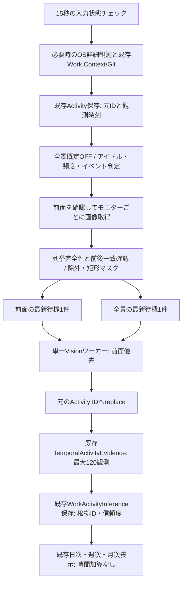

# デスクトップ補助情報と時系列統合

## 調査（2026-10-11、main be301f48）

未マージPRなし。main/origin/main一致。既存worktreeは変更しない。
作業中のmain更新`bd81c273`（起動スクリプトのみ）も取り込んだ。
15秒軽量観測、前面の実行中1件＋最新待機1件、開始間隔30秒・再解析300秒、
Work Context/Gitの観測時点スナップショット、TemporalActivityEvidenceと推定保存、
日次・週次・月次集計は実装済み。これらを再利用する。
全景は既定OFF、300秒。EVIDENCE_FIRSTでは初回から定期実行、旧VISION_FIRSTでは
画像変化が必要。別ワーカーにより前面と並列実行し得る。
Robotはモニターごとの画像とAWTデバイスIDを取得（Windows版JDKでは列挙番号由来）。
全景候補は元観測の候補配列へ追加され、保存は既存SQLite JSONのreplace。
保持は既存Activity保持機構、画像は既定非保存・保存時3日。全景向けマスキングなし。
可視ウィンドウ列挙は最大32件で失敗を無視するため、現在の情報だけで安全な全景送信は保証できない。

## 実装方針

Phase 1: 同一固定観測のA/B/C比較を既存評価クラスへ追加。ラベルなしに精度改善を断定しない。
Phase 2: 既存パイプライン内で前面・全景の待機枠各1件、単一Vision実行、前面優先。
全景は300秒定期と文脈変化・頻繁切替イベント、最低60秒・最大6開始/時。
送信前に対象モニター選択、既存除外設定と任意矩形を画像コピーへマスキング。
列挙が不完全なら全景を送信しない。アイドルと古い要求を抑制。
Phase 3: 既存VisionDiagnosticsに補助候補を保持し主活動配列へ追加しない。
既存TemporalActivityEvidenceに時刻・モニター・入力・補助候補を統合し、既存要約へ反映する。
SQL保存機構は追加しない。観測ID/観測時刻に関連付け、時間加算なし。

テストは各PhaseでRed→Green→Refactor。実機LLM/GPU性能と合成評価を区別する。

## 変更後のフロー



全景ONでは旧VISION_FIRST経路もメタデータ先行のパイプラインへ送る。
全景OFFの旧経路・前面の最新要求制御は維持する。実行中の全景は安全に完了させるため、
その間に届く前面要求は待つ。Vision処理を強制中断せず、次の仕事から前面を優先する。
別GPUワーカーは増やさない。既存constructorのbackgroundExecutor引数は互換性のため維持する。

全景は通常300秒、文脈revision/branch・可視ウィンドウ配置の変化・60秒内3回以上の
前面ID切替で前倒し可能。予約・実際の開始とも最低60秒、各ローリング1時間最大6件。
15秒ポーリングで検出できない短時間A/B/Aやウィンドウ移動は検出できない。
信頼できる最終入力情報で60秒以上無操作またはロックなら全景を抑制する。
無操作は離席の確定事実として扱わない。時刻が不確実ならその理由だけでアイドルとは判断しない。
待機中の全景は観測からbackground-analysis-interval-secondsを超えると破棄する。
pause/closeで両待機枠と世代を無効化し、遅い完了結果を公開しない。

## 保存・根拠・時間

新規SQLiteテーブルなし。既存Activity JSONの`visionDiagnostics.background.context`に
`observationId`, `observedAt`, モニターID付き候補（最大3件）, confidence（最大0.7）を保存する。
候補は推定で、主活動の`inference.activities`へ追加しない。主活動・記録時間・集計は変更しない。
解析開始/完了は既存`Timing.startedAt/completedAt`、画像取得時刻は`imageCapturedAt`。
観測時刻は元レコード`capturedAt`で関連付ける。古い完了は元IDへだけ反映し現在の比較基準を上書きしない。
旧JSONの追加フィールド欠落はnullとして読む。補助情報は既存Activity保持期間に従う。

TemporalはWork Context/Git、前面、入力のrecent/reliable、補助候補を取り込む。
全景の出典ID・観測時刻一致と300秒以内の鮮度を確認し、ウィンドウ末尾より後の完了を採用しない。
文脈が混在、長い観測空白、アイドル、低信頼度、プロジェクト根拠不足なら具体的推定へ進まない。
ブラウザにプロジェクト名がない場合も、同じ観測時Project IDの中にプロジェクトが
対応付けられた前面の開発活動があれば、開発/調査/文書系の画面を低い信頼度0.55で関連付ける。
候補が別プロジェクトを明示する場合や娯楽が混在する場合は、この関連付けを行わない。
プロジェクト候補がすべて一致する既存の推定は0.6を維持する。
前面の開発とテスト関連表示が揃う場合は、実装・検証の目的候補を断定せず記述する。
補助タイトルは同じプロジェクト候補かつ開発/調査/文書系だけをルール要約へ含める。
放置動画などの背景娯楽を操作時間や目的として扱わない。信頼度は校正された確率ではない。
要約の推定には元観測ID一覧と推定refで根拠を追跡できる。
既存Timelineのverbose表示でも、補助候補・モニター・元ID/時刻・信頼度を
「補助画面の推定（時間加算なし）」として表示する。内容は長さ制限・機密検出と
インラインコード化を行い、候補中のMarkdown画像や命令を実行しない。

## 設定・プライバシー

既存設定を明示して起動設定YAMLへ追加し、アプリを再起動する。

```yaml
rei:
  activity:
    work-context-enabled: false # 既存設定。Project/Git連携は明示trueにする
    detection:
      background-full-screen-enabled: false # 明示ONにする場合だけtrue
    background-analysis-interval-seconds: 300
    desktop-context:
      monitors: [] # 全接続モニター。指定時は保存済みWindows monitor interface IDを使用
      masks: [] # 任意機密領域: monitor, x, y, width, height
    keep-screenshots: false
    keep-on-extraction-failure: false
    screenshot-retention-days: 3
```

追加設定はモニター選択（最大16 ID）と矩形マスク（最大64）の2項目だけ。
矩形は指定モニターの物理ピクセル左上を原点とする相対座標で、幅・高さは正値。
例: `{monitor: 'device-id', x: 0, y: 0, width: 500, height: 300}`。
既存excluded-processes/excluded-window-title-patternsを全景にも適用し、モデル送信前に
画像コピー上で黒塗りする（除外ウィンドウ境界へ16pxの余白）。元画像は変更しない。
モニターID・boundsは保存されたObservation/候補で確認できる。
全景ONでは、WindowsのEnumDisplayDevices(EDD_GET_DEVICE_INTERFACE_NAME)から取得した
モニターデバイスインターフェースIDを、物理boundsでRobot画像へ対応付ける。
列挙番号への依存を避け、不明・重複・配置不一致時は送信を省略する。
対象が切断された場合はそのモニターを送らない。全指定IDが不在なら全景を省略する。
AWTのIDはWindows版JDKでは列挙番号由来のため全景ON時には使わない。
デバイスインターフェースIDはOSによるモニター識別で、接続ポート変更や再インストールを超える
恒久的な物理機器の同一性までは保証しない。

可視ウィンドウは最大256件まで列挙し、取得失敗・上限到達・前後差分では完全とは扱わない。
全景ON時は不完全な列挙や前面境界不明なら画像送信/保存を省略し、保存済みOS観測は維持する。
前面だけの解析にも同じマスクを適用する。機密領域を持つユーザーは矩形マスクを併用する。
列挙・画像取得はOSの原子的スナップショットではなく、その途中だけ現れるウィンドウや
ウィンドウ以外のOSオーバーレイの完全検出は保証しない。既定OFFを維持する。
ログは時刻・ID・件数・エラー種別を中心にし、画像/API本文/ウィンドウ内容を追加しない。

## 再現評価

`ActivityQualityEvaluation.compareDesktop`へ同一の観測リスト（最大120件）を渡す。
Aは前面、Bは前面+全景補助、Cは既存Temporal推定を追加する。
候補増加、主活動/記録時間不変、論理呼出し数、Timingによる待機/処理/鮮度を比較できる。
再解析・LLM・ファイル保存は行わない。Timing欠落の場合の0は測定なしを含み、
CPU/RSS/SSD I/OはこのAPIでは測定しない。
正解ラベルなしでは品質/意図推定精度の改善は断定できない。
手動ラベル評価は既存ActivityQualityEvaluation.Case/ConfirmedFactの投影評価と併用する。

固定fixture `src/test/resources/evaluation/activity-desktop-context.json` の8ケースは
IDE+仕様/テスト、放置動画、調査→IDE、頻繁切替、複数モニター、アイドル、遅延、欠落。
テストはフェイクClock/固定extractor/モック保存を使い外部モデルの揺らぎに依存しない。

最終検証（Windows/JDK 25、2026-10-11）: 追加5クラス30テストを含む
既存CIハーネス`full-test.ps1`/Maven `-Pfull`は4,700件、失敗0、エラー0、
スキップ2、BUILD SUCCESS（14分34秒）。liveモデル試験はfullプロファイルの対象外。
各Phaseで新規テストのRedを確認し実装後Greenにした。マスク・キュー・保存/旧JSON・
遅延/欠落/失敗・時間不変・Temporal連携・表示の回帰を含む。
PowerShell構文と埋込みWin32 C#のコンパイルも確認したが、実画面送信はしていない。

## 性能・制限

通常の補助頻度300秒を変えずに並列Visionを1件へ制限することでGPU同時消費を抑える設計。
画像は実行中と各最新待機枠の範囲でのみメモリ保持し、全景の選択はマスク済み画像を共有する。
既定画像保存は0。評価そのものの画像・JSONファイル書込みは0。
5分間の固定入力・モック保存ケースはOS観測21件、前面Vision2回、全景Vision2回、
合計4回、同時最大1件、最新待機枠2件、画像保存0件。前面のみのAは2回。
これは呼出し制御と観測保持の検証で、実モデルの性能・精度改善を示す測定ではない。
Windowsネイティブ入力プローブ1000回の今回の測定は中央値18.40μs、p95 86.80μs、
PowerShell起動0回、スクリーンショット0回。既存プローブの再測定であり本変更による高速化ではない。
実LLM/GPUの応答時間・CPU・RSS・SSD I/O・実利用推定精度は未測定。
保守的な列挙判定により全景実行率が低くなる可能性は、実環境で測定して改善する。
高解像度文字のROI選択と、異なる接続ポート間で同じ物理モニターを追跡する対応は未実装。前面の既存cropは再利用する。

モニターID取得の公式仕様: [EnumDisplayDevicesW](https://learn.microsoft.com/en-us/windows/win32/api/winuser/nf-winuser-enumdisplaydevicesw)。
