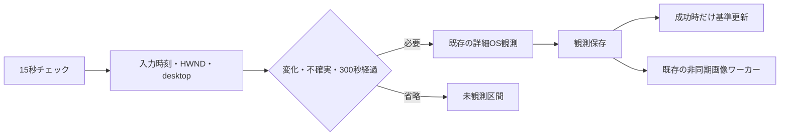

# 入力状態による軽量デスクトップ観測

## 処理と設定

`rei.activity.observation.input-aware-enabled=true`、`interval-seconds=15`、
`max-observation-interval-seconds=300` が既定値。
従来の `capture-interval-seconds=60` は無効時の間隔・記録長として維持する。
無効化すれば従来の EVIDENCE_FIRST / VISION_FIRST 経路へ戻る。
画像認識キュー最適化は[別設定](activity-vision-queue.md)で、全最適化の切戻しにはそちらも無効にする。

15秒ごとに JNA で最終入力の32ビット値、64ビット uptime、前面 HWND、
入力 desktop の名前を読む。入力内容、キー、クリック、音声内容は取得・保存しない。
JNA 5.17.0 は既存依存と同じ版を直接宣言する。
初回、入力値・HWND・desktop の変化、再開、Computer Use 進捗、音声状態イベント、
時刻不連続、取得失敗、最後の成功から300秒で詳細観測する。
タイトルとプロセスは既存 PowerShell 詳細観測で補足する。

開始時の入力状態と終了時の入力状態を比較する。保存失敗は次回再試行し、
実行中に受けた強制要求は消去しない。多重観測を開始しない。
最適化された VISION_FIRST も OS 観測を先に保存し、未知分類を画像で補足する。
基本記録の保存成功と任意の画像保存・補足の成功は別に扱う。

## 時間・集計・観測限界

`dwTime` は符号なし32ビットで等価性比較するため、周回や逆行も変化として扱う。
現在 uptime 下位32ビットとの剰余差が半周を超える場合は不確実として省略しない。
64ビット uptime の逆行、壁時計との不整合、2ポーリングを超える空白は強制観測する。
`QueryUnbiasedInterruptTime` の稼働時間との差が1秒を超えて増加すると、
短いスリープ・休止からの復帰として強制観測する。ポーリング空白と睡眠を混同しない。
稼働時間API失敗時も省略しない。睡眠・監視停止の時間に活動内容を割り当てない。

OS事実は既存 `Detection.evidence`、推定は `Inference` に分離する。
軽量対応環境の記録長は最大15秒。省略区間は未観測で、前回の活動を延長しない。
既存 Summary / Session の observedSeconds は記録長の和を用いるため、
表示上セッションが連結されても空白時間は加算されない。DB移行は不要。
入力がないことは離席や活動停止を意味しない。

Winlogon desktop が取得できた場合のみロックと判定する。アクセス拒否や
前面NULLは不明として詳細経路の既存プライバシー判定へ戻す。
WTS通知は HWND と message loop が必要で、サーバーには専用 HWND がないため
追加しない。短いロック・解除、同一HWND内のタイトル変化、ポーリング間のA/B/A切替、
RDP接続状態は完全には取得できない。300秒の更新で補足する。
無対応OSでも取得失敗を成功扱いしない。

## 検証と性能

`InputAwareObservationTest` はフェイクClockで周回、逆行、失敗、再開、ロック解除、
実行中変化、多重開始を確認する。`InputAwareCaptureTest` は保存失敗と集計を検証する。
5分間無変化の再現シナリオは従来5回に対し初回と300秒時の2回の詳細観測。
これはテスト上の回数で、実利用の削減率ではない。画像取得は分類済みIDEでは0回。
Windows実機のCPU・メモリ・PowerShell時間、短時間切替率は別途測定が必要。

2026-10-10 の Windows / JDK 25 でネイティブ読取り1000回（初期化除外）を測定:
中央値18.00µs、p95 90.30µs。PowerShell起動・スクリーンショット取得はともに0回。
アプリ全体のCPU・メモリ・実利用時の削減率を示す測定ではない。
全体4599テストの初回実行で保持期限処理の回帰1件を検出し修正。
保持期限・Activity関連・追加テストの再実行は成功。マージ前にCI全体テストも確認する。

公式資料:
- [GetLastInputInfo: セッション限定、失敗0、時刻は非単調](https://learn.microsoft.com/en-us/windows/win32/api/winuser/nf-winuser-getlastinputinfo)
- [LASTINPUTINFO: cbSizeを設定](https://learn.microsoft.com/en-us/windows/win32/api/winuser/ns-winuser-lastinputinfo)
- [GetTickCount64](https://learn.microsoft.com/en-us/windows/win32/api/sysinfoapi/nf-sysinfoapi-gettickcount64)
- [QueryUnbiasedInterruptTime: 睡眠・休止を除く稼働時間](https://learn.microsoft.com/en-us/windows/win32/api/realtimeapiset/nf-realtimeapiset-queryunbiasedinterrupttime)
- [GetForegroundWindow: NULLがあり得る](https://learn.microsoft.com/en-us/windows/win32/api/winuser/nf-winuser-getforegroundwindow)
- [OpenInputDesktop: 失敗NULL、使用後CloseDesktop](https://learn.microsoft.com/en-us/windows/win32/api/winuser/nf-winuser-openinputdesktop)
- [WTS通知の登録・解除](https://learn.microsoft.com/en-us/windows/win32/api/wtsapi32/nf-wtsapi32-wtsregistersessionnotification)
