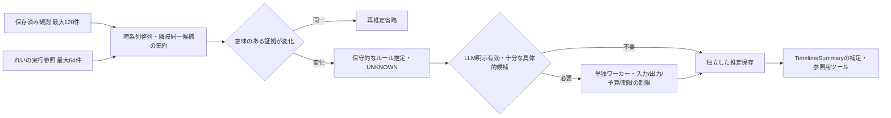

# 時系列の作業推定

全景補助・入力履歴の統合とプライバシー設定は[デスクトップ補助情報と時系列統合](activity-desktop-context-fusion.md)を参照。

## 概要と設定

直近5分の保存済みOS観測・前面の分類候補・観測時のProject/Git/Work revisionと、
れいのツール完了・失敗記録を集約する。OS記録を置換せず、別の補足テーブルへ保存する。
観測不足・文脈混在は正常な `UNKNOWN`。画面や文脈の関連はユーザーの操作・意図・成果の証明ではない。

`rei.activity.temporal` の既定値:

| 設定 | 既定値 | 制限 |
|---|---:|---|
| enabled | true | falseで推定・表示を停止 |
| llm-enabled | false | 明示有効時だけモデルで補足 |
| window-seconds | 300 | 60..600 |
| interval-seconds | 60 | 60..300、開始から次の開始まで |
| max-records | 120 | 1..120、超過は推定しない |
| max-input-chars | 12000 | 1000..16000、超過は送信しない |
| max-output-tokens | 512 | 1..2048 |
| max-total-tokens | 8192 | 1..32768、同一推定の試行合計 |
| max-retries | 1 | 0..1、次の周期で再試行 |
| timeout-seconds | 20 | 1..60、streamをキャンセル |

## 証拠と推定

前面の解決には既存の `ActivityRolePolicy` を利用し、背景候補を主作業としない。
複数の観測で同じProject関連の候補が裏付けられる場合、画面の内容を引用した
「関連画面を伴う作業の可能性」を出す。具体的な内容がなければ分類の抽象度に留める。
確信度はルールの目安（通常0.6、LLM上限0.7）であり、校正された確率ではない。
未観測時間を前後の活動で埋めない。

同一候補の連続観測は60秒以内・同一continuityに限りまとめ、元の観測IDを全て残す。
時刻・観測ID・取得時刻だけの追加はモデル再実行の理由にせず、十分性の変化（1件→複数）、
前面/分類/内容/Project/Git/Work revision/Vision状態/継続性、実行参照の変化で再評価する。
遅いVision結果は元観測の保存済み内容が変化した時に次の周期で新しい推定へ反映する。
過去の推定は履歴として残し、最新活動や基本記録を上書きしない。

実行主体は常に `REI`。SHELL/FILE_EDITの既存イベントIDとproject/session/turn/runを保持する。
COMPLETEDはツール呼出し完了であり、コマンド成功・テスト成功・ユーザー操作の証明ではない。
FAILEDは失敗記録、旧OS証拠の参照のみの場合はRECORDEDとする。
既存の結果要約だけを短く整形し、機密検出時は伏せる。コマンド本文、入力キー、画像、
会話や全アプリケーション実行履歴を新たに収集しない。実行イベントはプロセス内で最大64件。
再起動前のイベントは保存済みOS証拠の参照だけを使い、要約を復元したりユーザー操作を推測しない。

## 非同期処理・コスト・障害

既存の単一worker生成を再利用した別executor（待機0件）で動かす。観測・前面Vision・背景Visionを待たせない。
busy時は次周期へ委ね、古い推定タスクをキューへ積まない。監視停止時は実行しない。
LLMは全履歴や画像を送らず、上限内の構造化証拠だけを送る。タイトルや結果は命令として扱わず、
ツールを禁止し、厳格JSONのみを受け取る。入力文字列は各フィールドも160文字に制限する。
既存 `OutputLimitRunBudget` と `ModelCallBudgetScope` を再利用し、呼出し前に予約、利用量を確定する。
利用量不明・予算超過は追加呼出しを止める。既知の利用量は同一推定の試行全体で集計する。
一般的な失敗は次周期で最大1回だけ再試行する。再試行は元の証拠集合・ID・窓を保持する。
モデル・入力制限・保存の失敗は基礎Activityを変更せず、モデル失敗ではルール推定へ戻る。
補足の保存が失敗した場合は完成した結果を保持し、次周期では保存だけを再試行する。
再起動時は直近の保存済みinputHashが一致すれば重複推定しない（失敗の再試行数を再起動で補充しない）。

`Activity temporal metrics` は完了・失敗・同一入力省略・論理LLM呼出し・既知tokens・送信文字数の累積値。
通信層のHTTP再送は別であり、未知tokensは0消費という意味ではない。
token上限は実利用量を受け取った後に追加呼出しを禁止するもので、既に実行した1呼出しの超過は戻せない。

## 保存・集計・表示・切戻し

`activity_work_inferences` は `CREATE TABLE IF NOT EXISTS` で追加され、既存のrecord/sessionテーブルに変更しない。
推定ID、inputHash、窓・生成時刻、Project、推定文、原観測ID、REI実行参照、確信度・方法・利用量を保存する。
窓が日付をまたいでもwindowEndの属する日に1回だけ表示する。再試行の保存は同じIDを更新する。
Timelineの独立した推定項目、日次Summary・週次/月次レポートの補足に表示する。
`activityWorkInferences(date,projectId)` でProjectごとの保存済み根拠を参照できる（モデル呼出しなし）。
Activity × Work Contextの既存join・Planning Loop・Adaptive Coachingの観測秒数・スコア・発火条件は変更しない。
補足の読み取り失敗でも基本Timeline/Summaryを表示する。表示件数は日次200、Summary補足8件まで。
`temporal.enabled=false` で推定と表示を切り戻し、保存済み補足は残る。
無効時は新しい実行要約も保持しない。補足テーブルの自動保持期間削除は追加していない。

## 検証と限界

フェイクClock、SQLite、模型モデルで時系列集約、原ID、REI主体、入力上限、60秒間隔、
重複省略、後到着結果、日付境界、再試行・予算・旧Activity集計を検証する。
同じ意味の証拠を15秒ごとに追加する5分間の合成ケースでは、60秒周期の6回の判断に対し
LLMは1回（毎周期呼ぶ比較なら6回）、保存は1件、模型利用量は100tokensとなる。
これはAPI応答を固定した再現可能なテストで、実モデルの削減率・消費量・品質を示す実測ではない。
実モデルの消費量・応答品質、CPU/メモリ、ユーザーの実作業に対する精度は未計測。
観測内容が同じでも実作業は変化し得る。具体的な説明が得られない場合に新たな画面取得は増やさない。
今後の品質評価では、ユーザーの作業ラベルと原観測・推定を照合し、過剰断定・誤Project関連・
UNKNOWN率を分けて測る。必要性を実測してから文脈や画像差分の利用を拡張する。
