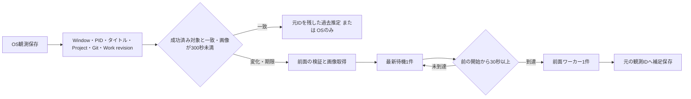

# 前面画像認識キューの頻度制御

## 設定とフロー

`rei.activity.vision-queue.enabled=true`、`minimum-start-interval-seconds=30`、
`max-refresh-interval-seconds=300` が既定値。開始間隔は前面認識の開始から次の開始まで。
全景は明示有効時だけ動き、前面優先の単一Visionワーカーと独立した最新待機枠を使う。
詳細は[デスクトップ補助情報と時系列統合](activity-desktop-context-fusion.md)を参照。
新しいタイマースレッドや待機sleepは追加せず、既存ポーリングで保留候補を再開する。
軽量チェックで詳細観測を省略したポーリングでもキューを確認する。
30秒は下限であり、実際の再開にはポーリング・実行中の解析・executorの遅延が加わる。

キーには前面ウィンドウ全情報、プロジェクトID・名前、Git branch/commit、
Work Context revisionを用いる。取得時刻だけの変化はキーへ含めない。
成功済み画像の取得時刻から300秒以上経つと再解析可能にする。
失敗した解析・補足保存は成功基準を更新しない。新しい待機候補は古い候補を置換するが、
保存済みOS観測は削除しない。重複が判明した場合は画像取得前に省略する。
スクリーンショット明示保存や背景解析が必要な場合は、それぞれの既存設定を優先する。

## 観測・推定と非同期結果

同じメタデータが続く場合、前面解析の成功結果を1件だけ保持し、
寄与する確信度を最大0.7に下げた `HISTORY` の推定として利用する。
これは統計的に校正された確率ではない。画面を再解析した事実としては扱わない。
表示は `Historical Inference`、modeは `EVIDENCE_PLUS_HISTORY`、
`visionUsed=false`、前面stateは `NOT_ATTEMPTED`。元の画像観測IDと時刻を保持する。
当該OS観測より後に完了した結果を、そのOS観測へ過去推定として反映することはない。
確信度不足ではOS情報だけに留める。背景結果は前面推定キャッシュへ入れない。

認識の診断には各スコープの `Timing(observationId,imageCapturedAt,startedAt,completedAt)`
を追加する。画像取得時刻はcapture終了直後で、後続の前面確認後の時刻と区別する。
Window/Project/Git/Work情報は同じ観測の不変なevidenceに残る。
新しいJSONフィールドはnullableで、旧保存データを読み取れる。SQLスキーマ変更は不要。
設定による切戻しをサポートする。

補足は常に元のID・観測時刻へreplaceする。現在の比較基準はIDが一致した時だけ更新し、
Activity時間を追加しない。停止・再開で世代を無効にし、遅い結果を破棄する。
認識・保存・スケジューリングの失敗後もワーカーは次の候補を処理できる。

## 計測と検証

`Activity vision queue metrics` は前面の累積値を出す:
候補生成、開始、補足保存完了、失敗、待機置換、重複省略、最小間隔保留、
論理API呼出し、画像取得〜開始の待機合計、認識実行合計、観測〜補足保存の遅延合計、
待機件数、ワーカー予約状態。保留数は保留を確認した回数。API数はextractor呼出し数で、
HTTP層の再送回数とは区別する。背景は既存の別カウンターを維持する。
世代変更で破棄した結果は補足保存完了に数えない。累積値はプロセス再起動でリセットする。

`Activity vision observation timing` は元IDと各時刻、待機・実行・保存遅延を記録する。
タイトル・画像内容・API応答はログへ出さない。保存されたTimingから原観測を追跡できる。

`ActivityVisionQueueTest` はフェイクClockと実際の候補ワーカーで容量、置換、
開始間隔（終了からではない）、重複、失敗復旧、遅い結果、文脈変化、旧JSONを検証する。
5分間に同一メタデータを15秒ごとに21回与える比較では、
最適化無効: OS21件・画像21回・論理API21回。
最適化有効: OS21件・画像2回・論理API2回・重複省略19回。
これは無遅延の合成シナリオで、実利用の削減率や処理能力を示す実測ではない。
別の合成例では待機3秒、認識12秒、観測〜保存15秒を別々に計測できることを確認する。
実APIの待機・失敗率、CPU・メモリ、作業内容の推定品質は未計測。

メタデータが同じでも画面内容は変わり得る。過去推定はその限界を持ち、
必要に応じてrefresh間隔を短くする。画像差分は実測で必要性を確認するまで追加しない。
操作停止そのものによる追加画像解析は行わず、変化・最新候補・再解析期限で処理する。

## 切戻し

`vision-queue.enabled=false` でPhase 1時点のキュー動作へ戻る。
Phase 1も含めて従来動作へ戻すには `observation.input-aware-enabled=false` も設定する。
入力最適化を無効にしたVISION_FIRSTの従来経路は既存実装を維持する。
