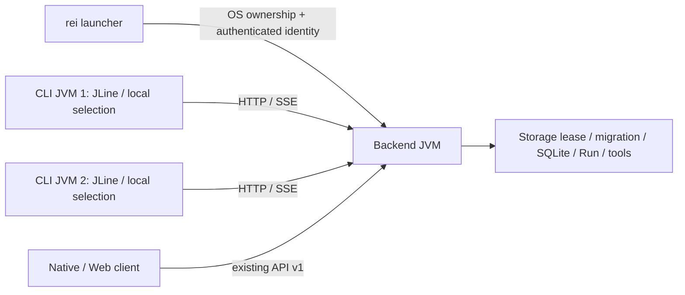

# 軽量 CLI と単一 Backend

移行はまだ完了していない。Session 排他・永続 receipt、独立 HTTP/SSE クライアント、detached launcher を実装したが、Shell 全コマンド互換と Windows Terminal 複数ペインでの全受け入れ検証は残っている。既存 Shell と `start.bat` / `start.sh` は維持している。[全47コマンドの対応表](lightweight-cli-command-matrix.md) を確認して利用する。

## 構成と境界



Backend だけが Storage、Migration、LLM、MCP、Tool Permission、Run、Session、Checkpoint を所有する。CLI は Spring、SQLite、provider SDK を依存に持たず、Backend の会話データを直接読まない。launcher が discovery と OS lock の状態を読む。CLI の Project/Session 選択は process ごとの local state であり、Shell や別 CLI の選択を変えない。

`terminal/pom.xml` は既存ルートビルドとは独立した reactor。`contract` は discovery の純 Java クラス、`completion` は `core.completion`、`cli` は JLine + Java HttpClient、`launcher` は OS 起動を扱う。既存 Backend クラスの大量移動は行っていない。CLI は文字・通常の端末出力を中心とし、全面再描画 TUI は使用しない。

## ビルドと起動

JDK 25、既存の Backend 設定、設定済みの `REI_API_KEY` が必要。キーを launcher が生成・保存することはない。データ保存先は既存 `REI_DATA_DIR` / `rei.data-dir` と OS 標準ディレクトリの規則に従う。

```powershell
# リポジトリのルートから実行
.\mvnw.cmd -DskipTests package
.\mvnw.cmd -f terminal/pom.xml package

# 通常の launcher 起動は auto。Backend を開始または既存 Backend に接続
.\rei.bat --project F:\project\example
.\rei.bat --mode=client       # 接続のみ。Backend がなければエラー
.\rei.bat --mode=server       # detached Backend を準備して launcher は終了
.\rei.bat server status
.\rei.bat server stop --yes   # 全 client に影響する停止の明示指定
.\rei.bat --mode=legacy-shell # 従来 Shell 全機能
.\rei.bat --mode=legacy-shell -- --help
```

`rei-cli.bat` は同じ launcher、Unix 向けは `sh ./rei.sh` / `sh ./rei-cli.sh`。Unix detached 起動は `/usr/bin/setsid` が必要で、macOS の service 管理は未実装。既存 `start.bat` / `start.sh` や Backend jar の直接起動は引き続き従来 Shell が既定。Backend jar 自体に `auto` / `client` を渡しても launcher にはならず、Spring 初期化前にエラーとなる。

Windows で稼働中の既定 jar を置換できない場合は、既存 process を止めず別名・別ディレクトリでビルドできる。

```powershell
.\mvnw.cmd '-Drei.build.directory=target/backend-package' '-Drei.build.final-name=rei-backend' -DskipTests package
.\rei.bat --backend-jar target/backend-package/rei-backend.jar --mode=server
# 以降も同じ --backend-jar を指定できる
```

launcher の `--project` は Backend の専用 Project 登録 API を使う。全機能 Shell の入力を新 CLI に汎用転送する API は作っていない。Shell は Backend と同じ JVM・同じ寿命であり、API 無効時は `--mode=legacy-shell` を使う。既存 Shell が Storage を所有する間に新 Backend を二重起動しない。既存 Shell を通常終了し、既存 API key を設定してから launcher を利用する。

Windows Terminal では、同じ `REI_DATA_DIR` と `REI_API_KEY` を設定した別ペインでそれぞれ `rei.bat --mode=client` を実行する。各 CLI の `/project select` と `/session switch` は独立する。下記の実 Backend プロセステストは実施済みだが、Terminal の split-pane 操作・ペインを閉じる操作を含む E2E は未実施。

## discovery・起動・停止

`<data-dir>/.storage/storage-id` はデータディレクトリの UUID、`backend-endpoint.json` は schema / instance / storage / PID / literal IPv4 loopback URL / protocol / READY を保持する。所有者だけの ACL / mode 600 と atomic move で公開し、秘密を含めない。壊れた UUID を勝手に再生成しない。protocol は2で、HTTP API の既存 `/api/v1` routes は維持する。

接続には OS lease の所有状態、永続 storage ID、認証済み `GET /api/v1/instance` の全 identity 一致が必要。PID、ファイルの存在、port、health 成功だけでは接続しない。redirect と proxy に資格情報を渡さない。起動中は readiness を最大90秒待つ。競合 launcher の最終 admission は Backend の Storage gate が決め、lease を取得するまで Migration しない。

Windows は `CreateProcess` の DETACHED_PROCESS / NEW_PROCESS_GROUP / BREAKAWAY_FROM_JOB を使用し、標準 IO と process handle を継承しない。job が breakaway を許可しない場合は明示エラー。コンソールと寿命を共有する起動には fallback しない。ログは `<data-dir>/logs/backend.log`。

停止は `server stop --yes` で、認証・identity を再確認して `POST /api/v1/instance/stop` を呼び、lease 解放を待つ。任意 PID を kill しない。CLI の `/exit`、Ctrl+D、Ctrl+C、接続喪失は Backend や他 CLI の Run を停止しない。Ctrl+C は自身の表示購読を切断し、Run cancellation は `/cancel RUN_ID` で明示する。

## Session admission と冪等受付

schema 6 の `conversation_admissions` / `chat_receipts` を、既存 Migration のバックアップ・検証・OS lease の下で追加する。Session metadata、canonical Run、Session lease、receipt を一つの Storage transaction で受付確定し、その後 dispatch する。全フロントエンドが共有する SessionLifecycle と ConversationInputRouter に適用する。

同じ Session に実行中の会話 Run は最大1つ。HTTP の新規独立 Run は409で target Project/Session/Run ID を返す。別 Session は既存 Project queue の access 規則に従って並行可能。既存 Shell の EXCLUSIVE 入力 queue は保持し、待機 Run は先行 Run の runner cleanup が終わってから Session lease を取得する。cancel の terminal event が届いただけでは実行中 lease を解放しない。

`POST /api/v1/chat` の任意 `Idempotency-Key` は `[A-Za-z0-9._:-]{1,128}`。Project、要求した Session（null を含む）、message、正規化 mode を fingerprint に含める。同じ key / payload は元の Run/Session を返し、再 enqueue しない。payload 変更は409。`GET /api/v1/chat/receipts/{key}` で受付照会できる。HTTP 応答の欠落、timeout、受付後の5xxでは CLI は receipt を一度照会し、POST を自動再送しない。照会できない場合は key と「受付不明」を表示する。

receipt 照会期間は7日。期限後は410で再実行しない。key hash の tombstone は再利用しない。admission / receipt はそれぞれ100,000件が上限で、容量超過は受付を拒否する。自動削除・再利用の運用は未実装。raw key、API key、message 本文は receipt テーブルに保存しない（通常の Session title/turns には会話が保存される）。owner PID / 開始時刻 / instance を検証し、再起動で owner を失った非 terminal Run は UNKNOWN。副作用を検査し、既存 Checkpoint の明示 Resume を使う。

## CLI の入力・コマンド

JLine の入力編集、履歴、prompt、completion、末尾 `\` の複数行入力と `/paste`（単独 `.` で完了）を用意した。Tab は cached Project/Session ID と共通 `core.completion` の client-local path 補完を使う。Tab 中に HTTP / Storage 読み取りを実行しない。全 Shell の補完・文法の互換は未完了。

| コマンド | 利用できる操作 |
| --- | --- |
| `/project` | `list`, `select ID`, `register LOCAL_PATH`（登録と local 選択） |
| `/session` | `list`, `show`, `new [TITLE]`, `select/switch/resume ID`, `end` |
| `/mode` | `status`, `auto`, `normal`, `conversation [--voice-only]`。Session の応答スタイル |
| `/run-mode` | `exclusive`, `read-only`, `conversation`。CLI local の Run access、既定 EXCLUSIVE |
| `/chat` | `[--mode ACCESS] [--run RUN_ID] [--] MESSAGE`。追加指示は選択 Session と対象 Run の所有権を Backend が検証 |
| `/cancel`, `/runs`, `/watch`, `/receipt` | 対象 Run ID / receipt key を明示。`/runs` 引数なしは local に選択した Run ID の表示のみ |
| `/history` | `list`, `show [SESSION_ID]`（会話の保存履歴）。`off/on` は入力履歴制御の互換拡張 |
| `/input-history` | `off`, `on`（端末入力履歴） |
| `/feed` | `list/show ID`, `add URL DISPLAY_NAME`, `enable/disable ID`, `delete ID --yes` |
| `/skill` | `list`, `show NAME`, `reload` |
| `/profile`, `/briefing`, `/search` | profile summary、今日の briefing、検索 query |
| `/reminder` | `list/show ID`, `add "MESSAGE" AT`, `delete ID --yes` |
| `/interest`, `/memory` | list/show。memory は `add "CONTENT" TYPE SCOPE`, `delete ID --yes` |
| `/timer` | `list/show ID`, `activate/cancel ID`, `history ID` |
| `/tasks` | Task Manager の `list/show ID`, `cancel/resume/suspend ID EXPECTED_RUN_ID REVISION` |
| `/goal` | `list/show ID`, `run/cancel/verify ID`, `progress/history ID` |
| `/attention`, `/approval` | list/show、`ack ID`、`approve/reject ID` |
| `/checkpoint`, `/resume` | list/show/inspect/save/abandon、checkpoint ID の resume |
| `/dependency`, `/work` | list/show/history/`answer ID VERSION "ANSWER"`、work show/summary/history/update |
| `/summarize`, `/image` | URL 要約 / prompt の既存 background API。HTTP 自動再送なし |
| `/paste`, `/help`, `/exit` | 複数行入力 / コマンド一覧 / 自身の CLI 終了 |

未知の slash と未対応 subcommand / option は明示エラー。先頭空白があっても slash を通常会話として送信しない。`/task`（Google Tasks）と `/schedule`（Google Calendar）は未対応であり、似た名前の Task Manager / Agent Scheduler に振り替えない。fixed named API のみ使い、任意 URL・service・shell・reflection 実行機能は用意しない。表示は JSON の簡易表示を含み、Shell と同じ表示・全 options ではない。

SSE は sequence を処理し `Last-Event-ID` を付けて最大3回再接続、重複は捨てる。接続待ち中の detach も古い購読を復活させない。409 gap は output incomplete と表示し、Run status を最大60秒 polling、terminal 後に保存 turns を照会する。ストリーム・JSON 応答は1MiBに制限。resume / POST / cancellation を SSE reconnect と連動させない。

## 入力履歴と秘密

入力履歴は `${user.home}/.rei-cli/history/cli-UUID.history`。Backend データディレクトリとは別で、各 CLI が自身のファイルだけを exclusive lock して書く。起動時は最新の終了済みファイル一つから安全な行だけ読む。他の動作中 CLI の履歴を読み書き・merge しない。最大1,000行・1MiB、owner-only ACL / 600。過去ファイルの自動掃除は未実装。

`--no-history` または `/input-history off` で入力履歴を保存しない。認証用 `REI_API_KEY` の実値、Bearer / Authorization / api-key / password / secret などの行と複数行は除外し、同じ規則を JLine の memory history にも適用する。任意の文章が秘密かどうかを完全に推定はできないので、機密入力時は明示 off にする。API key は metadata や client 設定に保存せず、CLI 出力でも既知の key を redact する。

履歴の削除は全 CLI を閉じてから、`$env:USERPROFILE\.rei-cli\history` にある対象 `cli-UUID.history` を確認して削除する。Backend の `.storage` や SQLite ファイルを削除しない。履歴を git・ログ収集に含めない。

## 接続失敗への対処

- API key 未設定: 既存 key を環境へ設定するか legacy-shell を使う。launcher は生成しない。
- 認証失敗 / protocol 不一致 / identity 不一致: 接続・置換を拒否する。設定と Backend バージョンを確認する。
- STARTING_OR_LEGACY_SHELL / readiness timeout: 同じ data-dir を使う既存 Shell、Backend ログ、Storage lease を確認する。所有中の lock を削除しない。
- stale endpoint: lease が無ければ起動候補は作れるが、最終 ownership は Backend が取得する。PID を根拠に別 process を停止しない。
- BREAKAWAY エラー: job 制限を確認する。独立 OS service として起動する運用が必要な環境では、通常 child に fallback しない。
- 同じ Session の409: 表示された Run を確認し、別 Session を選ぶか既存 Run へ明示追加指示する。
- receipt 不明 / 期限切れ / UNKNOWN: 自動再送せず、保存履歴・Run・Checkpoint と副作用を検査する。

## テストと実装状況

```powershell
.\mvnw.cmd -Pfull test                       # live の外部実行は除外
.\mvnw.cmd -f terminal/pom.xml package
.\scripts\Test-LightweightWindows.ps1       # PowerShell 7 / Windows / JDK25
# E2E の既定 Backend jar は target/backend-package/rei-backend.jar
# 任意のビルド済み jar は -BackendJar ABSOLUTE_PATH で指定
```

Windows E2E は毎回 repository の target 以下に UUID の隔離 root を作り、fixture key と provider の到達不能 loopback URL を子 process にだけ渡す。既存 Backend を止めず、認証・identity を確認して fixture Backend を停止する。外部 LLM 推論の成功を検証するテストではない。

| Phase | 現状 |
| --- | --- |
| 1 | Storage gate/discovery、canonical admission、Session 排他、transactional receipt、再起動照会、専用 stop API 実装。起動中異常終了・全 frontend 横断の受け入れケースは追加確認が必要 |
| 2 | 独立 CLI modules、JLine、local selection、入力・補完・履歴、HTTP/SSE、receipt 照会、明示 cancel 実装。全 Shell 入力/補完互換ではない |
| 3 | 固定 API adapter と全 Root コマンドの対応表を追加。一部操作のみ対応。未対応コマンド・全 options・表示・追加限定 API が残るため未完了 |
| 4 | Windows worker の親強制終了後の独立寿命、実 Backend で CLI 終了後の再接続・Project 登録・安全停止を確認。Session/style・同時 receipt・再起動 receipt 照会も実 Backend jar で確認済み。Terminal 複数ペイン全 E2E は未実施 |

Native API の詳細は [Native/Web API](native-web-api.md)、全機能 Shell の利用は [README](../README.md) を参照する。最終テスト件数・commit は作業報告に記録する。必須条件をすべて満たしていないため Phase 1〜4 の実装完了とは報告しない。

### 2026-10-11 の検証記録

| 検証 | 結果 |
| --- | --- |
| Backend `-Pfull test`（隔離 build directory） | 4,726件、失敗0・エラー0・skip 2。skip は既存の任意 benchmark 等であり、変更による無効化なし |
| 最終 Session API / admission / Run / Shell 対象回帰 | 29件成功。上の全回帰後に追加した Session API のテストを含む。件数は全回帰と重複 |
| CLI / launcher reactor | 27件成功。Windows worker の親 process 強制終了後の独立寿命を含む |
| Native UI | 25ファイル・99件成功、TypeScript typecheck 成功 |
| Native Rust | 120件成功（offline cargo test） |
| Windows 実 Backend / CLI jar | 成功。最初の CLI 終了後の readiness、同じ instance の別 CLI 接続、Project/Session/style、同時同 key の同 Run、再起動 receipt、2回の安全停止 |
| Windows Terminal 複数ペインの操作 | 未実施 |
| 外部 LLM・Google OAuth・音声・PTY 等の全機能 E2E | 未実施 |

TDD の Red/Green は admission の原子性・冪等性・期限・競合・Shell queue、CLI の受付不明・5xx後照会、秘密の入力履歴除外、Windows path 解釈、接続待ち中 SSE detach、応答スタイル分離、chat options、busy 対象表示で実施。全回帰の初回は4件失敗/エラーを検出し、旧 schema fixture の新テーブル取り残し、同一 Session 新契約の旧期待値、HTTP fixture の publisher 重複を修正して再実行した。

### 主な追加・変更 API

- `POST /api/v1/chat`: 任意 Idempotency-Key、同一 Session busy の409（Project/Session/Run ID付き）。既存キー無しの契約は維持。
- `GET /api/v1/chat/receipts/{key}`: 永続受付結果。未発見404、期限切れ410。
- `POST /api/v1/projects/register`: absolute existing directory の専用登録。任意 filesystem 列挙 API は追加しない。
- `POST /api/v1/sessions`: registered Project に空 Session を作成（201）。Run を起動しない。
- `GET/PATCH /api/v1/sessions/{id}/response-style`: Project 所有権を検証する応答スタイル専用操作。既存 SessionResponse の5 fields は変更しない。
- `POST /api/v1/instance/stop`: 認証済み instance/storage identity に限定した graceful stop（202）。

主なクラスは `ConversationAdmissionStore` / `ConversationAdmissionMigration`、共有 `SessionLifecycle` / `ConversationInputRouter` / `RunRegistry`、`BackendClient` / `TerminalClient` / `ClientHistory` / `SseDecoder` / `RemoteCommands`、`Launcher` / `DetachedBackend`。既存 Shell の全コマンドは保持し、HTTP の同一 Session 独立 Run は依頼された排他契約に合わせて409となる。
