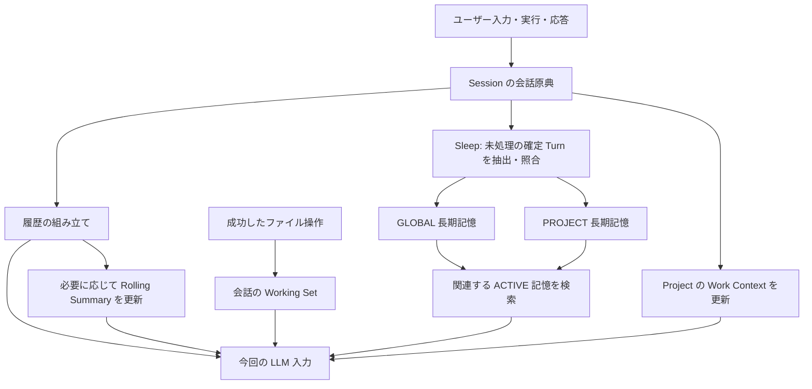
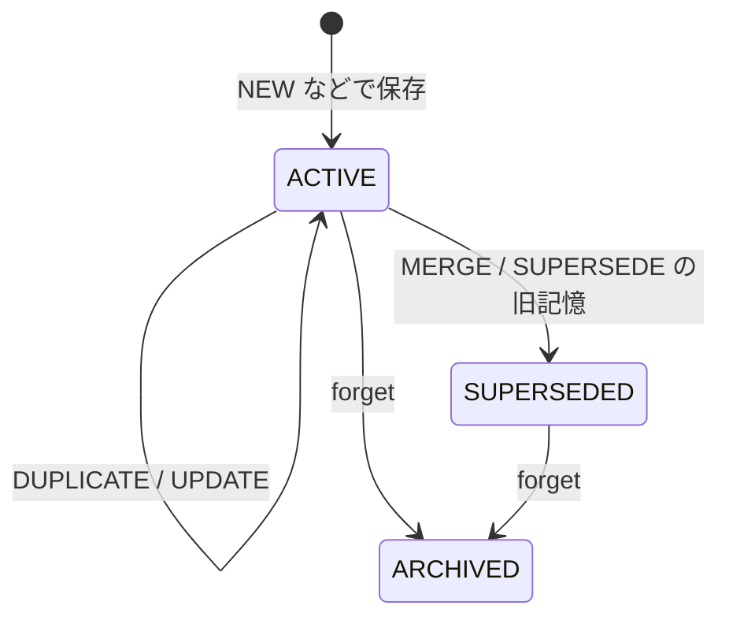

# 「れい」の記憶のしくみとライフサイクル

2026-10-08 時点の実装に基づく解説です。ここでは「何が保存され、いつ参照され、どの操作で消えるのか」を中心に説明します。

## 1. 全体像：記憶は一つの箱ではない

「れい」は、会話の原典、会話を続けるための要約、作業中のファイル参照、再利用する知識、プロジェクトの作業状態を別々に管理します。

**睡眠（Sleep）は、会話から知識を抽出して長期記憶に保存する処理です。元の会話を削除して長期記憶へ移動する処理ではありません。** また、ディスクに残っている情報がすべて毎回 LLM に渡されるわけでもありません。

| 仕組み | 保存するもの | 主な管理単位 | 作成・更新のきっかけ | 外れる・消える条件 |
|---|---|---|---|---|
| Conversation History | ユーザー入力、応答、会話ログと Turn の状態 | Session | 入力・応答・実行開始／終了 | Sleep やコンテキスト圧縮では消さない |
| Rolling Summary | 過去の会話や実行中の観測の要約 | Session／Run | LLM 入力のトークン量が圧縮閾値を超える | 新しい要約で保存スナップショットを更新 |
| Working Set | 最近利用したファイルのパス・アクセス情報 | 会話 | 読み書き・編集・作成の成功 | 上限超過、明示的除去、存在しないファイルの除去 |
| bounded ChatMemory | 件数制限のある互換用メッセージ履歴 | conversation ID | 会話 Advisor による追加 | メッセージ窓の件数制限 |
| Long-term Memory | 事実、好み、制約、決定、手順、知見など | GLOBAL／PROJECT | Sleep、検証済み Reflection の明示昇格 | 置換で SUPERSEDED、forget で ARCHIVED |
| Work Context | 現在の作業、判断、検証などの引き継ぎ状態 | Project | 手動更新、設定を有効にした実行終了後の自動更新 | 状態変更・置換。過去 revision は保持 |

「短期記憶」は、この資料では会話継続・現在の作業に使う上の複数の仕組みを指す説明用の言葉です。旧 API の `MemoryScope.SHORT_TERM` と同一の概念ではありません。



図の矢印は参照・抽出・注入を意味します。矢印の元のデータが消えることを意味しません。

## 2. 短期記憶：作成から要約まで

### 会話の原典

会話ログは `ConversationLogStore` が日付別 JSONL に追記します。Session ID で会話を識別し、同じ日付のファイルに複数 Session のログが入ることがあります。

これとは別に、`ConversationTurnStore` が実行開始時に `RUNNING` の Turn を作り、終了時に `COMPLETED`／`FAILED`／`CANCELLED` と最終応答を保存します。これは件数制限のある ChatMemory から独立しています。

通常の履歴組み立てでは、完全な会話ログを優先して読みます。ログがなければ Turn 履歴、両方なければ旧 bounded ChatMemory を利用します。つまり、古いメッセージが互換用の窓から外れても、会話原典まで同時に消えるわけではありません。

### Rolling Summary（継続用の要約）

LLM に送れる量には上限があるため、`ContextAssembler` が今回の入力を組み立てます。

1. 保存済み要約と、その要約がカバーする位置（`throughSequence`）を読む。
2. すでに要約済みの古い部分を、今回の入力では要約に置き換える。
3. トークン量が閾値を超えたら、古い会話から圧縮する。必要なら実行中の観測も圧縮する。
4. 要約が空でなく、指定トークン量と圧縮効果の条件を満たす場合に保存する。
5. それでも上限を超える場合は、補助の長期記憶・Work Context を今回の入力から外し、さらに古い履歴／観測のまとまりを外す。収まらなければ実行を停止する。

ここで削るのは **LLM に送る入力の写し** です。元の会話履歴や Working Set を書き換える処理ではありません。要約の保存ファイルは新しいスナップショットで更新されるので、要約自体の全 revision を保存する仕組みとも異なります。

会話の要約と実行（Run）の観測要約は別のキーで保存します。会話ログと旧 Turn 履歴でも位置の体系を分けています。Sleep の処理位置とは別です。

### Working Set（作業中のファイル参照）

ファイル操作に成功するとパスを登録します。検索結果に出ただけでは登録しません。既存パスを使うと最終アクセス日時を更新します。標準の上限は 20 件で、超過すると最終アクセスが古い参照から除去します。

明示的な `remove`／`clear` や、ファイルがなくなったことを確認する `removeIfMissing` でも参照を除去します。**参照の除去は、実ファイルの削除や長期記憶への移動ではありません。** 通常の会話では保存ファイルから復元しますが、非 EXCLUSIVE の Run では永続化せず、その Working Set を使います。

## 3. 長期記憶：何を、どこに保存するか

長期記憶は、本文、短い要約、型、確信度（confidence）、重要度（importance）、タグ、状態、出典 Session／Turn、関連情報などを持ちます。

| scope | 意味 | 別 Session での利用 |
|---|---|---|
| GLOBAL | プロジェクトに依存しない情報。例：恒常的な回答の好み | 別 Project を含む通常 CHAT の検索対象 |
| PROJECT | 特定 Project に所属する情報。例：そのプロジェクトの設計方針 | 同じ Project の別 Session でも検索対象 |

型は `FACT`、`PREFERENCE`、`DECISION`、`CONSTRAINT`、`PROJECT_STATE`、`PROCEDURE`、`LESSON`、`RELATION` です。出典 Session は「どの会話から得たか」を示し、利用範囲は scope／Project ID が決めます。現在の長期記憶には SESSION scope はありません。

通常 CHAT では、入力に関連する GLOBAL と現在 Project の ACTIVE 記憶を検索して補助 System Message に入れます。有効期間外の記憶や未解決 CONFLICT に関係する記憶は自動注入対象から除きます。検索結果数・トークン量にも上限があり、保存済みでも毎回すべて使うわけではありません。検索障害時は記憶なしで会話を続けます。

長期記憶検索は SQLite FTS／LIKE を使います。この検索に外部 Vector DB や embedding 呼び出しは追加していません。

## 4. 睡眠：会話から長期記憶を作る順序

手動の `/sleep` は、選択中の Session と Project を対象にします。

1. **開始位置を決める。** 成功済み Sleep の最大 `toSequence` を読み、未処理 Turn の先頭から進む。
2. **一回の範囲を決める。** Turn 数・入力トークン量の上限までを読む。RUNNING の手前で止まる。
3. **根拠を選ぶ。** COMPLETED の Turn だけを抽出用に渡す。FAILED／CANCELLED は処理位置には含めるが、確定知識の根拠として渡さない。
4. **LLM で候補を抽出する。** 安定した情報を選び、出典 Turn ID を付ける。雑談、一時的な感情、未採用の提案や推測などは除外するよう指示する。
5. **候補と既存記憶を照合する。** JSON schema、出典、確信度・重要度、対象 ID、scope、状態などを検証し、下表の action を決める。
6. **まとめて保存する。** 記憶・出典・タグ・関連・検索インデックスと成功 Sleep Run を、一つの DB トランザクションで確定する。

候補は抽出・照合中のデータであり、すべてを CANDIDATE 行として先に DB へ蓄積する方式ではありません。

| action | 新しい候補の扱い | 既存記憶の扱い |
|---|---|---|
| NEW | 新しい ID で ACTIVE を作成 | 変更なし |
| DUPLICATE | 新しい記憶は作らない | 出典・タグを追加 |
| UPDATE | 既存 ID の本文などを更新 | 元の作成日時・出典を保持。旧本文を別 revision に残す方式ではない |
| MERGE | 複数の記憶をまとめた ACTIVE を作成 | 元を SUPERSEDED にし、元の出典を新記憶へコピー。関連を保存 |
| SUPERSEDE | 新方針などを ACTIVE として作成 | 旧記憶を SUPERSEDED にし、後継 ID・有効終了時刻・関連を保存 |
| CONFLICT | 矛盾する候補も ACTIVE として保存 | 元も残し CONFLICT 関連を作成。自動注入は保守的に除外 |
| IGNORE | 保存しない | 変更なし |

完全一致の重複は Java 側で判定します。意味的な照合には検索結果と直近の記憶を使うため、非常に古い記憶や遠い言い換えまで必ず検出できるとは限りません。照合・変更は同じ scope、PROJECT なら同じ Project 内に限ります。

### 処理位置と失敗時の扱い

成功した範囲は次回処理から外れます。候補がゼロ、またはすべて IGNORE でも、処理した Turn があれば成功位置を保存します。「知識が作られなかった」と「まだ処理していない」は別です。

抽出・照合の失敗、timeout、キャンセル、DB 障害では成功位置を進めません。適用途中のエラーは rollback し、書き込み可能なら失敗／キャンセル履歴を別途記録します。再実行は同じ未処理範囲からです。一回の上限で残った Turn は次の Sleep で処理します。

同じ Session の同時 Sleep は拒否します。他 Session が対象記憶を書き換えた場合にも、適用前のスナップショット比較で中断します。

`/sleep preview` は抽出・照合を実行して予定を表示しますが、記憶、アクセス日時、Sleep Run 履歴、処理位置は更新しません。LLM 呼び出しとイベント発行は行い、モデル予算を有効にしている場合の消費は別管理です。

### 自動睡眠と終了時の要求

Auto Sleep は標準では無効です。`rei.memory.auto-sleep.enabled=true` の場合、idle、実行中 Agent／background 処理の有無、未処理 Turn 数、再試行間隔などを確認して、一回につき一つの batch を処理します。新しい入力や活動を検知するとキャンセルし、適用中でも rollback します。cron を設定しても idle／busy などの条件は維持します。

さらに `on-session-end`／`on-shutdown` を個別に有効にすると、Session 終了／graceful なアプリ終了時に **Sleep の要求を保存** します。どちらも標準では false です。終了操作そのものが LLM を呼んで睡眠を完了するわけではありません。

保存要求は次の idle tick で優先され、通常の minimum-turns や次の cron 時刻を待たず、未処理が一件から整理できます。busy／idle／再試行間隔／モデル予算の条件は維持します。要求は未処理がなくなるまで残り、再起動後も引き継ぎます。hard kill では終了 hook の実行を保証しません。

詳細は [終了時の Auto Sleep 要求](auto-sleep-end-requests.md)、[睡眠のモデル予算](sleep-model-budget.md)、[永続モデル予算](sleep-persistent-budget.md) を参照してください。古い [長期記憶資料](long-term-memory.md) の「Session 終了時の強制 Sleep はない」という説明は、現在の任意の終了時要求機能と併せて読む必要があります。

## 5. セッション別・プロジェクト別の記憶

### セッションを新規作成・再開・終了するとどうなるか

新しい Session は別の conversation ID を使います。会話原典・会話要約・通常の Working Set は別単位になり、前 Session の会話全文をそのまま通常履歴として引き継ぐわけではありません。ただし同じ Project の長期記憶と Work Context は利用できます。

既存 Session を再開すると、その ID の履歴や要約を参照します。`/session end` は選択を解除する操作で、Session metadata と会話履歴を残します。再開可能です。単なる Session 切替や画面を閉じる操作を、自動的に end と解釈しません。

### Project を切り替えるとどうなるか

Project ID を境界として会話・作業状態を選び直します。Shell の Project 切替では、切替先に Session があれば最新の Session を選択します。実行中の処理は開始時に捕捉した所有 Project／Session を保ちます。

切替元の記憶を切替先へ移す処理ではありません。通常 CHAT の長期記憶検索は GLOBAL と切替先 PROJECT を対象にします。既存 PROJECT 記憶を GLOBAL や別 PROJECT に自動で移動する機能もありません。

ただし **会話原典の検索ツールは別の仕組み** です。`ProjectHistoryRetrieval` は検索 scope に応じて現在 Project 優先・現在 Project のみ・全 Project の検索を行えます。他 Project の会話を検索して参照できても、その長期記憶の所属が変更されるわけではありません。

### Work Context：同じ Project の別 Session への引き継ぎ

Work Context は、現在の作業・判断・検証などを Project 単位で持つ状態です。Sleep で抽出する恒常的な知識とは別に更新します。会話 Turn、ツール結果、介入、Git 情報などの根拠を使い、手動 `/work update` または `rei.work-context.auto-update=true` による実行終了後の更新で作成します。自動更新の既定は false です。

更新ごとに新しい revision と現在位置を保存し、過去 revision を保持します。抽出結果に項目が出なかっただけでは削除しません。根拠付きの訂正・状態変更・置換を行い、SUPERSEDE では旧項目と後継の関係を残します。ユーザーの明示的な訂正を自動推測で上書きしない保護もあります。

未完了／失敗／キャンセルした Run の情報も、未確認であることや部分的な確認結果を区別して引き継げます。COMPLETED の Turn だけを根拠にする Sleep と、この点も異なります。

## 6. 「削除」「忘れる」「移動」の違い

| 操作・事象 | 変化 | 残るもの |
|---|---|---|
| コンテキスト圧縮／上限調整 | 今回の LLM 入力で古い部分を要約・除外 | 会話原典、保存済み知識 |
| bounded ChatMemory の窓から外れる | 互換用の履歴窓から外れる | 独立したログ／Turn 原典 |
| Working Set から除去 | ファイル参照を除去 | 実ファイル、会話原典 |
| Sleep | 原典から別の知識を作成／更新 | 原典、Working Set、Rolling Summary |
| MERGE／SUPERSEDE | 新 ACTIVE を作り旧を SUPERSEDED に変更 | 旧記憶の行・出典・関連 |
| `/memory forget <id>` | ARCHIVED に変更 | 記憶の行・出典・原典 |
| Session 終了 | 選択を解除。任意設定で Sleep 要求を保存 | Session metadata、履歴 |
| Project 切替 | 参照する所有範囲を変更 | 切替元の記憶 |
| Project 登録解除 | Registry から登録を除去 | ProjectService.remove は保存データを再帰削除しない |

`forget` は物理削除ではありません。通常の list／search／自動注入からは外れますが、同じ許可範囲の `show` で過去状態を確認できます。原典の会話を消す操作でもありません。

さらに、forget は「この内容を将来絶対に再登録しない」という禁止リストではありません。同じ内容が後の未処理会話に現れれば、新しい ACTIVE 記憶として保存される可能性があります。過去の成功済み Sleep の位置を戻して元会話を再処理する操作でもありません。

長期記憶を古さだけで自動 archive／物理削除する処理はありません。完全にデータを消去する機能と、通常参照から外す機能は区別して考える必要があります。



MERGE／SUPERSEDE では、この図の旧記憶の状態変更に加え、別 ID の ACTIVE 記憶を作ります。CONFLICT は双方を残して関係を付けます。

## 7. 具体例

Project A の Session 1 で「設定は YAML に統一する」と決め、会話を完了したとします。会話原典に記録され、Sleep が採用すれば PROJECT の DECISION が ACTIVE として作られます。Session 2 では全文履歴を共有しなくても、関連検索でその方針を利用できます。

後に「JSON に変更する」と確定し、Sleep が SUPERSEDE と判断した場合、新しい JSON 方針が ACTIVE、旧 YAML 方針が SUPERSEDED になります。旧方針の出典や原典は残ります。単なる候補の相談なら、確定方針として抽出しないようモデルに指示していますが、LLM の判断の正しさは schema 検証だけでは保証できません。

新しい方針に forget を実行すると ARCHIVED になり、通常検索から外れます。旧 YAML 方針が自動的に ACTIVE に戻るわけではありません。Project B に切り替えても、A の PROJECT 記憶は B に移りません。

## 8. 保存場所と確認方法

`<data-dir>` は `REI_DATA_DIR` または OS ごとの既定データディレクトリです。リポジトリの `docs` と記憶の実データ保存先は別です。

| 保存対象 | 主な保存先 |
|---|---|
| 互換 ChatMemory | `<data-dir>/memory.db` の `SPRING_AI_CHAT_MEMORY` |
| 長期記憶・出典・関連・Sleep 履歴／要求 | `<data-dir>/memory-consolidation.db` |
| Work Context の現在位置・revision | 同 DB の `work_context_heads`／`work_context_revisions` |
| Project の会話ログ | `<data-dir>/projects/<project-id>/conversations/<日付>.jsonl` |
| Project の Turn 原典 | `<data-dir>/projects/<project-id>/state/turns/<Session ID 由来のキー>.json` |
| 会話／Run の Rolling Summary | `<data-dir>/projects/<project-id>/state/context/summaries/<キー>.json` |
| 通常 Session の Working Set | `<data-dir>/projects/<project-id>/working-set/sessions/<キー>.json` |

Project 非所属の互換データはデータディレクトリ直下側を使います。Working Set の従来の CLI 会話には `working-set/files.json` を維持します。GLOBAL／PROJECT 長期記憶は物理的に別 DB へ移動する方式ではなく、同じ memories テーブルの scope と project_id で分けます。

確認に使えるコマンドです。

```text
/session show
/session list
/sleep preview
/sleep
/sleep status
/sleep history
/sleep requests
/memory list --limit 20 --offset 0
/memory search 設定
/memory show mem_<id>
/memory forget mem_<id>
```

最後の forget だけは記憶の状態を変更します。preview も LLM 呼び出し費用は発生し得ます。sleep status は GLOBAL／現在 PROJECT の状態別件数と、選択 Session の未処理件数などを確認できます。

## 9. 旧機能と追加の保存経路

旧 `/memory export`／`summarize`／`consolidate` は互換機能として残っています。旧 `SHORT_TERM` などの enum や、Project／出典が不明な旧行を、現在の GLOBAL／PROJECT 長期記憶と混同しないでください。旧行は新しい通常検索から除外されます。

特に旧 `MemoryConsolidatorService` の候補抽出は、互換 ChatMemory テーブルの直近 200 メッセージを conversation ID で絞らず読みます。Session の永続処理位置と所有範囲を検証する Sleep とは経路が異なります。旧 auto-trigger 設定も従来の整理提案通知用で、Sleep 起動条件ではありません。

Sleep 以外にも、独立検証済み Goal Reflection を人間向け操作で明示昇格する経路があります。`VerifiedReflectionMemoryService` は保存済み条件を再検証し、PROJECT_STATE と証明を保存します。任意の Reflection 本文や一般論を自動で長期記憶にする処理ではありません。詳細は [検証済み Reflection 記憶](verified-reflection-memory.md) を参照してください。

## 10. 実装を読むための入口

以下のリンクは本資料からの相対パスです。

- 原典：[ConversationLogStore](../src/main/java/dev/mikoto2000/rei/conversation/ConversationLogStore.java)、[ConversationTurnStore](../src/main/java/dev/mikoto2000/rei/conversation/ConversationTurnStore.java)
- 履歴の再構成・圧縮：[ContextHistoryAdvisor](../src/main/java/dev/mikoto2000/rei/core/contextbudget/ContextHistoryAdvisor.java)、[ContextAssembler](../src/main/java/dev/mikoto2000/rei/core/contextbudget/ContextAssembler.java)、[ConversationSummaryRepository](../src/main/java/dev/mikoto2000/rei/core/contextbudget/ConversationSummaryRepository.java)
- 作業参照：[WorkingSet](../src/main/java/dev/mikoto2000/rei/core/working/WorkingSet.java)、[WorkingSetConfiguration](../src/main/java/dev/mikoto2000/rei/core/working/WorkingSetConfiguration.java)
- 睡眠・永続化：[SleepService](../src/main/java/dev/mikoto2000/rei/memory/service/SleepService.java)、[MemoryResolver](../src/main/java/dev/mikoto2000/rei/memory/service/MemoryResolver.java)、[MemoryRepository](../src/main/java/dev/mikoto2000/rei/memory/service/MemoryRepository.java)、[AutoSleepService](../src/main/java/dev/mikoto2000/rei/memory/service/AutoSleepService.java)
- 長期記憶の利用：[MemoryRetriever](../src/main/java/dev/mikoto2000/rei/memory/service/MemoryRetriever.java)、[MemoryContextAdvisor](../src/main/java/dev/mikoto2000/rei/memory/service/MemoryContextAdvisor.java)
- Project と引き継ぎ：[ProjectService](../src/main/java/dev/mikoto2000/rei/core/project/ProjectService.java)、[WorkContextService](../src/main/java/dev/mikoto2000/rei/workcontext/WorkContextService.java)、[WorkContextRepository](../src/main/java/dev/mikoto2000/rei/workcontext/WorkContextRepository.java)、[WorkContextMerger](../src/main/java/dev/mikoto2000/rei/workcontext/WorkContextMerger.java)
- Project をまたぐ原典検索：[ProjectHistoryRetrieval](../src/main/java/dev/mikoto2000/rei/conversation/ProjectHistoryRetrieval.java)
