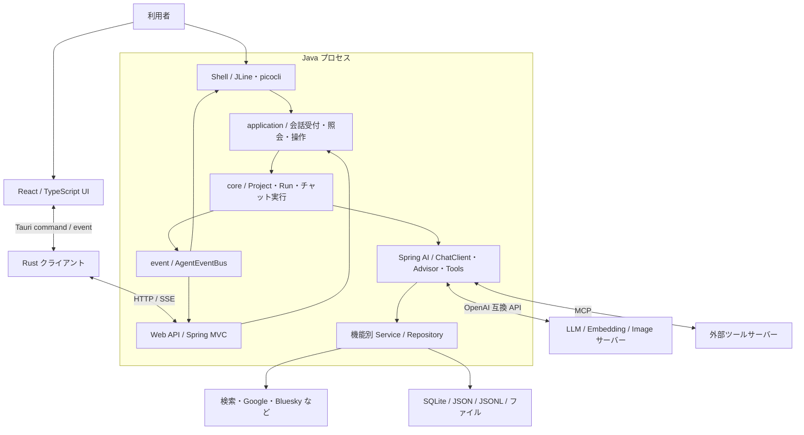
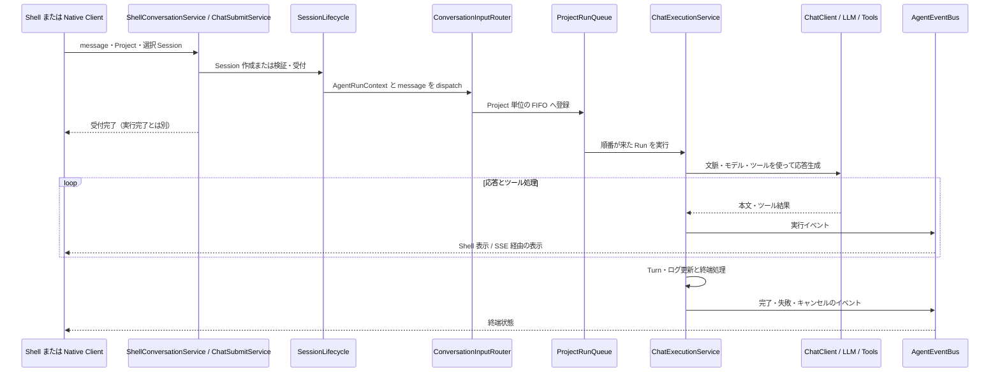
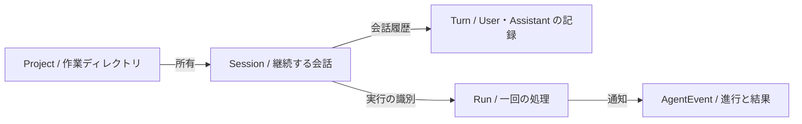
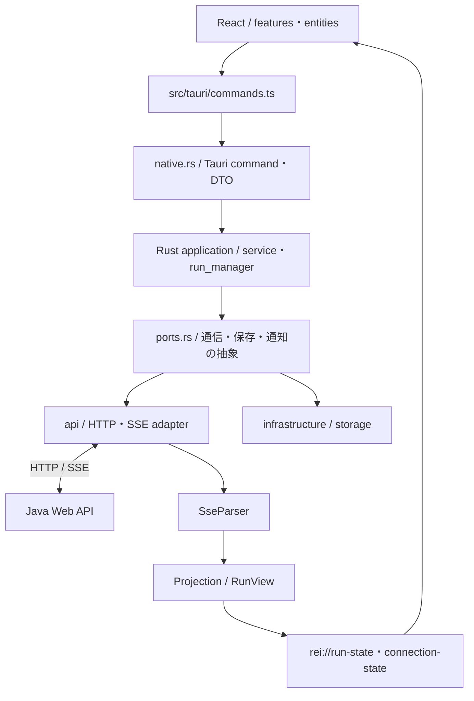

# 「れい」のプログラム構造 — 新規開発者向け

このガイドは、ソースコードを初めて読む開発者向けの入口です。2026年10月4日時点の構成をもとに、主要な責務と実行経路を説明します。図は細かな依存関係を省略した概念図です。Mermaid 対応の Markdown ビューアーで表示できます。

## 1. まず全体をつかむ

Rei は Java の AI 秘書アプリケーションです。ターミナルの Shell と認証付き Web API が共通の実行基盤を使います。`client/` の Tauri クライアントは別プロセスで動き、HTTP と SSE（サーバーからのイベント配信）で Java 側へ接続します。



技術スタックの定義元は、Java が [`pom.xml`](../pom.xml)、UI が [`client/package.json`](../client/package.json)、Rust が [`Cargo.toml`](../client/src-tauri/Cargo.toml) です。Java 25、Spring Boot、Spring AI、React、Tauri 2 を使用します。

起動点は [`ReiApplication`](../src/main/java/dev/mikoto2000/rei/ReiApplication.java) です。外部設定を準備して Spring を起動し、Shell の入力ループを組み立てます。[`WebApplication`](../src/main/java/dev/mikoto2000/rei/web/WebApplication.java) は `REI_API_KEY` が空でないときに Servlet / Web API を有効化します。Web API は別の AI 実装ではありません。

## 2. ディレクトリと責務

```text
rei/
├─ pom.xml / mvnw / mvnw.cmd       Java の依存・ビルド
├─ src/main/java/dev/mikoto2000/rei/
│  ├─ ReiApplication.java         起動と Shell 入力ループ
│  ├─ ui/                        Shell と表示用 Projection
│  ├─ web/                       HTTP Controller・認証・SSE・DTO
│  ├─ application/               会話受付・照会・状態変更のユースケース
│  ├─ core/                      チャット実行・Project・共通ツール・設定
│  ├─ event/                     UI 共通の意味的イベント
│  ├─ llm/                       用途別モデル選択・フォールバック
│  ├─ conversation/              Session 台帳・Turn・会話ログと検索
│  └─ 各機能のパッケージ          memory / paper / feed など
├─ src/main/resources/            組み込み設定・プロンプトなど
├─ src/test/                     Java テスト・フィクスチャ
├─ client/
│  ├─ src/                       React UI・型・Tauri 境界
│  ├─ src-tauri/src/              Rust のアプリ層・通信・保存・ネイティブ連携
│  ├─ src-tauri/tests/            Rust テスト
│  └─ e2e/                       UI の Playwright テスト
├─ docs/                         利用・実装ガイド
└─ .kiro/                        内部仕様・設計・実装記録
```

Java 側は機能ごとのパッケージ構成と、共通の `core` / `application` が併存しています。すべての機能が同じ階層を厳密に通る構造ではありません。例えば Shell の機能コマンドが機能 Service を直接呼ぶ経路もあります。

| 領域 | 主な責務・読む入口 |
| --- | --- |
| `ui/shell` | 入力コマンドとイベント表示。`RootCommand`、`ChatCommand`、`ShellAgentEventRenderer` |
| `web` | API の入出力と認証。`ChatController`、`SessionController`、`SseController`、`WebApiEventMapper` |
| `application/session` | Session の作成・所有権検証・受付・履歴照会。`SessionLifecycle`、`ShellConversationService`、`SessionQueryService` |
| `application/run` | Web の Run 登録・状態管理・受付。`ChatSubmitService`、`RunService`、`RunRegistry` |
| `core/chat` | キュー、追加入力、実行、キャンセル。`ConversationInputRouter`、`ProjectRunQueue`、`ChatExecutionService` |
| `core/project` | 作業ルート、クライアントの選択状態、Project のスコープと保存。`ProjectService`、`ProjectRegistry` |
| `core/configuration` | Spring の配線、ツール・Advisor 登録。`AiConfiguration`、`ChatMemoryConfiguration` |
| `core/contextbudget` | LLM に渡す文脈の組み立てと圧縮。`ContextAssembler`、`ContextBudgetManager` |
| `event` | 実行・LLM・ツール等のイベント、購読、再接続用バッファ。`AgentEvent`、`InMemoryAgentEventBus` |
| `conversation` | Session メタデータ、Turn、日付別ログの永続化と履歴検索 |
| `llm` | `LlmModelProvider`、`LlmChatClientProvider` による用途別のモデル・クライアント提供 |
| `voice` | VAD/Whisperの隔離処理、VoiceInputCoordinator、任意のVoiceCorrectionService、VOICEのまま共通Gatewayへ配送。補正専用用途はTool/Agent Advisor/Captureを持たない |

## 3. 会話が処理されるまで

通常の会話受付は Shell と Web で入口が異なり、`SessionLifecycle` と `ConversationInputRouter` を共有します。



この図は正常な受付から実行までの概要です。受付拒否、キャンセル、保存失敗などの分岐は対応するテストと個別仕様を参照してください。Web では `RunService` がルーターの実行を包み、Web 用の Run 状態を管理します。

同じ Project のエージェント実行は `ProjectRunQueue` が FIFO で直列化します。別 Project は並行実行できます。追加入力の受理と実行順序は、`UserInterventionQueue`、Session の受付、各 API の契約も関係します。URL 要約・画像生成などはバックグラウンド実行の経路もあるため、すべての処理をチャットのキューと同一視しないでください。

LLM まわりの用語:

- **ChatClient**: プロンプト、モデル、Advisor、ツールを組み合わせて呼び出す窓口。
- **Advisor**: 呼び出しの前後に会話履歴、作業状態、時刻、予算などの文脈や制御を加える処理。
- **Tools**: AI が呼び出せる操作の窓口。機能 Service や外部 API を呼びます。

登録の入口は [`AiConfiguration`](../src/main/java/dev/mikoto2000/rei/core/configuration/AiConfiguration.java)、実行の入口は [`ChatExecutionService`](../src/main/java/dev/mikoto2000/rei/core/chat/ChatExecutionService.java) です。文脈圧縮などは設定によって経路が変わります。

## 4. Project・Session・Turn・Run を区別する



| 概念 | 変更時に守る境界 |
| --- | --- |
| Project | 作業ルートと状態を分離する単位。Web API はクライアント指定の任意パスではなく登録済み Project ID を使う |
| Session | Project は作成時に固定。別 Project の Session を選択・送信して混ぜない |
| Turn | 過去会話を表示・再開するための記録。ライブのツールイベントとは別 |
| Run | 実行中の処理とキャンセルの対象。再起動で実行が自動再開されるものではない |
| AgentRunContext | 実行の ID、Project、会話、作業ルート、入力元などを引き渡す文脈 |

Shell の選択中 Project / Session はクライアントの操作状態です。実行中の処理は `AgentRunContext` とスコープを使います。表示側で Project を切り替えたことを、既に走っている Run の作業先変更として扱わないことが重要です。

## 5. 保存されるもの・メモリ内に留まるもの

Java の共通保存先は `ReiDataDirectory` / `ReiPaths` が扱い、`REI_DATA_DIR` で変更できます。作業対象の Project ディレクトリと、Rei 自体のデータ保存先は別です。

| データ | 保存・実装 |
| --- | --- |
| 設定・追加プロンプト | Rei データディレクトリの `application.yaml` 等。組み込み設定は `src/main/resources/` |
| Session 台帳 | `sessions.json`。`FileSessionRepository` が担当 |
| 会話の Turn | Project 別の `state/turns/*.json`。`ConversationTurnStore` が担当 |
| 会話ログ | `conversations/` 配下の日付別 JSONL。`ConversationLogStore` が担当 |
| ChatMemory・機能データ | `memory.db` の SQLite。機能ごとに独立したテーブル・Repository がある |
| 文書ベクトル | `vectorstore.db`。`SqliteVectorStore` と `sqlite-vec` |
| ライブ Run・イベント replay | メモリ内の状態・`ReplayBuffer`。永続的なイベント履歴ではない |
| Native Client の接続設定・秘密 | Java 側と別のアプリデータ領域。Rust の JSON repository / encrypted vault |

Session の台帳、Turn、会話ログ、LLM 用の ChatMemory は目的が異なります。一つの保存形式を変更しただけで全履歴が移行されるわけではありません。旧 Shell 履歴を台帳へ自動移行しない契約などは [Session History](session-history.md) を確認してください。

Work Context は Project の目的・決定・進捗を引き継ぐ機能で、長期記憶やライブ Run 状態とは別です。[Work Context](project-work-context.md) と [長期記憶](long-term-memory.md) に更新・保存の仕様があります。

## 6. Native Client の構造



配線は `infrastructure/composition.rs` と `native.rs`、業務処理は `application/`、モデルは `domain/` にあります。Rust が HTTP 認証、SSE 解析、状態の Projection を担当し、React はその結果を表示します。React 側で Web API のイベントを再度 reduce する構成ではありません。

Run の識別は `(serverId, runId)` の組です。保存済み API Key は Rust から WebView に返しません。再接続用 cursor とライブ表示はメモリ内にあり、過去 Session の取得とは別経路です。詳細は [client/README.md](../client/README.md) と [ライブイベント仕様](native-live-agent-events.md) を参照してください。

## 7. 機能を変更するときの入口

| 変更したいこと | 最初に調べる場所 | 対応するテストの場所 |
| --- | --- | --- |
| Shell コマンド・入力・補完 | `ui/shell`、`core/command`、`core/completion` | `src/test/java/.../ui/shell`、`core`、`ReiApplication*Test` |
| チャット実行・FIFO・キャンセル | `core/chat`、`application/run`、`application/session` | `core/chat`、`application/session`、`web` |
| モデル選択・プロンプト・文脈 | `llm`、`core/configuration/AiConfiguration`、`core/contextbudget` | `llm`、`core/contextbudget` |
| Web API の契約 | `web` と対応する `application` | `web` の Controller・DTO・HTTP テスト |
| 文書検索・Web 検索 | `vectordocument`、`vectorstore`、`websearch`、`search` | 同名パッケージ |
| 記憶・作業引き継ぎ | `memory`、`workcontext`、`conversation` | 同名パッケージ |
| 外部連携・委譲 | `googlecalendar`、`task`、`feed`、`bluesky`、`subagent`、`externalagent`、`computeruse` | 同名パッケージ |
| 論文・通知・作業履歴 | `paper`、`topic`、`interest`、`reminder`、`activity` | 同名パッケージ |
| Native Client の見た目 | `client/src/features`、`App.tsx` | 同居する `*.test.tsx` と `client/e2e` |
| Native Client の通信・保存 | `client/src-tauri/src/api`、`application`、`infrastructure` | `client/src-tauri/tests` |

表の Java テスト欄で省略した基準パスは `src/test/java/dev/mikoto2000/rei/` です。機能を追加するときは、既存の Command / Controller / Tools と Service の組を探すと責務を合わせやすくなります。LLM 用ツールを追加する場合は実装だけでなく登録とイベント装飾、機能の有効・無効設定も確認します。

## 8. 最初の読み進め方と検証

1. [README](../README.md) で起動し、通常入力、`/session`、`/runs` の動きを確認する。
2. `ReiApplication` → `ui/shell/ChatCommand` → `ShellConversationService` → `SessionLifecycle` を追う。
3. `ConversationInputRouter` → `ProjectRunQueue` → `ChatExecutionService` → `AiConfiguration` で実行経路を読む。
4. `AgentEvent` と Shell renderer、`SseBridge` / `WebApiEventMapper` で表示への戻り道を読む。
5. 担当する機能の Service とテストを読み、必要な個別仕様へ進む。

Java の日常テストはルートから `./mvnw test -q`、全テストは `./mvnw verify -Pintegration` です。Windows PowerShell では `./mvnw.cmd` に置き換えます。分類・実行時間は [テスト性能レポート](test-performance.md)、開発手順は [DEVELOP](../DEVELOP.md) を参照してください。

Native Client は `client/` で `npm test`、`npm run typecheck`、`cargo test --manifest-path src-tauri/Cargo.toml` が入口です。Playwright の UI テストは境界を置き換えた fixture を使い、実サーバーとの E2E とは区別します。ビルドと追加チェックは [client/README.md](../client/README.md) にあります。

関連する詳細仕様: [Project と Run](agent-run-project-state.md)、[Session 実装](session-history-implementation.md)、[文脈圧縮](context-compression.md)、[Web API](native-web-api.md)、[SubAgent](subagents.md)。構造や API を変更したら、このガイドの該当図・責務表・リンクも更新してください。
