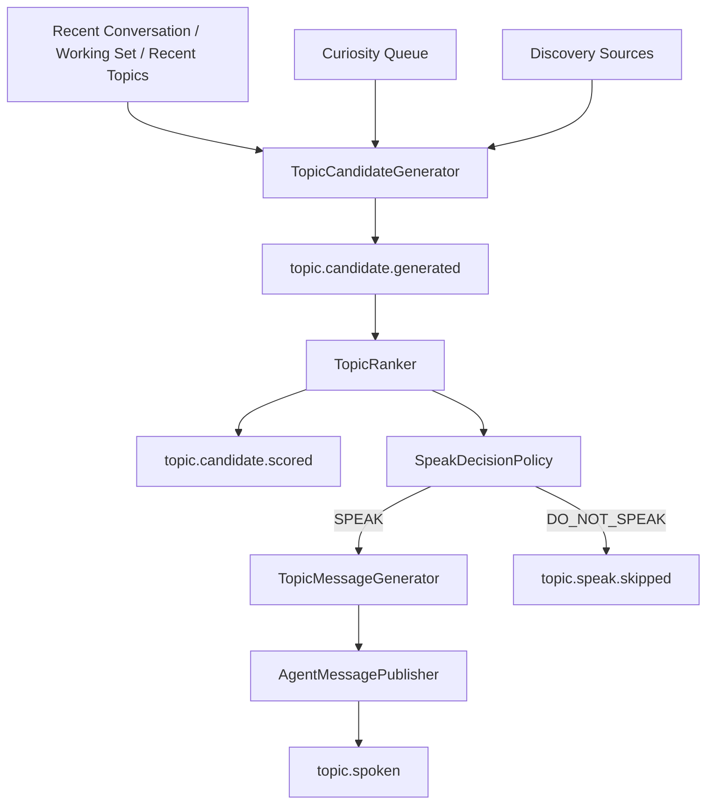
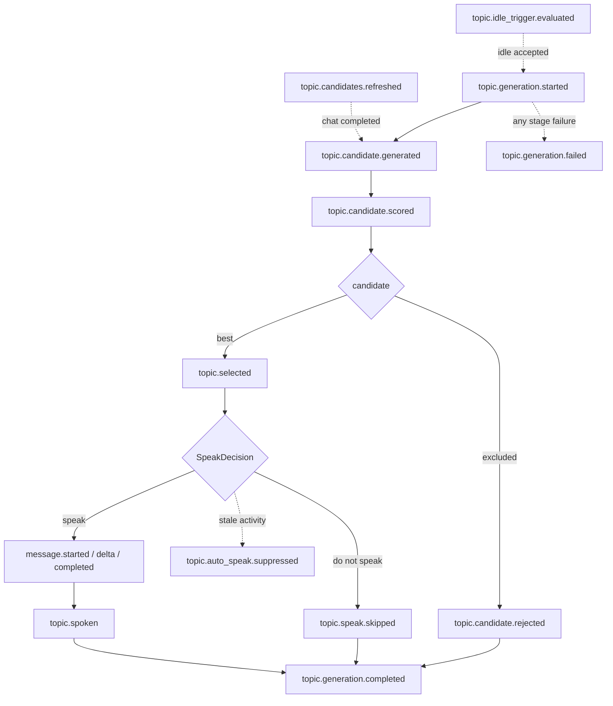

# Topic Generator

## 概要

Topic Generator は、ユーザーから明示的な入力がない場合でも会話上の話題候補を作るための補助機能です。
通常応答の主経路を壊さないため、`rei.topic-generator.enabled=false` では LLM、Web、Feed、GitHub の追加呼び出しを行いません。

## アーキテクチャ



候補生成、ランキング、発話判定、発話文生成を分離しています。
LLM は候補生成にだけ使い、最終スコアと発話可否は deterministic な Java 実装で判定します。
通常の chat 完了時には候補だけを更新し、idle scheduler がユーザー不在を検出したときに保存済み候補から発話します。

## TopicCandidate

`TopicCandidate` は `id`, `topic`, `reason`, `type`, `source`, `priority`, `freshness`, `usefulness`, `intrusiveness`, `confidence`, `createdAt` を持ちます。
スコア系の値は 0〜1 に丸めます。

## TopicType

定義済みの種別は `UNFINISHED_WORK`, `FOLLOW_UP`, `RECENT_INTEREST`, `DISCOVERY`, `REFLECTION`, `CASUAL`, `TIME_CONTEXT` です。
Phase 1 の LLM 候補生成では `UNFINISHED_WORK` と `FOLLOW_UP` だけを採用します。

## TopicSource

情報源は `WORKING_SET`, `CONVERSATION`, `MEMORY`, `CURIOSITY_QUEUE`, `WEB`, `FEED`, `GITHUB`, `TIME_CONTEXT` です。

## TopicRanker

初期実装は `DeterministicTopicRanker` です。戻り値の `RankedTopicCandidate` は `TopicScoreBreakdown` を持ちます。

```text
score =
    priority      * 0.20
  + freshness     * 0.20
  + usefulness    * 0.30
  + confidence    * 0.20
  - intrusiveness * 0.25
  - repetitionPenalty
```

直近 topic と normalized string が一致する場合は repetition penalty を加えます。
`topic.candidate.scored` はこの breakdown をそのまま payload に載せます。Event 用のスコア再計算はしません。

## SpeakDecision

`DefaultSpeakDecisionPolicy` は、候補なし、agent busy、user recently active、cooldown、minimum score、minimum confidence、repetition を見て `SPEAK` / `DO_NOT_SPEAK` を返します。
通常の chat 完了直後は候補を refresh するだけで、自動割り込み発話はしません。
発話は `rei.topic-generator.idle-trigger.enabled=true` かつ、アプリ起動、最後のユーザー入力、最後のエージェント応答のいずれからも `minimum-idle` 以上経過し、エージェントが busy でない場合だけ試行します。
発話文生成中にユーザー入力や別のエージェント活動が入った場合は stale activity として publish しません。

## Curiosity Queue

`CuriosityItem` は `id`, `question`, `reason`, `source`, `priority`, `createdAt`, `expiresAt`, `status` を持ちます。
status は `PENDING`, `USED`, `DISMISSED`, `EXPIRED` です。
実装は `SqliteCuriosityQueue` で、`.rei/curiosity.db` に保存します。
`normalized_question` の unique index により重複を抑止し、期限切れ item は `EXPIRED` に更新して候補にしません。

## Discovery

`DiscoverySeedGenerator` は Working Set、recent topic、recent conversation から seed を作り、`rei.topic-generator.discovery.max-seeds` で制限します。
`WebDiscoverySource` は既存 `WebSearchAndReadService`、`FeedDiscoverySource` は既存 `FeedService` を使います。
`GitHubDiscoverySource` はコネクタ未接続でも全体を止めない空実装です。
`DiscoveryTopicCandidateGenerator` は source failure を source 単位で無視し、低 relevance と seen item を除外します。

## Event API

Topic Generator event はログではなく、1 回の評価サイクルの状態遷移を表す fact です。Event Bus の既存 sequence を使うため、Agent run / message / tool event と同じ順序空間で追跡できます。



イベント:

- `topic.generation.started`
- `topic.idle_trigger.evaluated`
- `topic.candidates.refreshed`
- `topic.candidate.generated`
- `topic.candidate.scored`
- `topic.candidate.rejected`
- `topic.selected`
- `topic.speak.skipped`
- `topic.spoken`
- `topic.generation.completed`
- `topic.generation.failed`
- `topic.auto_speak.suppressed`

主な payload:

- `topicGenerationId`: 1 回の Topic Generator 評価サイクルを相関付ける ID。
- `candidateId`: 候補単位の ID。
- `topicSummary` / `reasonSummary`: Shell と Projection 用の短い summary。長大な会話本文や外部本文は載せません。
- `score`: `TopicScoreBreakdown`。priority / freshness / usefulness / confidence の寄与値、intrusiveness / repetition の penalty、finalScore を持ちます。
- `rejectionReason`: `TopicRejectionReason`。候補が最終候補から除外された理由です。
- `skipReason`: `TopicSpeakSkipReason`。候補選択後に今回は発話しなかった理由です。
- `durationMs`: `topic.generation.completed` のサイクル全体所要時間。

`rejected` と `skipped` は意味を分けています。

- `rejected`: candidate 自体を最終候補として採用しない。例: `LOW_SCORE`, `LOW_CONFIDENCE`, `RECENTLY_SPOKEN`。
- `skipped`: candidate は選択された、または候補なしとしてサイクルを閉じたが、今回は発話しない。例: `COOLDOWN`, `USER_ACTIVE`, `AGENT_BUSY`, `NO_CANDIDATE`。

`topic.generation.completed` は正常終了を表し、発話成功だけを意味しません。候補なし、全 candidate rejection、selected + skipped、selected + spoken のいずれも completed です。エラー時は `topic.generation.failed` を出し、通常 Agent run failure には昇格しません。

自動発話では `AgentMessagePublisher` が先に assistant message を会話履歴と通常 message event に publish し、その後に `topic.spoken` と `topic.generation.completed` を publish します。これにより Shell には通常応答と同じ経路で発話文が表示されます。

idle scheduler は、判定が `accepted` になったとき、または rejected reason が前回から変わったときだけ `topic.idle_trigger.evaluated` を publish します。`FEATURE_DISABLED` は既定無効時の常時通知を避けるため Shell へ出しません。

## TopicGeneratorProjection

`TopicGeneratorProjection` は Topic event 列から `TopicGeneratorState` を復元します。既存 `DefaultAgentUiProjection` と同じく stale sequence を無視し、不完全な candidate event 順序にも placeholder で耐えます。

`TopicGeneratorState` は `status`, `topicGenerationId`, `candidates`, `selectedCandidateId`, `skipReason`, `startedAt`, `completedAt`, `lastSpokenAt`, `spoken`, `lastSequence` を持ちます。

`TopicCandidateState` は `candidateId`, `status`, `type`, `source`, `topic`, `reason`, `score`, `rejectionReason` を持ちます。

新しい `topic.generation.started` では前 generation の candidates / selected / skipReason をクリアします。ただし `lastSpokenAt` は cooldown 等の UI 表示に必要なので維持します。

## Shell 表示

Shell は Topic lifecycle を簡潔に表示します。

```text
[topic] generation started
        id: tg-123
[topic] idle trigger skipped
        idle: 30.00s
        required: 120.00s
        reason: INSUFFICIENT_IDLE
[topic] candidates refreshed
        candidates: 3
[topic] candidate
        id: topic-001
        type: unfinished_work
        source: working_set
        topic: Working Set の効果測定
[topic] scored
        id: topic-001
        score: 0.82
        priority: +0.16
        freshness: +0.17
        usefulness: +0.27
        confidence: +0.18
        intrusiveness: -0.05
        repetition: -0.01
[topic] selected
        id: topic-001
        score: 0.82
        rank: 1
[topic] speak skipped
        id: topic-001
        reason: COOLDOWN
[topic] auto speak suppressed
        reason: stale activity
[topic] generation completed
        candidates: 3
        scored: 3
        rejected: 2
        selected: topic-001
        spoken: false
        duration: 184ms
```

## 設定

```yaml
rei:
  topic-generator:
    enabled: false
    max-candidates: 5
    minimum-score: 0.65
    minimum-confidence: 0.70
    minimum-topic-speak-interval: 30m
    candidate-max-age: 30m
    idle-trigger:
      enabled: true
      check-interval: 30s
      minimum-idle: 2m
    curiosity:
      expiration: 30d
    discovery:
      enabled: true
      max-seeds: 3
      minimum-relevance: 0.70
      freshness-window-days: 30
```

## 障害時動作

LLM 失敗、不正 JSON、timeout は候補なしとして処理します。
Web / Feed / GitHub source の失敗はその source のみ無視します。
Topic Generator 全体の失敗は `ChatCommand` 側で捕捉し、通常会話を失敗させません。
idle scheduler と orchestrator の例外も通常 shell loop には伝播させません。

## Phase 1〜5 の実装範囲

Phase 1: LLM/stub から unfinished work / follow-up 候補を生成します。
Phase 2: deterministic ranking、repetition penalty、cooldown、minimum score/confidence を実装しました。
Phase 3: Topic Event と Shell 表示を追加しました。
Phase 4: Curiosity Queue、dedup、expiration、TopicCandidate 変換を追加しました。
Phase 5: Working Set 等から seed を作り、Web/Feed/GitHub source から discovery candidate を作る構造を追加しました。

## 今後の拡張候補

GitHub connector が利用可能になった段階で release / issue / pull request の実装を差し替えられます。
Curiosity Queue は SQLite 永続化済みです。必要になれば古い item の定期 prune や一覧/削除コマンドを追加できます。
