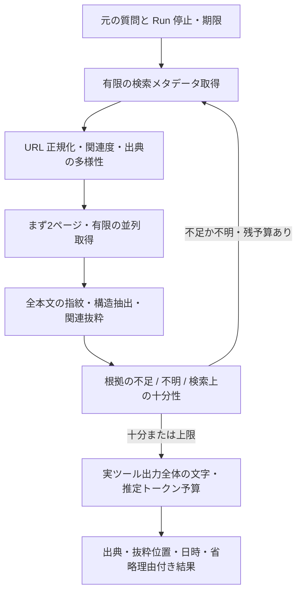

# Web 検索の効率・品質改善

## 調査結果と Phase 0

`webSearch` → `WebSearchService` は設定順に DuckDuckGo / Brave の全プロバイダーを呼ぶ。
`webSearchAndRead` → `WebSearchAndReadService` は上位3件を `UrlContentFetchService` で直列取得する。
`searchKnowledge` → `SearchKnowledgeService` → `WebSearchOrchestrator` は
`WebSearchQueryPlanner` の元クエリ / official / latest を全実行し、URL文字列で重複排除、
全候補を `WebPageFetcher` で直列取得後、`WebSearchAggregator` で最終件数を制限する。
`WebPageExtractor` は Jsoup で本文先頭2000文字を抽出する。

Paper Research の `SafePaperHttpClient` は Reactor Netty の resolver で実際の接続先を検証し、
リダイレクトも再検証する。PDF用サイズ制限、`PaperOperation` のキャンセル・Future停止がある。
通常ページ取得は別の JDK HTTP 実装でサイズ制限がなく、URL要約の文字コード判定のみ共通化済み。
Web専用キャッシュ・並列本文取得・関連箇所スコアリングは未実装。
既存の lexical / rerank は VectorStore にあり、検索ごとの embedding は追加しない方針。

## 計測

既存 Actuator / Micrometer の global registry を利用する。
`rei.web.search.events` は event ごとの観測件数、`rei.web.search.providers` は
duckduckgo / brave / other の実際の Search API 呼び出し数、`rei.web.search.http` はステータス数。
`rei.web.search.duration` は search / fetch / total の Timer と P50 / P95。
URL・クエリ・本文・APIキーをラベルや計測ログに含めない。

events: search_api_calls, http_requests, results, duplicate_urls, fetch_candidates,
fetch_successes, fetch_failures, timeouts, cancellations, additional_searches,
output_characters, estimated_tokens, received_bytes。
同じURLがプロバイダー統合時・展開クエリ統合時に重複した場合は、それぞれの除外を数える。
文字数は返却本文の量であり、実際のモデル入力・課金トークンとは区別する。
推定トークンは既存の共通 `TokenEstimator.conservative()` を再利用する。
ASCII は4文字あたり1、非ASCIIのコードポイントは1文字あたり2を目安にした予算用近似。

キャッシュ、single-flight、リダイレクトは未実装なので観測値を生成しない。
Phase 0 の received_bytes は受信 body の byte[] 長を観測する。HTTPヘッダー・TLS通信量は含まない。
途中失敗したレスポンスの部分受信量も未計測。HTTPサイズ計測の共通化は Phase 1。
P50/P95 は MeterRegistry の観測窓・exporter に依存し、少数標本では比較に使わない。
現在はプロセス集計であり Run / Session ごとの集計は未実装。
Actuator公開設定は既存の認証・公開範囲に従う。

## 品質回帰

`WebSearchQualityRegressionTest` は外部通信なしの固定検索・本文 fixture。
一般技術、公式、バージョン、最新、複数サイト要求、日本語、英語、少数結果、
障害、本文失敗の10シナリオで出典維持と本文根拠維持を独立に検証する。
公式・鮮度・複数独立出典の充足を評価する本格的な品質判定は Phase 2 / 5 の対象。
このテストだけで実検索 Recall の改善を主張しない。
既存 provider localhost integration tests は固定 HTTP 応答の解析・統合順を検証する。

実行: `./mvnw -Pfull -Dtest='WebSearch*Test,WebPage*Test,SearchKnowledgeServiceTest,UrlContentFetchServiceTest' test`。
比較時は同じ fixture・設定・ウォームアップ・キャッシュ状態・繰返し数を使う。
削減率=(Before−After)/Before×100、成功率・Recall は絶対値と差を比較する。

| 指標 | Phase 0 | 最終 | 改善率 |
|---|---|---|---|
| Search API 回数 | 未計測 | 未計測 | 未計測 |
| HTTP 回数 | 未計測 | 未計測 | 未計測 |
| 本文取得ページ数 | 未計測 | 未計測 | 未計測 |
| 受信バイト数 | 未計測 | 未計測 | 未計測 |
| P50 / P95 | 未計測 | 未計測 | 未計測 |
| モデル入力推定トークン | 未計測 | 未計測 | 未計測 |
| 根拠取得成功率 / Recall | 未計測 | 未計測 | 未計測 |

計測基盤の追加は実環境性能の計測結果を意味しない。

`measuresLegacyBaselineWithoutNetwork` の固定 fixture（3展開クエリ、各1件の独立候補、
最終 limit=1、本文は全て `evidence`、キャッシュなし）では検索サービス呼び出し3回、
追加検索2回、本文取得3回、返却出典1件を直接検証する。
Search API / HTTP はモックなので実通信件数や速度のベースラインではない。

## Phase 0 検証とマージ阻害要因（2026-10-09 JST）

TDD: `WebSearchMetricsTest` はクラス未実装のコンパイル失敗（Red）を確認後に実装。
検索・本文取得の関連テストは成功。最終差分の再検証結果は PR に記載する。
全体 `./mvnw -q -Pfull test` は **3815件、failure 0、error 1、skipped 1** で失敗。
既存の `DocumentRendererProcessTest` の PlantUML テストが skip。
既存テストを削除・無効化していない。

エラーは `ImplementationDelegationIntegrationTest` の CODEX ケース。
`ExternalAgentProcessRunner.cleanup()` の `child.destroyForcibly()` が
`IllegalStateException: destroy of current process not allowed` を送出した。
同クラスは今回の差分に含まれず main と同じ実装。
`ProcessHandle` の収集後に生存確認だけで終了しており、自 JVM を対象外にする保証、
終了対象の起動時刻・親子関係の同一性確認を検証する必要がある。
Windows の PID 再利用等が原因かどうかは未確定で、原因を断定しない。
単に例外を握り潰す修正では対象外プロセスの終了リスクを解決できない。

対策案: 自 JVM・祖先を明示的に除外し、収集時と終了時のプロセス識別を保証する。
Windows の Job Object 等の所有プロセス境界も比較検討し、終了済み・PID再利用・
親終了後の子・キャンセル競合の回帰テストを追加する。
安全性問題を報告して無理にマージしないという依頼の条件に従い、Phase 0 を保留する。
後続 Phase は先行 Phase のマージ・main 同期が前提のため着手しない。
全体テストの失敗を関連テストの成功で置き換えない。

### 再試行と続行

ユーザーの再試行・続行指示に従い、既存 Java プロセスがない状態から
`bb4efacf` の全体回帰を再実行した。今回の XML 集計は **3816件、failure 0、error 0、skipped 1**、
終了コード0。前回失敗した CODEX ケースを含め両外部エージェントケースが成功した。
初回実行後に追加された baseline テスト1件も実行されたため件数が1件増えている。
別起動の Rei が初回失敗の原因かは未確定で、初回失敗の履歴を保持する。
CI 成功とレビュー要件を確認後、Phase 0 をマージして後続 Phase を開始する。

続行前のレビューで、推定トークンを既存の共通予算管理と同じ `TokenEstimator` に統一した。
日本語・英語混在の Red テストで expected 10 / actual 5 の不一致を確認後に修正。
これによって Web 独自の推定式を追加せず、モデル入力の計測・予算と整合する。

### CI 環境の整合

旧コミットの CI は最新版への置換で停止したが、取得したログに既存回帰失敗があるため保存・報告する。
Windows runner の `C:\Users\RUNNER~1` 形式の一時パスと `toRealPath()` が返す
`C:\Users\runneradmin` の差が、Project / Task の所有確認を含む既存テストの不一致を起こしていた。
CI は runner の正規の一時ディレクトリを TMP / TEMP / java.io.tmpdir に指定する。
LF 前提の YAML fixture は Git の自動 CRLF 変換を無効にしてチェックアウトする。
端末通知の unit test は実 system terminal の代わりに明示的な入出力ストリームを持つ
非 system terminal を使う。headless runner で各ケースに約150秒の待機が発生していたため。
既存テストの選択・アサーションは維持し、全体 CI のテスト除外は追加しない。

最新 CI ではパス・改行の不一致が解消し、3817件中 error 10 / failure 0 / skipped 1。
残りは欧文 native.encoding で日本語を argument file に書けない1件と、
JLine の native terminal provider 探索による入力テストのタイムアウト9件だった。
windows-1252 を明示する Red テストで文字コードエラーを再現し、classpath は argument file に残したまま、
表現できない引数を Unicode のプロセス引数として渡す修正で Green を確認した。
端末 fixture は provider 探索を行わない DumbTerminal を直接生成し、実 JLine reader と既存 assertions は維持する。
関連22件成功（入力13件、通知7件、長いclasspathと文字コード2件）。全体 CI の除外は追加しない。

99874508 の最終ローカル全体回帰は3818件、failure 0 / error 0 / skipped 1、終了コード0（6分41秒）。
GitHub run 37809653438 は設定済みの30分上限を過ぎても in_progress のままでログ取得不可。
通常取消・強制取消を受理した後も状態が変わらず、同じ run の再実行は「既に実行中」と拒否された。
終了原因は未確定で成功扱いしない。この検証履歴の追記で新しい runner の全体回帰を起動する。
ソース、テスト選択、アサーション、CI 上限は変更せず、最新コミットの CI 成功がマージ条件。

別 runner の run 37814110817 も30分上限を超えて終了状態が確定せず、強制取消を要求した。
停止箇所を診断できるよう、CI の同じ Maven 全体回帰を所有子プロセスとして実行する。
子プロセスの締切は20分、期限超過は124、Maven の通常失敗はその非ゼロ終了コードを返す。
15秒ごとの進行表示と従来と同じ Maven 標準ログを残し、テスト・アサーションは除外しない。
1秒締切の試験で124、子プロセス限定の JAVA_HOME 不備で1の伝播を実測した。
追加のレポート・ダンプ送信は行わず、通常の CI 標準ログを診断に使う。

締切付き CI run 37818179082 は全3818件を完了（10分21秒）、failure 2 / error 0 / skipped 1。
端末入力13件は成功し、残り2件は欧文 Windows の argv で日本語が ??? に変わる fixture 引数の破損だった。
OS のコードページで表現できない絵文字を追加し、ローカルでも文字が ?? に変わる Red を確認した。
fixture 補助ランチャーは classpath を argument file に保持し、引数を ASCII Base64 として渡して Java 内で UTF-8 復元する。
固定引数の個数を明示し、コマンドに後から追加される native 引数の既存契約も維持する。
Unicode・長いclasspath・実 native 引数・端末・外部エージェントの関連33件成功。全体回帰を再実行する。
変更前 wrapper の通常成功も全3818件、failure 0 / error 0 / skipped 1、Maven 6分47秒・wrapper終了0を確認済み。

### フェーズ0完了

PR [#42](https://github.com/mikoto2000/rei/pull/42) はマージ済み。
最終コミット `7394b557` のローカル全体回帰は3819件、failure 0 / error 0 / skipped 1、wrapper終了0（6分49秒）。
同じコミットの GitHub CI run `37820606493` も3819件、failure 0 / error 0 / skipped 1で成功（9分37秒）。
保護ルール・必須レビューなし、CI成功を確認して `77c0c812` で main へマージした。
別途起動した rei と最初のプロセス cleanup エラーの因果関係は未確定。再試行後は再発していない。

### フェーズ1: 共通の安全な HTTP 取得

`http.SafeHttpFetcher` を検索プロバイダー、URL本文、WebPageFetcher、Paper に共通化した。
検索本文と URL 本文の既存文字コード判定は維持する。Paper の再試行・Content-Type 検証・公開 API も維持する。
wire bytes は各 ByteBuf をコピーする前、decoded bytes は圧縮展開中の各書き込み前に制限する。
Content-Length がない転送でも実測で制限し、大きい Content-Length は早期拒否する。
identity / gzip（連結メンバーを含む）/ zlib deflate に対応し、未知の Content-Encoding は拒否する。
接続、無通信の読み取り、処理全体の期限を別に扱う。全体期限には DNS、転送、リダイレクト、展開を含み、
Paper のリトライと backoff でもリセットしない。待機中は実行中止を短い間隔で確認し、future・DNS問い合わせ・接続を解放する。

| 設定接頭辞 | wire 上限 | decoded 上限 | 接続 / 読み取り / 全体 | redirect 上限 |
| --- | ---: | ---: | --- | ---: |
| rei.web-search | 2 MiB | 4 MiB | 5s / 10s / 10s | 5 |
| rei.url-fetch | 2 MiB | 4 MiB | 5s / 10s / 30s | 5 |
| rei.paper（API） | 4,000,000 B | 8,000,000 B | 5s / 10s / 30s | 5 |
| rei.paper（PDF） | 20,000,000 B | 20,000,000 B | 5s / 10s / 30s | 5 |

Web/URL のキーは `max-wire-bytes`, `max-decoded-bytes`, `connect-timeout-seconds`,
`read-timeout-seconds`, `timeout-seconds`, `max-redirects`。対応する環境変数は application.yaml に記載。
Paper は `max-response-bytes`, `max-decoded-response-bytes`, `max-pdf-bytes`, `max-decoded-pdf-bytes`,
`connect-timeout`, `read-timeout`, `timeout`, `max-redirects` を使う。
サイズは最大100 MiB、各期限は最大5分、redirectは最大10の設定検証を行う。
これらは有限の暫定初期値であり、実Webのサイズ分布やP95から最適化した値ではない。
全体期限は既存の Web 10秒 / URL 30秒 / Paper 30秒を維持し、Paper の wire 上限も既存値を維持した。
従来の HTML 取得は無制限で実サイズ分布の記録がないため、2 MiB / 4 MiBを暫定の安全上限として設定可能にした。

公開ページは http:80 / https:443 のみ、userinfo・IPv6 zone・localhost・非公開/予約/文書用 IP を拒否する。
DNS の全応答を検証し、検証済み InetSocketAddress を transport へ渡す。
接続後の実 peer も、その問い合わせで検証済みの IP と一致することを確認する。
リダイレクト先でも再検証し、認証等のヘッダーは異なる origin に送らない。TLS のホスト名は元の URI を維持する。
IP分類は [IANA IPv4 Special Registry](https://www.iana.org/assignments/iana-ipv4-special-registry/) と
[IANA IPv6 Special Registry](https://www.iana.org/assignments/iana-ipv6-special-registry/) を参照した保守的な公開アドレス判定。
一部の特殊用途の globally reachable アドレスも拒否する。

管理者が設定する検索プロバイダーは origin を固定し、別 origin への redirect を拒否する。
既存のローカルプロバイダーとの互換性のため、設定 origin が明示的 localhost/loopback のときだけ同じ origin の loopback 接続を認める。
private LAN API が必要な場合だけ provider の `allow-private-network: true` を明示する。
この例外は管理者設定の provider origin に限定され、検索結果のページ URL や fetchUrlContent には適用しない。

実リクエストと受信チャンクを observer で計測し、redirect 後の通信も計数する。拒否された URL はリクエスト数に含めない。
エラーは低カーディナリティのコードで返し、クエリ・本文・認証値をログやメトリクスへ追加しない。
`ToolContext` の実行中止はツールスキーマに公開せず伝播し、通常の取得失敗への fallback で握りつぶさない。
実ソケットの fixture と純粋な境界テストを使用する。ライブWebの速度・転送削減率は未測定。

### フェーズ1完了

PR [#43](https://github.com/mikoto2000/rei/pull/43) を `f3914e18` で main へマージした。
`031a3ec2` のローカル全体回帰3893件、failure 0 / error 0 / skipped 1、wrapper終了0（8分05秒）。
同じ head の CI run `37829967450` も3893件、failure 0 / error 0 / skipped 1で成功（5分38秒）。
merge state CLEAN、未解決レビューコメントなし、必須保護ルールなしを確認してマージした。

### フェーズ2: 段階的検索と取得前の選定

`WebSearchSelection` を WebSearchAndRead と searchKnowledge の WebSearchOrchestrator に共通利用する。
元の検索から始め、件数だけでなく関連語、公式ドメインと質問の製品名の対応、指定バージョン、日付、
独立ドメイン数、正規化後の重複率で追加検索を判断する。メタデータの十分性は候補選定の目安であり回答の正しさの保証ではない。
公式判定を任意の `docs.*` 接頭辞や `.gov` の部分一致から変更した。未知の製品は公式と断定しない。
最新版の判定は出典が主張する日付を使う暫定30日ルールで、日付なし・解析不能・遠い未来は十分と扱わない。
同一ホスト配下のサイトを独立した出典として数えない。ドメインの末尾2ラベルで保守的にまとめるため、
co.jp/co.uk等の複数組織も同一グループになる場合がある。この判定で独立性を過剰に主張しない。

`max-search-queries` は既定3・最大3、`max-search-api-calls` は既定4・最大12。
後者は全クエリ/プロバイダー共通で実通信の開始時に消費し、provider redirect も含める。
`max-page-fetches` は既定5・最大20で、最終候補数・readTopと合わせて **本文取得前** に適用する。
`max-results` は最大20。各環境変数は application.yaml に記載した。
関連性・出典の優先度を評価し、元の検索順位を同点時に維持しながらドメインの多様性を優先する。
readTop=0は元クエリだけを使い、本文は取得しない。LLM/embedding呼び出しは追加しない。

URLは scheme/host の小文字化、既定port・fragmentの除去、dot path の正規化、
utm_*/gclid/fbclid/msclkidのみの除去を行う。ref/source/version/qやクエリ値のエンコード・順序は保持する。
重複候補の元URL/タイトル/日付は alias に保存し、検索結果の本文はそのURLを使って取得する。
本文は **切り詰める前の抽出全文** とコードの原文（字下げを含む）から SHA-256 を計算する。
同一本文は一件にまとめ、引用 alias を統合する。旧コンストラクタや失敗snippetは全文ハッシュを持たず、
短い出力だけで誤って重複扱いしない。HTTP redirect は実際の最終URLを `http_redirect` として保存する。
same-origin canonical は `page_canonical_claim` として保存し、外部ページの主張だけで本文を同一視しない。
これらは出典データであり、ツール権限やシステム指示へ昇格させない。

フェーズ0の同じ固定fixture（最終一件、内容 evidence）の実測は検索3/取得3。
改善後は検索1/取得1で、返すURLと evidence を保持するテストを追加した。
これは mock を使う決定的な回数比較であり、実Webの66.7%高速化・通信削減・Recall改善を意味しない。
品質 fixture の期待出典と evidence を維持し、重複本文は複数行を返す代わりに全引用URLを alias に保持する。

#### CI 停止の追加調査

`4fce9297` のローカル全体回帰は3913件、failure 0 / error 0 / skipped 1、wrapper終了0（7分30秒）。
CI run `37833781348` は20分のプロセス期限を越えても実行中になり、ジョブログ取得は BlobNotFound だった。
通常キャンセルに反応しなかったため force-cancel を要求した。この run を成功とは扱わない。

外部エージェントの子プロセス終了処理には、終了済み root の descendants を再列挙し、
取得したハンドルを無条件に終了する問題があった。モックのプロセスだけを用いる境界テストで4件の失敗を再現した。
root が生存し開始時刻を確認できる間だけ列挙し、列挙の前後で同じ開始時刻と生存を確認する。
root より古い、開始時刻不明、現在の JVM またはその祖先のハンドルを拒否する。
確認済みのハンドルは root 終了後も保持し、既存の子プロセスキャンセルを維持する。
確認できないプロセスを終了しないため、瞬時に孤児化した子の追跡には限界がある。

OpenJDK の [ProcessHandleImpl](https://github.com/openjdk/jdk/blob/master/src/java.base/share/classes/java/lang/ProcessHandleImpl.java)
は parent PID と開始時刻から descendants を探索する。root 終了後の古い parent PID により、
無関係なプロセスが候補に入る可能性を考慮した修正である。
現在の CI 停止や別途起動した rei との因果関係はログが取得できず未確定。
テストを除外せず、所有を検証したプロセスだけを終了するようにした。

### フェーズ2完了

PR [#44](https://github.com/mikoto2000/rei/pull/44) を `b0139807` で main へマージした。
最終 head `6c9f359f` の全体回帰はローカル3920件、failure 0 / error 0 / skipped 1、
wrapper終了0（9分47秒）。CI run `37837465243` も同じ3920件で成功（7分57秒）。
未解決レビューコメントなし、merge state CLEAN、必須保護ルールなしを確認してマージした。
停止した旧 run は最終状態 cancelled で、成功の検証には使っていない。

### フェーズ3: 制限付き並列本文取得

WebSearchAndRead と searchKnowledge は同じ Spring 管理の `WebFetchBatch` を使用する。
従来コンストラクタも維持し、その利用時は共有の既定値 executor を使う。
`ParallelSubAgentDelegator` / `ExternalAgentDelegationService` は LLM エージェント実行・登録・予算管理専用であるため、
そこで使う bounded ThreadPoolExecutor の方式を採用し、HTTP の実行制御は共通 FetchOperation / FetchScope を再利用する。
HTTP 用 executor は固定の daemon worker、有限キュー、AbortPolicy と明示的な shutdown を持つ。

| 設定 | 既定値 | 許容範囲 |
| --- | ---: | --- |
| fetch-parallelism | 3 | 1..3 |
| fetch-per-host | 2 | 1..fetch-parallelism |
| fetch-queue-capacity | 32 | 1..64 |
| fetch-batch-timeout-seconds | 30 | 1..300秒 |

環境変数は `REI_WEB_SEARCH_FETCH_PARALLELISM` 等、application.yaml に記載する。
並列数を1にするときは fetch-per-host も1にする。各設定は暫定値で、実WebのP95から調整した値ではない。
上限は同時に実行される複数のバッチにも適用する。ホスト待機中も worker とバッチ期限の上限を保つ。
検索候補のホスト単位で loader を制限し、共通 `http.HostAdmission` を使って SafeHttpFetcher の実接続先にも制限する。
各 redirect hop で実接続先の permit を取り直すため、複数の元URLが同じ転送先へ集中しても上限を保つ。
ホストは URI の hostname で判定する。ホスト名が異なる同一IPへの接続も全体 worker 上限で抑制する。
permit の待機・所有が終わると参照を削除し、ホスト一覧を蓄積しない。

本文の完了順や長さで再順位付けせず、取得前に選定した順位で結果を返す。
一次/補足分類は保持し、WebSearchContext.allResults は選定順を保持する。
searchKnowledge のツール出力も分類ごとに並べ替えず、一つの順位順一覧で sourceType を表示する。
失敗は fetchStatus / errorType を付け、searchKnowledge の出力にも表示する。
失敗時に snippet を残す場合も success と表示しない。元の例外診断文は本文・認証値を含み得るため出力しない。
レコードとサービスの既存コンストラクタは維持し、新しい状態フィールドは追加方式とする。

バッチ期限は各 HTTP 期限とは独立で、親 Run の期限が早ければその期限を使う。
遅い先頭項目を待っている間に完了した後続の成功も残す。未完了項目は BATCH_TIMEOUT、
キュー飽和・executor 終了は FETCH_REJECTED として明示する。
Run の停止・割込みは全体へ伝播し、未開始タスクを取り除き、実行中の future/HTTP を取り消す。
future.cancel と worker 終了を区別し、worker の finally が済むまで実行枠を解放しない。
バッチ終了時は最大1秒、アプリ終了時は最大2秒を後処理の待機に使う。
共通 HTTP は短い間隔で取消を確認し接続を閉じる。割込みを無視する独自 loader を強制終了する仕組みではない。

遅延120msの3ページ fixture は同じ値・順位を返し、最終関連テスト実行時の実測は逐次368.6ms / 並列130.4ms。
開始 latch を使う別テストでも3件が同時に開始することを検証する。
これは固定のローカル遅延 fixture の一回の計測であり、実Webの速度改善率やP50/P95の測定結果ではない。
実HTTPの同一接続先ホスト上限、期限切れによるソケット切断、部分成功も fixture で検証する。
関連 full-profile 回帰は125件、failure 0 / error 0 / skipped 0で成功した。
`5e41ba67` の全体回帰はローカル3939件、failure 0 / error 0 / skipped 1、wrapper終了0（9分51秒）。
同じ head の CI run `37840916290` も3939件で成功（7分45秒）。
その後、ツール出力の分類が順位を変えるケースを Red テストで再現し、sourceType を表示する順位順の出力へ変更した。
この修正後の最終コミットも、関連回帰と全体 CI 成功を確認してからマージする。
出力順位の修正を含む関連 full-profile 回帰126件は failure 0 / error 0 / skipped 0で成功した。

最終 head `5ae36f50` の全体回帰はローカル3940件、failure 0 / error 0 / skipped 1（9分56秒、wrapper終了0）。
CI run `37842990034` も同じ3940件で成功（8分05秒）。PR [#45](https://github.com/mikoto2000/rei/pull/45) を
`ef83060e` で main にマージし、次のキャッシュ段階はこの main から開始した。

### フェーズ4: メモリーキャッシュと同一取得の集約

既存 SearchResultCache の同期 FIFO / TTL を `BoundedTtlCache` に共通化した。既存 API を保持し、
実際に同じインスタンスの時刻を進める TTL 境界テストへ置き換えた。
HTTP の検索メタデータと本文は同じ Spring 管理 HttpResponseCache を使用する。
SQLite へ永続化せず、プロセス終了で内容を捨てる。手動生成する旧サービスコンストラクタは
従来の取得動作を保つためキャッシュ無効、新しい注入コンストラクタで共通キャッシュを使用する。
Paper の保存・取得はこのキャッシュの対象ではない。

| rei.http-cache 設定 | 既定値 | 許容範囲 |
| --- | ---: | --- |
| enabled | true | true / false |
| search-ttl-seconds | 30 | 1..300秒 |
| page-ttl-seconds | 60 | 1..300秒 |
| retention-seconds | 300 | TTL以上、最大1800秒 |
| max-entries | 128 | 1..1024 |
| max-bytes | 33554432 | 1..134217728 |
| load-parallelism | 3 | 1..3 |
| load-queue-capacity | 16 | 1..64 |
| max-in-flight | 32 | 1..128 |

環境変数は `REI_HTTP_CACHE_ENABLED` 等、application.yaml に記載する。
容量は本文、URI、ヘッダー、固定管理費を含む保守的な推定 resident weight であり JVM ヒープ実測値ではない。
通信中の作業バッファは別に既存 wire / decoded 上限と有限 worker / queue で制限する。
キャッシュ有効化は Web 検索の有効化を変更しない。

キーは namespace、provider / limit、正確な URI と全クエリ、すべての正規化ヘッダー、
HTTP 方針の全フィールド、実 transport を長さ付きで SHA-256 化する。生のキーはログ・metrics に出さない。
認証ヘッダー、許可リスト外ヘッダー、private origin、機密値を検出した URI はキャッシュも共有取得も回避する。
公開の直接200応答だけを保持する。redirect は各 hop のキャッシュ方針を保持しないため保守的に対象外とする。
no-store / private / must-understand / Set-Cookie / Vary:*、binary / 機密本文、エラーを保存しない。
SensitiveInfoDetector を再利用し JSON secret / access token 等の形を追加、既存 RE2J で走査する。
検出は完全な秘密情報判定ではなく、公開ドキュメントの例示も検出し得る保守的なパターン判定である。
レスポンスの本文は保存・返却の境界でコピーして呼び出し元の変更による汚染を防ぐ。

TTL は設定値と Cache-Control / Expires の短い方から Age、Date、応答遅延を引く。
不正な lifetime は fresh と扱わない。no-cache / max-age=0 は validator を保持して毎回再検証する。
重複 Cache-Control / Vary を統合し、早い no-store を最後のヘッダーで失わない。
通常の期限切れと forceRefresh は ETag、なければ Last-Modified で検証する。
304 は内部で送った validator と既存表現がある場合のみ本文を再利用し、取得日時 retrievedAt を保持、
検証日時 validatedAt を更新する。失敗した検証に古い本文でフォールバックしない。
意味と制約は [RFC 9111](https://www.rfc-editor.org/rfc/rfc9111.html) に従い、アプリ側の有限 TTL / privacy 条件を加える。

既存4ツールの名前と旧引数は保持し、省略可能な forceRefresh を追加した。
「latest」「最新」等を含むクエリも、展開クエリと並列本文取得まで再検証フラグを伝える。
別 origin へ転送するときは ETag / Last-Modified 条件だけを外し Cache-Control を保持する。
認証情報を転送しない従来の拒否規則、DNS / peer 検証、タイムアウトは維持する。

同じキーの冷たい取得は有限 executor で一度に集約する。待機者それぞれの停止・期限を確認し、
最初の待機者の短い期限を共有 loader に流用しない。一人の取消では他の待機者の通信を止めず、
全員が離れると待機項目・実行タスク・HTTP を取り消す。共有 future を個別待機者から cancel しない。
応答を読んで初めて no-store 等が分かった場合、合流した待機者にはその本文を配らず個別に再取得する。
エラー後は次の呼び出しで再試行でき、shutdown / 飽和は FETCH_REJECTED を返す。
後から始まった明示的再検証を、先に開始して遅く完了した取得が上書きしない。
再検証中に始まった通常取得も、再検証結果より優先して格納しない。
取消済みの旧 loader の後処理が、同じキーの新しい成功エントリを削除しない。
合流元の API 予算が不足した場合、別の待機者は自身の残り予算と期限で個別に再試行する。
metrics は `rei.web.cache.events` の namespace / event 固定ラベルだけで計測する。
キャッシュ hit の実 HTTP request / received bytes は増えず、既存物理通信 observer を保つ。

TTL、容量、深いコピー、条件分離、304、privacy、取消、共有取得、更新競合、ツールの optional schema を
固定時刻・latch・mock transport と実 HTTP ヘッダ fixture で検証する。
例として同一公開本文2回の fixture は raw fetch が2回から1回へ、同時2要求は1回へ集約する。
これは固定 fixture の呼び出し数であり、実 Web の改善率やモデル実使用トークン数ではない。

全体回帰の初回は3974件、failure 1 / error 0 / skipped 1（9分50秒）。
新設定が外部設定テンプレートに不足していたため、テンプレートへ全キャッシュ設定を追加した。
同時取得・取消・更新の競合テストも追加し、関連194件は failure 0 / error 0 / skipped 0で成功した。
取消済みの旧取得による新規エントリ削除をさらに Red テストで再現し、後処理の格納世代を無効化した。

フェーズ4の最終 head `c5868f3f` はローカル3977件、failure 0 / error 0 / skipped 1
（9分51秒、wrapper終了0）。同じ head の CI run `37850087268` も3977件で成功した。
PR [#46](https://github.com/mikoto2000/rei/pull/46) は `80570541` で main にマージした。

### フェーズ5: 関連抜粋・有限の追加調査・出力予算

通常の webSearchAndRead と searchKnowledge の Web 補足は WebResearchPipeline を共有する。
元のユーザークエリを固定し、メタデータ候補を選び、既定でまず2ページを取得する。
本文の重複、論点、公式情報、指定バージョン、複数の独立ドメインを確認し、足りなければ
既存 planner の公式情報 / reference / release date の有限な補足クエリを使用する。
補足で新しく見つかった URL は、旧候補の未取得ページより先に調査する。
返却順は候補の関連度・多様性・検索順位に従い、完了時刻の順にはしない。
同一の正規化 URL を再取得せず、失敗も取得試行数に含める。
従来の orchestrator の取得ページだけを返す API と readTop=0 のメタデータ専用モードを維持する。

HTML は既存 jsoup で読み、見出しの階層、段落、リスト、表、コードを最大512個の
800文字の候補窓として扱う。質問のキーワード、メモリー上の BM25（k1=1.2, b=0.75）、
見出し、バージョン、コード/API リテラルで順位を付け、採用箇所は元の文書順に戻す。
コードの改行とインデントを保持し、UTF-16 のサロゲートを途中で切らない。
既存 SqliteVectorStore の lexical query terms を LexicalTerms に共通化した。
HybridRetriever の dense embedding、SQLite FTS の bm25、および外部 RerankService は
ネットワーク・登録文書ストアを必要とするため、Web の毎回の処理に必須化していない。
追加 LLM / embedding / rerank 呼び出しは行わない。
BM25 の係数と IDF は [Lucene BM25Similarity](https://lucene.apache.org/core/9_12_3/core/org/apache/lucene/search/similarities/BM25Similarity.html)
と同じ式を用い、tokenization はこのアプリの軽量な語句一致である。

指紋は抜粋前の全可視本文とコードから作る。抜粋範囲の内容が同じだけの別文書は統合しない。
抜粋 metadata は本文を二重に持たず content の範囲、DOM 順位、見出し、anchor、HTML source range を示す。
[source range](https://jsoup.org/apidocs/org/jsoup/nodes/Range) は jsoup の追跡情報であり、
HTTP バイトオフセットではない。追跡できない位置は -1。
retrievedAt / validatedAt は HTTP の取得・再検証時刻で、文書の公開日ではない。
旧コンストラクタや mock transport で未提供の場合は null とする。

assessment の sufficient は検索上の語句・根拠条件を満たすという heuristic であり、回答の真偽や完全性を保証しない。
本文が読めない、抽出や出力の必要箇所が省略された、最新という主張を検証できない場合は unknown とする。
コピーの alias、canonical の自己申告、同じ本文の別 URL は独立した複数出典の証明にしない。
公式サイト判定は既存の有限の製品・ドメイン対応表であり、未知の公式サイトを自動証明しない。
日本語の語句と部分語の一致も保守的な heuristic で、意味的な網羅性判定ではない。
全 Web 本文には external_untrusted を表示し、ページ中の指示を planner の入力や権限に使用しない。
既存 Tool Permission / Policy の NETWORK_READ と Run のキャンセルを維持する。

| rei.web-search 設定 | 既定値 | 許容範囲 |
| --- | ---: | --- |
| page-max-characters | 2000 | 128..8000 |
| page-max-tokens | 1500 | 128..6000 |
| max-output-characters | 16000 | 512..64000 |
| max-output-tokens | 6000 | 256..16000 |
| initial-page-fetches | 2 | 1..3 |
| research-timeout-seconds | 30 | 1..300秒 |
| total-wire-bytes | 8388608 | 1..134217728 |
| total-decoded-bytes | 16777216 | 1..268435456 |

既存 max-search-queries=3、max-search-api-calls=4、max-page-fetches=5 も調査全体で共有する。
TTL hit は物理 HTTP 回数や wire を増やさず、返却本文の decoded bytes は論理処理量として予算を消費する。
304 で既存本文を使う場合も同じ decoded 予算を消費する。
通信予算は並列 worker と cache loader に明示的に引き継ぎ、受信コピー・展開書き込み前に原子的に確保する。
既に受信したネットワーク packet は取り消せないため、拒否した最後の chunk を含む実受信 observer は
予算カウンターより大きくなり得る。TLS / HTTP headers を含む OS 全通信量の上限ではない。
別の調査予算の cold load は飛行中キーを分離する。最初の調査の小さい予算で別調査を失敗させないためで、
異なる調査の cold requests を常に1本に集約する設計ではない。通常の予算なしの同一取得集約と共有 fresh hit は維持する。

全体期限は DNS・queue 待機・検索・本文・抽出にまたがり、親 Run の短い期限を延長しない。
上限到達時は partial results と unknown / 理由を返す。キャンセルと Run 停止は成功に置き換えない。
HTML Reader は入力サイズと最大10000個の '<' の密度を parser に渡す前に確認し、各読み込みで停止を確認する。
これは任意 HTML の厳密な DOM node / JVM heap 上限の証明ではなく、文字列中の '<' でも保守的に拒否し得る。

WebResultBudget は既存 DefaultToolCallResultConverter の実際の文字列を測る。
URL、タイトル、snippet、alias、抜粋位置、日時、エラー、assessment、JSON escaping をすべて含む。
ページ本文文字数とページ出力推定 tokens、全ツール出力文字数と tokens の両方を制限する。
全体 tokens は既存 ContextBudgetManager、ContextCompressionProperties の completion / safety / tool reserves、
Run の会話 snapshot 推定量と整合させ、既定の実効上限は toolReserve の4096。
Run に現在のモデル名がないため、設定済み context limits の最小値を保守的に使用する。
TokenEstimator は近似で、モデル実使用 tokens として Run / Goal に課金しない。
本文・metadata の省略を明示し、source URL を途中で切らない。URL 自体が大きすぎる場合は出典を省略する。
JSON / HTML 文字列の一部を返す場合も、外側の JSON は完全で truncated / omissions を示す。
knowledge は整形した引用付き entry 全体を選択し、引用の途中で切らない。
旧 Java コンストラクタと引数は維持し、予算適用は登録されたツール境界で行う。
URL サービスの内部 API は全本文の指紋を得るため受信上限内の本文を保持する。

#### 固定 HTML での品質比較

WebExtractionQualityComparisonTest の10件は、先頭・中盤・末尾、API コード、バージョン、日本語、
リスト、テーブル、rare API、離れた2箇所を含む frozen HTML。全件同じ URL / HTML / 既定予算を使用する。
従来の先頭2000文字抽出と関連抽出を同じ converter でシリアライズし、metadata を含む推定量を比較する。
検索 API / HTTP / モデルは呼ばず、cache / warm-up / ネットワークの影響を含まない。
Phase 0 の11件の小さい検索 fixture は別途回帰する。最初の Java 本文 mock は full fingerprint と
Java という根拠を付加し、legacy の未検証文字列だけで sufficient と扱わないよう修正した。
この10件の HTML 比較と Phase 0 の別データの結果を同一条件の数値として混ぜない。

| 指標（この固定 HTML 比較） | Before | After | 改善率 |
| --- | ---: | ---: | --- |
| Search API 呼び出し回数 | 未計測 | 未計測 | 未計測 |
| HTTP リクエスト回数 | 未計測 | 未計測 | 未計測 |
| 本文取得ページ数 | 未計測 | 未計測 | 未計測 |
| 受信バイト数 | 未計測 | 未計測 | 未計測 |
| 検索時間 P50 | 未計測 | 未計測 | 未計測 |
| 検索時間 P95 | 未計測 | 未計測 | 未計測 |
| LLM 入力推定トークン合計 | 6400 | 3304 | 48.375%削減 |
| 必要な根拠をすべて取得した率 | 1/10 (10%) | 10/10 (100%) | +90 percentage points |
| 期待出典 URL Recall | 10/10 (100%) | 10/10 (100%) | 変化なし |

推定量削減率は (6400-3304)/6400*100。根拠成功は fixture ごとに指定した全 literal が残るかで判定する。
実 Web 全体の品質・レイテンシー・モデル実 tokens に対する改善率ではない。
Phase 2 の同一メタデータ fixture の3→1 search / fetch、Phase 3 の単回遅延 fixture、Phase 4 の raw fetch 2→1 は
各段階の上記記録を参照し、未計測の P50 / P95 と混同しない。

#### Phase 0 の同一 fixture の最終再実行

finalImplementationReplaysTheUnchangedPhaseZeroUnverifiedFixture は Phase 0 と同じ
Java / Java official / Java latest の固定候補、本文 evidence、fingerprint 未提供、limit=1 を再現する。
最終 planner は reference を使用するため、その query の固定検索結果は空である。
検索サービス呼び出しは3→3（変化なし）、本文取得呼び出しは3→2（33.333%削減）、
返却 URL / evidence は同じ1件を保持した。これは mock の呼び出しで、Search API / HTTP の実通信ではない。
この本文は Java の根拠かも full body かも検証できないので、最終 assessment は unknown とする。
Java evidence と full fingerprint を追加した別 fixture では3→1の早期終了を回帰するが、
同一の Phase 0 データ比較の改善率としては使用しない。
実通信、受信量、検索 P50 / P95、モデル入力推定量、一般的な検索 Recall はこの fixture では未計測。

出典統合時の duplicate_body_http_redirect はコピー側の転送を示し、代表ページの実転送とは区別する。
コピーの転送が代表ページの公式性を変更しない Red テストを追加して修正した。
追加検索だけの provider 障害は先に取得した根拠を保持し、unknown / additional_search_failed を返す。
モデル予算には会話 snapshot に加え、少なくとも4096 tokens（toolReserve 以上）の schema 余裕も確保する。

#### フェーズ5の検証履歴

入力・通信予算クラス未実装の Red、関連抜粋 API 未実装の Red、cache worker の予算伝播と
別調査の同一取得分離の Red、独立根拠の追加取得の失敗を再現して各 Green を確認した。
出力予算の初回は15件中 error 1（縮小前の source 除外）、修正後は関連27件が成功した。
全対象の関連回帰初回264件は failure 1 / error 1。新しい初回2ページという挙動に合わせ、
全3並列を検証する fixture には initial-page-fetches=3 を明示した。
実 MethodToolCallback のテストには非空 ToolContext が必要で、テストの呼び出し方法を修正した。
古い公開日の不足理由、補足 provider 障害、コピー側転送による公式性変更、巨大 optional alias による
正常出典の消失も、それぞれ Red を確認して修正した。関連272件は failure 0 / error 0 / skipped 0。
この後に応答メタデータのページ予算境界を追加し、最終 full-profile で再確認する。
失敗ログは作業用 target/phase5-*.log に保持し、テストを無効化していない。

応答メタデータを含むページ予算と巨大な公開日 claim の2件も Red を確認した。
本文・出典を維持し、64文字を超える公開日 claim と、長い Content-Type / error message を
省略理由付きで扱う。alias は最大4件、URL 2048文字以内、ページ推定 tokens の1/3以内で選び、
optional citation metadata が主出典の根拠を圧迫しないようにした。
最終関連 full-profile 回帰は274件、failure 0 / error 0 / skipped 0（42秒）。
固定 HTML の測定値と Phase 0 の同一 fixture の測定値も再確認した。
未知の公式サイト、意味的な網羅性、絶対的な最新性、モデル tokenizer との誤差は残る制限である。
external_untrusted ラベルと既存 Policy は権限の暗黙付与を防ぐが、モデルの指示追従に対する
prompt injection の完全な防御を保証するものではない。
